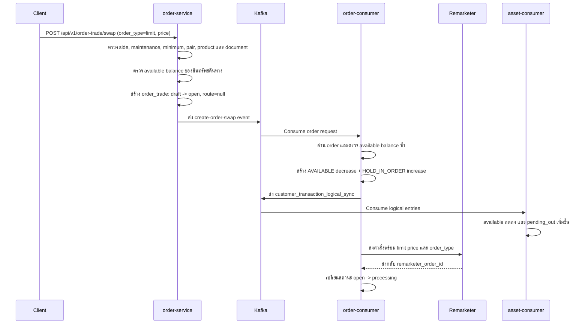
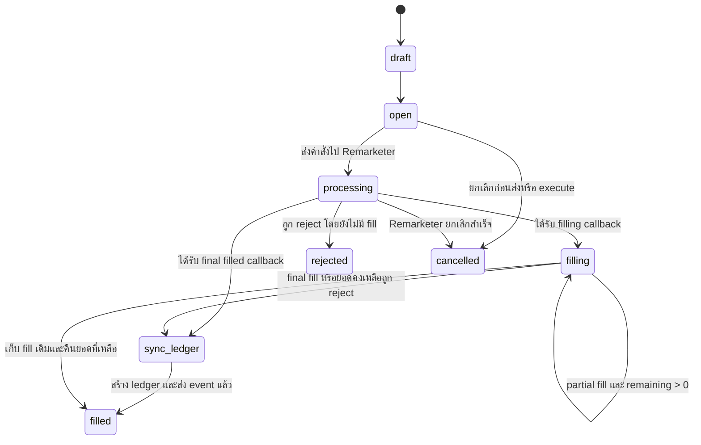

# Business Logic: ลำดับการทำงานของ Swap Limit Order

## วัตถุประสงค์

อธิบายการทำงานของ Crypto Swap แบบ `limit` ตั้งแต่รับคำสั่ง, ล็อกยอดสินทรัพย์, ส่งคำสั่งไป Remarketer, รับ webhook, สร้าง ledger และอัปเดต `asset_portfolio`

## หน้าที่ของแต่ละ Service

| Service | หน้าที่รับผิดชอบ |
| --- | --- |
| `order-service` | ตรวจสอบ request, สร้าง `order_trade`, รับ Remarketer webhook, คำนวณยอดที่จับคู่จริง, fee, refund และสร้าง settlement ledger |
| `order-consumer` | Consume event สร้างคำสั่ง, ตรวจสอบยอดอีกครั้ง, ล็อกสินทรัพย์ต้นทาง และส่งคำสั่งไป Remarketer |
| Remarketer | เก็บ limit order ไว้รอจับคู่, เลือก route/exchange และ callback สถานะกับผลการจับคู่ |
| `asset-consumer` | Consume customer logical-ledger event และนำรายการเคลื่อนไหวไปอัปเดตยอดกับต้นทุนใน `asset_portfolio` |

## ความหมายของ Limit Order

- Client ส่ง `order_type = limit` พร้อมราคาที่ต้องการใน `price`
- Limit order ไม่ต้องรับ route จาก client โดย `order-service` จะบันทึก `route = null` เสมอ
- `CanSwap` ยังคงตรวจสอบยอดขั้นต่ำ, คู่สินทรัพย์, สถานะการขายผลิตภัณฑ์ และเอกสารที่จำเป็น
- Limit order ต่างจาก market order ตรงที่ `CanSwap` จะไม่ตรวจสอบ route และ order book ปัจจุบันจาก Remarketer
- Remarketer ได้รับ `price`, `order_type = limit`, `route = null` และเป็นผู้ตัดสินใจว่าจะจับคู่คำสั่งเมื่อใดและผ่านช่องทางใด
- การสร้างคำสั่งสำเร็จไม่ได้แปลว่า swap สำเร็จแล้ว สินทรัพย์ต้นทางจะถูกล็อกไว้จนกว่าจะถูกจับคู่, ปฏิเสธ หรือยกเลิก

## ลำดับการสร้างคำสั่งและล็อกยอด

## สินทรัพย์ต้นทางที่ถูกล็อก

| Side | สินทรัพย์ที่ลูกค้าใช้จ่าย | วิธีล็อกยอด |
| --- | --- | --- |
| `BUY` | Quote/fiat asset ซึ่งปกติคือ THB | ย้ายจำนวนเงินต้นทางจาก `AVAILABLE` ไป `HOLD_IN_ORDER` |
| `SELL` | Crypto ที่ลูกค้าต้องการขาย | ย้ายจำนวน crypto ที่สั่งขายจาก `AVAILABLE` ไป `HOLD_IN_ORDER` |

การล็อกยอดประกอบด้วย logical ledger สองรายการสำหรับสินทรัพย์ต้นทางเดียวกัน:

1. `AVAILABLE / DECREASE`
2. `HOLD_IN_ORDER / INCREASE`

เมื่อ `asset-consumer` ประมวลผล จะกระทบ portfolio ดังนี้:

| รายการ | `available_unit_balance` | `pending_out_unit_balance` | `unit_balance` |
| --- | ---: | ---: | ---: |
| `AVAILABLE / DECREASE` | ลด `amount` | ไม่เปลี่ยน | ไม่เปลี่ยน |
| `HOLD_IN_ORDER / INCREASE` | ไม่เปลี่ยน | เพิ่ม `amount` | ไม่เปลี่ยน |

ดังนั้น การวาง limit order จะลดยอดที่ลูกค้านำไปใช้ต่อได้ แต่ยังไม่ลดยอดถือครองรวมจนกว่าจะเกิดการจับคู่จริง

## การส่งคำสั่งไป Remarketer

`order-consumer` ส่งข้อมูลหลักต่อไปนี้ไป Remarketer:

| Field | ที่มาและความหมาย |
| --- | --- |
| `client_order_id` | Order ID สำหรับแสดงผล |
| `symbol`, `symbol_pair`, `side` | คู่สินทรัพย์และ side จาก `order_trade` |
| `quantity` | SELL ใช้ order quantity; BUY ใช้ quantity ที่ปรับตาม transaction fee logic |
| `route` | เป็น `null` สำหรับ limit order |
| `price` | Limit price ที่ลูกค้าระบุ |
| `order_type` | `limit` |
| `callback_url` | URL ของ Remarketer webhook ใน `order-service` |

หากส่งคำสั่งไม่สำเร็จหลังจากล็อกยอดแล้ว `order-consumer` จะ reject order และสร้าง ledger ย้อนกลับ เพื่อย้ายยอดต้นทางทั้งหมดจาก `HOLD_IN_ORDER` กลับไป `AVAILABLE`

## ลำดับการทำงานของ Remarketer Webhook

Remarketer เรียก `POST /api/v1/order-trade/webhook` และ `order-service` ประมวลผลสถานะดังนี้:

| Webhook status | การทำงาน |
| --- | --- |
| `filling` | เปลี่ยนสถานะ `processing -> filling` และยังไม่คืนยอดที่ล็อกไว้ |
| `filled` และ `remaining_quantity > 0` | บันทึกผลการจับคู่ครั้งนี้และ settle เฉพาะส่วนที่จับคู่ได้ โดย order ยังรอการจับคู่ครั้งต่อไป |
| `filled` และไม่มียอดคงเหลือ | บันทึก final fill, settle ยอดที่สำเร็จ, คืนยอดล็อกที่ไม่ได้ใช้ และปิดคำสั่ง |
| `rejected` ก่อนมี fill | คืนยอดที่ล็อกทั้งหมดและเปลี่ยน order เป็น `rejected` |
| `rejected` หลังเกิด partial fill | คงผลการจับคู่ก่อนหน้าไว้, คืนเฉพาะยอดที่ยังไม่ถูกจับคู่ และจบ order เป็น `filled` |

### State ของคำสั่ง

## การ Settle ยอดสุดท้าย

### BUY

เมื่อ BUY จับคู่สำเร็จ:

- ลด fiat ของลูกค้าใน `HOLD_IN_ORDER` ตามยอดที่ execute โดยรวมวิธีคิด fee ของ swap
- เพิ่ม crypto ปลายทางใน `AVAILABLE` ด้วย net received quantity
- สร้าง ledger ฝั่ง XD main และ XD fee ที่สัมพันธ์กัน
- เมื่อจบคำสั่ง ให้คืน fiat ส่วนที่ไม่ได้ execute จาก `HOLD_IN_ORDER` กลับไป `AVAILABLE`

### SELL

เมื่อ SELL จับคู่สำเร็จ:

- ลด crypto ของลูกค้าใน `HOLD_IN_ORDER` ตาม executed quantity
- เพิ่ม fiat ใน `AVAILABLE` ด้วยยอดรับสุทธิหลังหัก fee
- สร้าง ledger ฝั่ง XD main และ XD fee ที่สัมพันธ์กัน
- เมื่อจบคำสั่ง ให้คืน crypto ส่วนที่ขายไม่สำเร็จจาก `HOLD_IN_ORDER` กลับไป `AVAILABLE`

### สูตรคำนวณยอดคืน

`order-service` คำนวณสินทรัพย์ที่ล็อกไว้แต่ไม่ได้ใช้ดังนี้:

| Side | Returned quantity |
| --- | --- |
| SELL | `order_quantity - sum(executed_quantity)` |
| BUY | `order_quantity - (sum(executed_quantity) + sum(order_fee))` |

หาก returned quantity เป็นศูนย์ ระบบจะไม่สร้าง refund ledger

## การอัปเดต Asset Portfolio

`asset-consumer` ประมวลผล logical-ledger แต่ละ batch ภายใน database transaction เดียว:

1. บันทึก logical entries เป็น audit/history
2. สร้าง portfolio ของสินทรัพย์นั้นหากยังไม่มี
3. อัปเดต balance ตาม ledger type และ movement
4. คำนวณต้นทุน crypto ใหม่เมื่อ crypto balance เพิ่มขึ้น
5. Reset `average_cost` และ `total_cost` เป็นศูนย์เมื่อยอดถือครองหมด
6. ส่งข้อมูล asset portfolio ที่อัปเดตแล้วไปยัง downstream

กฎการอัปเดตหลัก:

| Logical movement | ผลต่อ Portfolio |
| --- | --- |
| `AVAILABLE / INCREASE` | เพิ่ม available balance และ total unit balance |
| `AVAILABLE / DECREASE` | ลดเฉพาะ available balance |
| `HOLD_IN_ORDER / INCREASE` | เพิ่มเฉพาะ pending-out balance |
| `HOLD_IN_ORDER / DECREASE` | ลด pending-out balance และลด total unit balance ขั้นสุดท้าย |

## กฎเมื่อเกิดข้อผิดพลาดและความสอดคล้องของข้อมูล

- ระบบตรวจ balance สองครั้ง ครั้งแรกใน `order-service` ก่อนสร้างคำสั่ง และครั้งที่สองใน `order-consumer` ก่อนล็อกยอด
- การตรวจครั้งที่สองป้องกันกรณี balance เปลี่ยนระหว่าง API request กับการ consume แบบ asynchronous
- ยอด execute จริงยึดข้อมูลจาก Remarketer webhook ไม่ใช่ estimate ตอนสร้างคำสั่ง
- Partial fill จะสร้าง ledger ตามแต่ละ fill และ final callback เท่านั้นที่จะคืนยอดส่วนที่ไม่ถูก execute
- การเขียนฐานข้อมูลกับการ publish Kafka ไม่ใช่ distributed transaction เดียวกัน จึงต้องมี monitoring/retry สำหรับกรณี DB สำเร็จแต่ Kafka ล้มเหลว หรือ Kafka สำเร็จแต่ DB rollback

## จุดอ้างอิงในโค้ด

| ขั้นตอน | Code path |
| --- | --- |
| API handler | `order-service/handler/order_trade_handler.go:CreateSwapOrder` |
| การตรวจสอบคำสั่ง | `order-service/pkg/order_trade/service.go:CanSwap` |
| สร้าง order และ event | `order-service/pkg/order_trade/swap_service.go:MakeSwapOrderRequest` |
| กำหนด route ของ limit order | `order-service/pkg/order_trade/swap_service.go:resolveRouteByOrderType` |
| Consume, hold และ submit | `order-consumer/pkg/digital-asset-order-request/swap.go:processCreateSwapOrder` |
| ส่ง request ไป Remarketer | `order-consumer/pkg/remarketer/new_remarketer.go:Trade` |
| รับ webhook | `order-service/handler/order_trade_handler.go:OrderTradeWebhook` |
| Settle fill และ refund | `order-service/pkg/order_trade/webhook_service.go` และ `service_ledger.go` |
| อัปเดต portfolio | `asset-consumer/pkg/customer-logical-entry/service.go:UpdateAssetPortfolio` |

## ข้อสังเกตจากการตรวจสอบโค้ด

- Production path ของ `order-service` ที่ตรวจสอบไม่พบเงื่อนไขห้าม `SIRIHUB2` ทำ limit order โดยตรง ข้อความเดิมใน [Swap Rules](./Swap-Rules.md) จึงควรตรวจสอบกับ configuration หรือ service อื่นเพิ่มเติมก่อนนำไปอ้างอิง
- เอกสารนี้อธิบายจากสาม repository ที่ตรวจสอบ ณ วันที่ 2026-06-14 ส่วน matching logic ภายใน Remarketer อยู่นอก repository เหล่านี้
