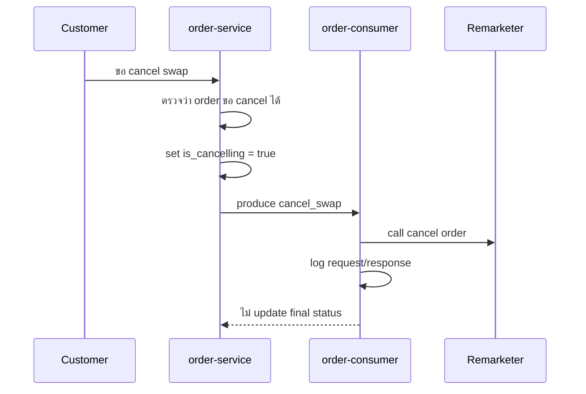
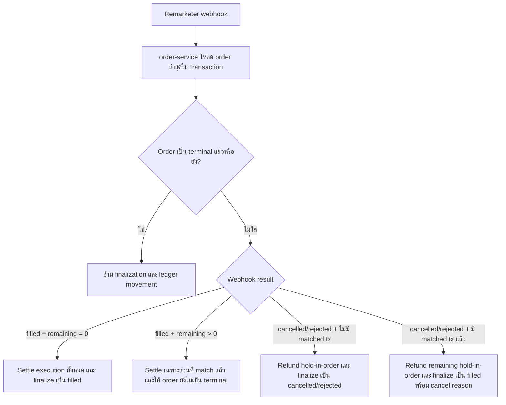

# แนวทางจัดการ Race ระหว่าง Swap Cancel และ Remarketer Webhook

## สรุปสั้น

แนวทางหลักคือให้ `cancel` เป็นเพียงความตั้งใจของลูกค้า จนกว่า `order-service` จะได้รับผลการ execute จริงจาก remarketer webhook แล้วค่อยตัดสินสถานะสุดท้ายของ order

- `order-service` ควรเป็นเจ้าของสถานะ order, การ finalize จาก webhook, การ settle/refund ledger และการส่ง logical ledger event
- `order-consumer` ควรเหลือหน้าที่ consume `cancel_swap`, call cancel ไป remarketer และบันทึก request/response log เท่านั้น
- `asset-consumer` ไม่ควรตัดสินผลลัพธ์ order เพราะเป็นปลายทางที่ consume logical ledger entry เพื่อ update asset portfolio
- ถ้า remarketer match ครบแล้ว full match ต้องชนะ cancel request เสมอ และสถานะสุดท้ายต้องเป็น `filled`
- ต้องมี guard กันการ finalize ซ้ำและ logical ledger movement ซ้ำ เพราะ duplicate event จะกระทบ portfolio ใน `asset-consumer`

## สภาพ code ปัจจุบัน

### `order-service`

Cancel API อยู่ที่ `pkg/order_trade/service.go`

ปัจจุบัน `CancelSwapOrder` ทำงานดังนี้:

1. ตรวจสอบ owner, สถานะ order, ประเภท order, `is_cancelling` และ remaining quantity
2. update `is_cancelling = true`
3. produce Kafka event `cancel_swap` ไป topic `TopicOrderDigitalAssetOrderRequest`

รูปแบบ message ปัจจุบันมีแค่ `order_request_id`:

```json
{
  "order_request_id": "<order_trade_id>"
}
```

Remarketer webhook อยู่ที่ `pkg/order_trade/webhook_service.go`

ปัจจุบัน webhook handler process status เหล่านี้:

- `filling`
- `filled`
- `rejected`

จากการตรวจซ้ำที่ handler/DTO: request DTO รับ `status` เป็น string ตรง ๆ และ `MapProcessRemarketerWebhookToInput` ส่งค่าต่อเข้า service โดยไม่ validate enum ดังนั้นถ้า remarketer ส่ง `cancelled` เข้ามา request จะ bind/map ผ่านได้

แต่ `ProcessRemarketerWebhook` ยังไม่มี `case "cancelled"` ดังนั้นถ้า status เป็น `cancelled` จริง จะถูก ignore ใน service switch ตาม code ปัจจุบัน เว้นแต่ upstream map เป็น `rejected` มาก่อนแล้ว

จุดเสี่ยงใน webhook ปัจจุบัน:

- `filled` จะ insert order transaction/exchange ก่อน แล้วค่อย settle ledger หรือ complete order
- ยังไม่มี guard สำหรับ terminal state ชัดเจนก่อน insert transaction/ledger
- `rejected` ถ้า `remaining_quantity > 0` จะคืน `nil` ทันที ก่อนดูว่า order เคย partial fill แล้วหรือยัง
- code ยังไม่ได้ใช้ `is_cancelling` เพื่อเลือกพฤติกรรมตอน finalize ใน webhook
- ยังไม่มี test case สำหรับ webhook status `cancelled`

### `order-consumer`

Cancel consumer อยู่ที่ `../order-consumer/pkg/digital-asset-order-request/swap.go`

ปัจจุบัน `processCancelSwapOrder` ทำงานดังนี้:

1. load order จาก DB
2. เช็ค `IsOrderCancellable()` ซึ่งแปลว่า `is_cancelling = true` และ status ยังไม่ใช่ terminal
3. register `defer` เพื่อ clear `is_cancelling = false` หลังเริ่ม process cancel แล้ว
4. call cancel ไป remarketer และบันทึก request/response log ผ่าน callback
5. ถ้า call cancel fail จะ return แต่ `defer` ยัง clear `is_cancelling = false`
6. ถ้า call cancel สำเร็จ จะ load `orderTradeInfo` เพื่อดูว่า partial filled แล้วหรือยัง
7. ถ้า partial filled แล้ว จะทำใน DB transaction:
   - update action flow เป็น cancelled/sync-ledger/synced
   - move remaining hold-in-order กลับ available
   - update order เป็น `filled` พร้อม reason ว่าถูก cancel โดย customer
   - create action flow status `filled`
8. หลัง partial-filled transaction สำเร็จ จะ:
   - send trade notification
   - produce customer logical transaction
9. ถ้ายัง open หรือยังไม่มี partial fill จะทำใน DB transaction:
   - move hold-in-order กลับ available
   - update order เป็น `cancelled`
   - create action flow status `cancelled`
10. หลัง open-order transaction สำเร็จ จะ:
    - send trade notification
    - produce customer logical transaction
11. เมื่อ function return จะ clear `is_cancelling = false` ผ่าน `defer`

นี่คือจุด race หลัก เพราะ `order-consumer` ยัง finalize order และสร้าง logical ledger movement เองหลังจาก call cancel สำเร็จ โดยไม่รอผลจาก remarketer webhook

### `asset-consumer`

การ update portfolio อยู่ที่ `../asset-consumer/pkg/customer-logical-entry/service.go`

ปัจจุบัน `asset-consumer` ทำงานดังนี้:

1. consume customer logical ledger entry
2. insert logical ledger transaction
3. update asset portfolio ตาม ledger type เช่น `AVAILABLE`, `HOLD_IN_ORDER`, `PENDING_WITHDRAWAL`
4. produce update asset portfolio event ต่อ

ดังนั้นถ้า `order-service` และ `order-consumer` produce logical ledger movement ซ้ำจาก race เดียวกัน portfolio จะถูก update ซ้ำได้จริง

## ปัญหาที่ต้องแก้

Race เกิดเมื่อ customer กด cancel limit swap ในเวลาใกล้กับที่ remarketer match order

ตัวอย่าง flow ที่เสี่ยง:

1. Customer กด cancel
2. `order-service` stamp `is_cancelling = true` และส่ง `cancel_swap`
3. Remarketer match order และส่ง `filled` webhook
4. `order-consumer` consume `cancel_swap` แล้ว call cancel สำเร็จ
5. ทั้ง webhook path และ cancel consumer path พยายาม:
   - update สถานะ terminal
   - create action flow
   - create logical ledger movement
   - produce logical entry ให้ `asset-consumer`

ผลที่ไม่ควรเกิด:

- fully matched order ถูก mark เป็น `cancelled`
- สถานะ terminal ของ order ถูกเขียนทับกัน
- logical ledger movement ถูกสร้างซ้ำ
- asset portfolio ถูก update ซ้ำจาก duplicate logical entry
- `is_cancelling` ถูก clear เร็วเกินไปจน audit/decision path หาย

## Ownership ที่ควรเป็น

### `order-service`

ควรเป็นเจ้าของ:

- Customer cancel API
- `is_cancelling` intent flag
- Order status/action flow
- Remarketer webhook processing
- การตีความ matched/remaining quantity
- การตัดสิน final state
- Logical ledger settlement/refund movement
- การ produce customer logical ledger entry ให้ `asset-consumer`

### `order-consumer`

ควรเป็นเจ้าของแค่:

- consume `cancel_swap`
- call cancel API ไป remarketer
- save cancel API request/response log
- update operational metadata ของ cancel attempt ถ้ามี field รองรับ เช่น `cancel_requested_at`, `cancel_response_at`, `cancel_response_status`

ไม่ควร:

- update final order status เป็น `cancelled` หรือ `filled`
- create refund/settlement logical ledger movement
- produce customer logical ledger entry จาก cancel path
- clear `is_cancelling` ก่อน order ถูก resolve ด้วย webhook หรือ reconciliation path ที่ชัดเจน

### `asset-consumer`

ควรเป็นเจ้าของแค่:

- consume logical ledger entry
- persist logical entry
- update asset portfolio
- produce portfolio update event

ไม่ควร:

- ตัดสินว่า cancel ชนะหรือ fill ชนะ
- รับผิดชอบ dedupe race ที่ต้นทางควรป้องกัน

## ลำดับการทำงานเป้าหมาย

### ลำดับตอนลูกค้าขอ cancel



### ลำดับตอน finalize จาก webhook



## กติกา final state

| เงื่อนไข | สถานะสุดท้าย | พฤติกรรมของ ledger | หมายเหตุ |
| --- | --- | --- | --- |
| Full match ก่อนหรือระหว่าง cancel | `filled` | settle execution ที่ match แล้ว | Cancel intent เป็น audit metadata เท่านั้น |
| ไม่มี match และได้รับผล cancel/reject confirmed | `cancelled` หรือ `rejected` | move hold-in-order กลับ available | ต้องตกลง business status ให้ชัด |
| Partial match แล้วตามด้วย cancel/reject confirmed | `filled` | settle ส่วนที่ match แล้ว และ refund remaining hold-in-order | Reason ควรบอกว่า customer requested cancel |
| Webhook/event ซ้ำหลัง order terminal แล้ว | ไม่เปลี่ยน | ไม่สร้าง ledger movement เพิ่ม | ต้อง idempotent |

ข้อสรุป: full match ต้องชนะ cancel request. ระบบไม่ควร mark fully matched order เป็น `cancelled`

## รายการ code ที่ควรแก้

### 1. ย้าย final cancel outcome ออกจาก `order-consumer`

ใน `../order-consumer/pkg/digital-asset-order-request/swap.go`:

- คง `cancelSwapOrderToRemarketer`
- คง API request log callback
- remove หรือ bypass:
  - `handleCancelSwapOrderInCasePartialFilled`
  - `handleCancelSwapOrderInCaseStatusOpen`
  - `moveHoldInOrderToAvailableWhenCancelOrderThatHaveNotBeenMatched`
  - `moveHoldInOrderToAvailableWhenCancelOrderPartialFilled`
  - status updates ไปเป็น `cancelled`, `sync-ledger`, `filled`
  - producing customer logical transaction จาก cancel path
- ไม่ควร clear `is_cancelling` ทันทีหลัง cancel API call ถ้า final resolution ยังต้องรอ webhook

ถ้ายังต้องบันทึกว่า cancel API สำเร็จหรือล้มเหลว ให้เพิ่ม metadata แยก แทนการเปลี่ยน final order state

### 2. ทำให้ webhook finalization ใน `order-service` รู้จัก cancel intent

ใน `pkg/order_trade/webhook_service.go`:

- โหลด order ล่าสุดภายใน transaction ก่อนทำ terminal transition
- ถ้า order เป็น terminal แล้ว (`filled`, `cancelled`, `rejected`) ให้ข้าม finalization
- ใช้ `is_cancelling` เพื่อ stamp reason/audit metadata เมื่อ fill complete หลัง customer request cancel
- รองรับ `cancelled` ให้ชัดเจนถ้า remarketer ส่ง status นี้ได้
- สำหรับ `rejected`/`cancelled` ห้าม return early เพียงเพราะ `remaining_quantity > 0`; ต้องดูด้วยว่ามี matched transactions แล้วหรือยัง และ webhook นี้กำลัง resolve cancelling order หรือไม่

จุด mismatch ปัจจุบันที่ต้องระวัง:

`handleOnRemarketerCallbackRejected` จะคืน `nil` เมื่อ `input.HasRemaining()` เป็น true ทำให้ cancelling order ที่ partial fill แล้วอาจค้าง unresolved ถ้า remarketer ส่ง cancel/reject พร้อม remaining quantity

### 3. เพิ่ม idempotency guard ให้ ledger movement

ก่อนสร้าง ledger transactions:

- เช็ค terminal state ใน transaction เดียวกัน
- เช็ค existing logical/physical ledger transactions สำหรับ order และ movement type เดียวกัน หรือเพิ่ม idempotency key
- ป้องกัน duplicate webhook ไม่ให้ create duplicate `order_trade_transaction`
- ป้องกัน duplicate refund ไม่ให้ produce duplicate customer logical ledger entry

ตัวอย่าง idempotency dimensions:

- `order_trade_id`
- `remarketer_order_id`
- `exchange_order_id`
- webhook status
- matched transaction sequence หรือ exchange match identifier
- ledger movement purpose เช่น `execution_settlement`, `cancel_refund_remaining`

### 4. คง `asset-consumer` ไว้ก่อน เว้นแต่ downstream idempotency ยังไม่พอ

`asset-consumer` ไม่ควรเป็นเจ้าของ race decision นี้ แต่ยังควรมี defensive dedupe ถ้า logical ledger transaction IDs ไม่ guarantee unique across retries

สิ่งที่ต้องเช็ค:

- `customer_logical_entry` มี uniqueness หรือไม่
- duplicate Kafka message ที่มี logical transaction IDs เดิมถูก ignore หรือ fail safe หรือไม่
- พฤติกรรม retry สามารถทำให้ portfolio update ซ้ำหลัง DB success บางส่วนได้หรือไม่

## หมายเหตุการ implement

- คง `cancel_swap` message shape เดิมไว้ก่อน เว้นแต่ต้องเพิ่ม cancel attempt metadata
- ถ้าต้องเพิ่ม metadata ให้ใช้ optional fields เพื่อ backward compatibility
- ควร clear `is_cancelling` เฉพาะเมื่อ:
  - order เข้าสู่ terminal state ผ่าน webhook finalization แล้ว
  - cancel attempt failed ชัดเจนและ order ยัง active
  - reconciliation/manual review resolve state แล้ว
- ถ้า remarketer ไม่มี cancel-result webhook ต้องมี reconciliation path หลัง cancel API success ไม่อย่างนั้น no-match cancel order จะค้าง unresolved

## แผนทดสอบ

### `order-service`

- Cancel API ต้อง set `is_cancelling = true` และ produce `cancel_swap`
- Cancel request ซ้ำขณะ `is_cancelling = true` ต้องถูก reject
- Filled webhook ที่ `remaining_quantity = 0` ระหว่าง `is_cancelling = true` ต้อง finalize เป็น `filled`
- Filled webhook ที่ `remaining_quantity > 0` ต้อง create เฉพาะ matched-slice settlement และ order ยังไม่เป็น terminal
- Cancelled/rejected webhook ที่ไม่มี matched transactions ต้อง finalize เป็น `cancelled`/`rejected` และ refund hold-in-order แค่ครั้งเดียว
- Cancelled/rejected webhook ที่มี matched transactions แล้ว ต้อง finalize เป็น `filled`, refund เฉพาะ remaining hold-in-order และ stamp customer cancel reason
- Filled/cancelled/rejected webhook ซ้ำ ต้องไม่ create duplicate transactions หรือ ledger movement
- Webhook หลัง terminal order ต้องถูก ignore อย่างปลอดภัย

### `order-consumer`

- `cancel_swap` ต้อง call remarketer cancel และ write request/response log
- `cancel_swap` ไม่ update final order status
- `cancel_swap` ไม่ create logical ledger movement
- `cancel_swap` ไม่ produce customer logical ledger entry
- cancel API failure ต้องเหลือ metadata/log เพียงพอสำหรับ retry หรือ manual handling

### `asset-consumer`

- Consume logical entry batch เดียวแล้วต้อง update portfolio ถูกต้อง
- พฤติกรรมของ duplicate logical entry ต้องชัดเจนและมี test
- Portfolio update ยังอยู่ใน transaction เดียวกับ logical entry insert

## คำถามที่ต้อง confirm

1. Remarketer จะส่ง cancel result เป็น `cancelled` ใช่ไหม และ payload จะเหมือน `rejected` หรือมี field ต่างกัน?
2. ถ้า cancel API สำเร็จแต่ไม่มี webhook ตามมา เราจะ resolve order ด้วย polling/reconciliation หรือ timeout/manual review?
3. กรณี no-match cancel สุดท้ายควรใช้ status `cancelled` หรือ `rejected` ในรายงานธุรกิจ?
4. ต้องเพิ่ม cancel audit fields แยกจาก `reason` หรือใช้ field เดิมพอ?
5. Ledger transaction table มี unique constraint/idempotency key ที่กัน duplicate movement ได้แล้วหรือยัง?

---

## TODO List สำหรับ Planning / Implementation

> จุดประสงค์ของ section นี้คือเอาไปแตก task ใน sprint/PR ได้เลย
> Code block เป็น suggest code เพื่อบอกจุดแก้และ shape ของ implementation จริง ตอนลงมือควรปรับตาม interface, config, mock และ pattern ใน repo อีกครั้ง

## Phase 0: ตัดสิน contract ก่อนเริ่มแก้ code

### Task 0.1: Confirm ว่า remarketer ส่ง cancel result กลับมาทางไหน

**Files ที่เกี่ยวข้อง**

- อ่าน/เทียบ payload จริงจาก remarketer หรือ log ในระบบ
- `handler/order_trade_dto.go`
- `pkg/order_trade/webhook_service.go`
- `../order-consumer/pkg/digital-asset-order-request/swap.go`

**Checklist**

- [ ] Confirm ว่า remarketer ส่ง status `cancelled` ผ่าน webhook หรือไม่
- [ ] Confirm ว่า cancel webhook payload มี `remaining_quantity`, `executed_quantity`, `received_quantity`, `status_reason`, `exchanges` เหมือน `rejected` หรือไม่
- [ ] Confirm ว่า cancel API success หมายถึง “cancel accepted” หรือ “order cancelled แล้วจริง”
- [ ] Confirm ว่ากรณี no-match cancel สุดท้าย business ต้องเห็น status เป็น `cancelled` หรือ `rejected`
- [ ] Confirm ว่าถ้า call cancel สำเร็จแต่ไม่มี webhook จะใช้ reconciliation แบบไหน

**ตัวอย่าง payload ที่ควรเอาไปถาม/เทียบกับ remarketer**

```json
[
  {
    "remarketer_order_id": "202508140427545801-50-250807-002136",
    "exchange": "bitkub",
    "exchange_order_id": null,
    "exchange_order_date": "2026-06-20T10:00:00Z",
    "order_type": "limit",
    "order_side": "sell",
    "symbol": "USDT",
    "symbol_pair": "THB",
    "placed_quantity": "100",
    "placed_quantity_exchange": "100",
    "executed_quantity": null,
    "received_quantity": null,
    "remaining_quantity": "100",
    "executed_price": null,
    "match_date": null,
    "fx_rate": null,
    "exchange_fee": null,
    "status": "cancelled",
    "status_reason": "Cancelled by customer",
    "post_order_type": "",
    "original_executed_price": null,
    "original_exchange_fee": null,
    "original_fx_rate": null,
    "exchanges": []
  }
]
```

**Decision gate**

- ถ้า remarketer ส่ง `cancelled` webhook: ใช้ Phase 1 เป็นหลัก และไม่ต้องเพิ่ม Kafka event กลับจาก `order-consumer`
- ถ้า remarketer ไม่ส่ง `cancelled` webhook: ต้องทำ Phase 2 เพิ่ม คือให้ `order-consumer` produce cancel result กลับไปให้ `order-service` หรือทำ reconciliation path อื่น
- ถ้ายังไม่รู้แน่: ทำ Phase 1 ให้รองรับ `cancelled` ก่อน และออกแบบ Phase 2 เป็น fallback แบบ feature flag

---

## Phase 1: แก้ `order-service` ให้ webhook เป็น source of truth

### Task 1.1: เพิ่ม test ว่า webhook status `cancelled` ไม่ถูก ignore

**Files**

- Modify: `pkg/order_trade/webhook_service_test.go`
- Modify ภายหลัง: `pkg/order_trade/webhook_service.go`

**เป้าหมาย**

ถ้า `ProcessRemarketerWebhook` ได้ status `cancelled` ต้องเข้า branch ที่จัดการ cancel result ไม่ใช่ loop ผ่านแล้ว return nil เฉย ๆ

**Suggest test shape**

```go
func TestProcessRemarketerWebhook_Cancelled_NoMatchedTransaction_FinalizesCancelled(t *testing.T) {
	ctx := context.Background()
	remarketerOrderID := "remarketer-order-1"
	orderTradeID := uuid.Must(uuid.NewV4())

	orderTrade := &domain.OrderTrade{
		Data: domain.OrderTradeDB{
			ID:                    orderTradeID,
			Status:                enum.SWAP_ORDER_STATUS_PROCESSING.String(),
			ResponseTransactionID: utils.ToPointer(remarketerOrderID),
			IsCancelling:          utils.ToPointer(true),
			OrderType:             "limit",
			OrderSide:             string(enum.ORDER_CRYPTO_SWAP_SELL),
			OrderQuantity:         decimal.NewFromInt(100),
			CustomerAccountID:     uuid.Must(uuid.NewV4()),
			CustomerIdentificationID: uuid.Must(uuid.NewV4()),
			ProductID:             uuid.Must(uuid.NewV4()),
			ProductSymbol:         "USDT",
			ProductAssetCode:      "USDT",
			ProductType:           "CRYPTO",
		},
	}

	orderTradeRepo := new(MockIOrderTradeRepository)
	orderTradeTxRepo := new(MockIOrderTradeTransactionRepository)
	actionFlowRepo := new(MockICryptoOrderActionFlowRepository)
	ledgerSvc := new(ledgertransaction.MockILedgerTransactionService)
	produceSvc := new(produce.MockIProduceService)

	orderTradeRepo.
		On("FindByResponseTransactionID", mock.Anything, remarketerOrderID).
		Return(orderTrade, nil).
		Once()

	orderTradeTxRepo.
		On("FindByOrderTradeId", mock.Anything, orderTradeID).
		Return([]domain.OrderTradeTransaction{}, nil).
		Once()

	// Expect refund hold-in-order, status cancelled, action flow cancelled, produce logical entry.
	// ปรับ expectation ให้ตรง helper จริงหลัง implement

	err := service.ProcessRemarketerWebhook(ctx, []ProcessRemarketerWebhookInput{
		{
			RemarketerOrderID: remarketerOrderID,
			Status:            "cancelled",
			StatusReason:      utils.ToPointer("Cancelled by customer"),
			RemainingQuantity: utils.ToPointer("100"),
			Exchanges:         []ProcessRemarketerWebhookExchangeInput{},
		},
	})

	require.NoError(t, err)
	orderTradeRepo.AssertExpectations(t)
	orderTradeTxRepo.AssertExpectations(t)
	actionFlowRepo.AssertExpectations(t)
	ledgerSvc.AssertExpectations(t)
	produceSvc.AssertExpectations(t)
}
```

**Run**

```bash
go test ./pkg/order_trade -run TestProcessRemarketerWebhook_Cancelled_NoMatchedTransaction_FinalizesCancelled -count=1
```

**Expected ก่อน implement**

```text
FAIL เพราะไม่มี case "cancelled" หรือ expectation ไม่ถูกเรียก
```

### Task 1.2: เพิ่ม `case "cancelled"` ใน `ProcessRemarketerWebhook`

**Files**

- Modify: `pkg/order_trade/webhook_service.go`

**Suggest code**

```go
func (s *orderTradeService) ProcessRemarketerWebhook(ctx context.Context, input []ProcessRemarketerWebhookInput) error {
	mapOrderID := make(map[string]bool)
	err := s.dbTransaction.Transaction(func(tx *gorm.DB) error {
		for _, item := range input {
			switch strings.ToLower(item.Status) {
			case "filling":
				return s.handleOnRemarketerCallbackFilling(tx, item)
			case "rejected":
				mapOrderID[item.RemarketerOrderID] = true
				return s.handleOnRemarketerCallbackRejected(ctx, tx, item)
			case "cancelled":
				mapOrderID[item.RemarketerOrderID] = true
				return s.handleOnRemarketerCallbackCancelled(ctx, tx, item)
			case "filled":
				mapOrderID[item.RemarketerOrderID] = true
				return s.handleOnRemarketerCallbackFilled(ctx, tx, item)
			default:
				logs.InfoWithContext(ctx, "skip unsupported remarketer webhook status", map[string]any{
					"remarketer_order_id": item.RemarketerOrderID,
					"status":              item.Status,
				})
			}
		}
		return nil
	})
	if err != nil {
		return errors.Wrap(err, "failed to process remarketer webhook")
	}

	for id := range mapOrderID {
		if err := s.sendOrderStatusNotification(ctx, id); err != nil {
			return err
		}
	}

	return nil
}
```

**หมายเหตุ**

- ถ้าไม่อยากส่ง notification สำหรับ cancel ใน phase แรก ให้ยังไม่ใส่ `mapOrderID[item.RemarketerOrderID] = true` ใน `cancelled`
- ถ้าต้องส่ง notification คนละ template กับ `filled/rejected` ให้แยก `sendOrderStatusNotification` เพิ่ม

### Task 1.3: เพิ่ม terminal-state guard ใน webhook ทุก terminal path

**Files**

- Modify: `pkg/order_trade/webhook_service.go`
- อาจต้อง Modify: `internal/domain/order_trade.go`

**เป้าหมาย**

ทุก path ที่จะ finalize หรือ create ledger ต้องเช็คสถานะล่าสุดก่อน ถ้า order เป็น `filled`, `cancelled`, `rejected` แล้ว ให้ skip ทันที

**Suggest helper**

```go
func isTerminalSwapOrder(orderTrade *domain.OrderTrade) bool {
	if orderTrade == nil {
		return false
	}
	return orderTrade.IsOrderFilled() ||
		orderTrade.IsOrderCancelled() ||
		orderTrade.IsOrderRejected()
}
```

**Suggest usage ใน `filled` path**

```go
func (s *orderTradeService) handleOnRemarketerCallbackFilled(ctx context.Context, tx *gorm.DB, input ProcessRemarketerWebhookInput) error {
	orderTrade, err := s.orderTradeRepo.FindByResponseTransactionID(tx, input.RemarketerOrderID)
	if err != nil {
		return errors.Wrap(err, errFailToFindOrderTradeByResponseTransactionID)
	}

	if isTerminalSwapOrder(orderTrade) {
		logs.InfoWithContext(ctx, "skip filled webhook because order is already terminal", map[string]any{
			"order_trade_id":       orderTrade.ID(),
			"status":               orderTrade.Status(),
			"remarketer_order_id":  input.RemarketerOrderID,
		})
		return nil
	}

	// existing filled logic continues here
}
```

**Suggest usage ใน `rejected` และ `cancelled` path**

```go
if isTerminalSwapOrder(orderTrade) {
	logs.InfoWithContext(ctx, "skip cancel/reject webhook because order is already terminal", map[string]any{
		"order_trade_id":      orderTrade.ID(),
		"status":              orderTrade.Status(),
		"remarketer_order_id": input.RemarketerOrderID,
	})
	return nil
}
```

### Task 1.4: ทำ cancel/reject webhook ให้ดู matched transaction ก่อนตัดสิน

**Files**

- Modify: `pkg/order_trade/webhook_service.go`

**ปัญหาปัจจุบัน**

`handleOnRemarketerCallbackRejected` คืน `nil` ทันทีเมื่อ `input.HasRemaining()` เป็น true ทำให้ partial-fill cancel/reject อาจไม่ถูก resolve

**Suggest refactor**

```go
func (s *orderTradeService) handleOnRemarketerCallbackCancelled(
	ctx context.Context,
	tx *gorm.DB,
	input ProcessRemarketerWebhookInput,
) error {
	return s.handleOnRemarketerCallbackCancelledOrRejected(ctx, tx, input, enum.SWAP_ORDER_STATUS_CANCELLED.String())
}

func (s *orderTradeService) handleOnRemarketerCallbackRejected(
	ctx context.Context,
	tx *gorm.DB,
	input ProcessRemarketerWebhookInput,
) error {
	return s.handleOnRemarketerCallbackCancelledOrRejected(ctx, tx, input, enum.SWAP_ORDER_STATUS_REJECTED.String())
}

func (s *orderTradeService) handleOnRemarketerCallbackCancelledOrRejected(
	ctx context.Context,
	tx *gorm.DB,
	input ProcessRemarketerWebhookInput,
	finalNoMatchStatus string,
) error {
	orderTrade, err := s.orderTradeRepo.FindByResponseTransactionID(tx, input.RemarketerOrderID)
	if err != nil {
		return errors.Wrap(err, "FindByResponseTransactionID: fail to find order trade by response transaction id")
	}

	if isTerminalSwapOrder(orderTrade) {
		return nil
	}

	orderTradeTransactions, err := s.orderTradeTransactionRepo.FindByOrderTradeId(tx, orderTrade.ID())
	if err != nil {
		return errors.Wrap(err, "failed to get order trade transaction from repo")
	}

	if len(orderTradeTransactions) == 0 {
		return s.finalizeNoMatchCancelOrReject(ctx, tx, orderTrade, input, finalNoMatchStatus)
	}

	return s.finalizePartialFillCancelOrReject(ctx, tx, orderTrade, orderTradeTransactions, input)
}
```

**Suggest no-match helper**

```go
func (s *orderTradeService) finalizeNoMatchCancelOrReject(
	ctx context.Context,
	tx *gorm.DB,
	orderTrade *domain.OrderTrade,
	input ProcessRemarketerWebhookInput,
	finalStatus string,
) error {
	fromSymbol := orderTrade.ProductSymbol()
	if orderTrade.IsBuySide() {
		fromSymbol = orderTrade.ProductPairSymbol()
	}

	product, err := s.productService.GetProductBySymbol(fromSymbol)
	if err != nil {
		return errors.Wrap(err, "fail to find product by symbol: "+fromSymbol)
	}

	productInfo := convertToProductInfo(product)
	if productInfo == nil {
		return errors.New("fail to convert product to product info: " + fromSymbol)
	}

	ledgerCreated, err := s.revertSwapHoldInOrderLedgerTransaction(
		tx,
		*orderTrade,
		*productInfo,
		entities.UpdateStandard{
			UpdatedAt:     utils.GetTimeNow(),
			UpdatedBy:     constants.System,
			UpdatedByName: constants.System,
		},
	)
	if err != nil {
		return errors.Wrap(err, "fail to refund hold-in-order ledger")
	}

	if err := s.produceCustomerTransactionLogical(domain.LogicalLedgerTransactionList{
		Data: ledgerCreated,
	}, *orderTrade, enum.Swap); err != nil {
		return errors.Wrap(err, "fail to produce customer transaction logical")
	}

	return s.updateOrderTradeToCancelOrRejectTerminal(tx, orderTrade.ID(), input.StatusReason, finalStatus)
}
```

**Suggest terminal update helper**

```go
func (s *orderTradeService) updateOrderTradeToCancelOrRejectTerminal(
	tx *gorm.DB,
	orderTradeID uuid.UUID,
	reason *string,
	finalStatus string,
) error {
	timeNow := utils.GetTimeNow()
	return s.orderTradeRepo.UpdateTx(tx, orderTradeID, &domain.OrderTradePartialUpdate{
		Data: domain.OrderTradeUpdateInput{
			ReasonCode:    utils.ToPointer(enum.ORDER_TRADE_REASON_CODE),
			Reason:        reason,
			Status:        utils.ToPointer(finalStatus),
			StatusDate:    utils.ToPointer(timeNow),
			StatusBy:      utils.ToPointer(constants.System),
			StatusByName:  utils.ToPointer(constants.System),
			UpdatedAt:     utils.ToPointer(timeNow),
			UpdatedBy:     utils.ToPointer(constants.System),
			UpdatedByName: utils.ToPointer(constants.System),
			IsCancelling:  utils.ToPointer(false),
		},
	})
}
```

### Task 1.5: ย้าย ownership ของ partial-fill cancel finalization มาอยู่ใน `order-service`

**Files**

- Modify: `pkg/order_trade/webhook_service.go`
- Reuse หรือย้าย logic จาก: `pkg/order_trade/swap_service.go`
- เทียบ logic จาก: `../order-consumer/pkg/digital-asset-order-request/swap.go`

**สถานะ code ปัจจุบัน**

ของเดิมที่ finalize partial-fill cancel อยู่ใน `order-consumer` จริง:

- `../order-consumer/pkg/digital-asset-order-request/swap.go`
- `processCancelSwapOrder` call cancel ไป remarketer แล้วอ่าน `orderTradeInfo.IsPartialFilled()`
- ถ้า partial filled จะเข้า `handleCancelSwapOrderInCasePartialFilled`
- helper นี้เป็นคน update action flow, move remaining hold-in-order กลับ available, update order เป็น `filled`, ส่ง notification และ produce customer logical transaction

ฝั่ง `order-service` มี helper refund partial-fill บางส่วนอยู่แล้วใน `pkg/order_trade/swap_service.go` เช่น `moveHoldInOrderToAvailableWhenCancelOrderPartialFilled` แต่ webhook path ใน `pkg/order_trade/webhook_service.go` ยังไม่มี branch `cancelled` และยังไม่มี orchestration ที่ finalize cancel จากผลของ remarketer โดยตรง

ดังนั้นคำว่า "ย้าย" ใน task นี้หมายถึงย้าย **เจ้าของการตัดสิน final state และการทำ side effect หลัง remarketer confirm cancel** ออกจาก `order-consumer` มาไว้ที่ `order-service` ไม่จำเป็นต้อง copy code ทั้งก้อน ถ้า reuse helper เดิมใน `swap_service.go` ได้

**เป้าหมาย**

เมื่อ order partial fill แล้ว remarketer ส่ง `cancelled`/`rejected` มา:

- refund เฉพาะ remaining hold-in-order
- ไม่ refund ส่วนที่ execute แล้ว
- final status เป็น `filled`
- reason เป็น customer cancel reason ถ้า `is_cancelling = true`

**Suggest helper shape**

```go
func (s *orderTradeService) finalizePartialFillCancelOrReject(
	ctx context.Context,
	tx *gorm.DB,
	orderTrade *domain.OrderTrade,
	orderTradeTransactions []domain.OrderTradeTransaction,
	input ProcessRemarketerWebhookInput,
) error {
	lastOrderTradeTransaction := orderTradeTransactions[len(orderTradeTransactions)-1]

	orderTradeExchanges, err := s.orderTradeExchangeRepo.FindByOrderTradeTransactionID(
		tx,
		lastOrderTradeTransaction.ID(),
	)
	if err != nil {
		return errors.Wrap(err, "failed to get order trade exchange from repo")
	}

	// สามารถเรียกใช้ฟังก์ชันที่มีอยู่แล้วแทนการเขียนคำนวณคืนเงินขึ้นมาใหม่ เช่น:
	// - s.stampRefundedLogicalLedgerTransactionSwapSell (สำหรับ Sell Order)
	// - s.stampRefundedLogicalLedgerTransactionSwapBuy (สำหรับ Buy Order)
	// ซึ่งมีการดึงประวัติมาคำนวณร่วมกับ domain.SwapRefundCalculated ไว้อยู่แล้ว เพื่อป้องกัน Code Duplicate
	var ledgerCreated []domain.LogicalLedgerTransaction
	var refundErr error
	batchID := utils.NewUUIDV4()
	timeNow := utils.GetTimeNow()
	userUpdate := entities.UpdateStandard{
		UpdatedAt:     timeNow,
		UpdatedBy:     constants.System,
		UpdatedByName: constants.System,
	}

	if orderTrade.IsBuySide() {
		product, getProductErr := s.productService.GetProductBySymbol(orderTrade.ProductPairSymbol())
		if getProductErr != nil {
			return errors.Wrap(getProductErr, "failed to get product for refund")
		}
		ledgerCreated, refundErr = s.stampRefundedLogicalLedgerTransactionSwapBuy(tx, batchID, orderTrade, product, userUpdate)
	} else {
		product, getProductErr := s.productService.GetProductBySymbol(orderTrade.ProductSymbol())
		if getProductErr != nil {
			return errors.Wrap(getProductErr, "failed to get product for refund")
		}
		ledgerCreated, refundErr = s.stampRefundedLogicalLedgerTransactionSwapSell(tx, batchID, orderTrade, product, userUpdate)
	}

	if refundErr != nil {
		return errors.Wrap(refundErr, "failed to refund remaining hold-in-order")
	}

	if len(ledgerCreated) > 0 {
		if err := s.produceCustomerTransactionLogical(domain.LogicalLedgerTransactionList{
			Data: ledgerCreated,
		}, *orderTrade, enum.Swap); err != nil {
			return err
		}
	}

	if err := s.updateOrderTradeToFilledAfterCustomerCancel(tx, orderTrade.ID(), input.StatusReason); err != nil {
		return err
	}

	if err := s.createFilledActionFlowAfterCancel(tx, orderTrade.ID()); err != nil {
		return err
	}

	_ = orderTradeExchanges // ใช้ต่อถ้าต้องคำนวณ exchange aggregate เพิ่ม
	return nil
}
```

**Suggest status update**

```go
func (s *orderTradeService) updateOrderTradeToFilledAfterCustomerCancel(
	tx *gorm.DB,
	orderTradeID uuid.UUID,
	statusReason *string,
) error {
	reason := constants.REASON_CANCELLED_BY_CUSTOMER
	if statusReason != nil && *statusReason != "" {
		reason = *statusReason
	}

	timeNow := utils.GetTimeNow()
	return s.orderTradeRepo.UpdateTx(tx, orderTradeID, &domain.OrderTradePartialUpdate{
		Data: domain.OrderTradeUpdateInput{
			ReasonCode:    utils.ToPointer(enum.ORDER_TRADE_REASON_CODE),
			Reason:        utils.ToPointer(reason),
			Status:        utils.ToPointer(enum.SWAP_ORDER_STATUS_FILLED.String()),
			StatusDate:    utils.ToPointer(timeNow),
			StatusBy:      utils.ToPointer(constants.System),
			StatusByName:  utils.ToPointer(constants.System),
			UpdatedAt:     utils.ToPointer(timeNow),
			UpdatedBy:     utils.ToPointer(constants.System),
			UpdatedByName: utils.ToPointer(constants.System),
			IsCancelling:  utils.ToPointer(false),
		},
	})
}
```

**หมายเหตุสำคัญ**

- อย่าเรียก `handleOnCompleteOrderTrade` ตรง ๆ ถ้า webhook เป็น `cancelled/rejected` และไม่มี new fill transaction เพราะ helper เดิมถูกออกแบบสำหรับ complete execution
- เพื่อป้องกัน Code Duplication และความเสี่ยงในการคำนวณผิดพลาด ให้เรียกใช้ฟังก์ชันคืนเงินที่มีอยู่แล้วใน `webhook_service.go` เช่น `stampRefundedLogicalLedgerTransactionSwapSell` และ `stampRefundedLogicalLedgerTransactionSwapBuy` ซึ่งใช้โครงสร้าง `domain.SwapRefundCalculated` ครบถ้วนแล้ว
- ควรแยก helper สำหรับ refund remaining โดยเฉพาะ เพื่อไม่เผลอ settle execution ซ้ำ

### Task 1.6: เพิ่ม idempotency guard ก่อน create transaction/ledger

**Files**

- Modify: `pkg/order_trade/repository.go`
- Modify: `storages/postgres/ordertraderepository/order_trade_transaction_repository.go`
- Modify: `pkg/ledger_transaction/repository.go`
- Modify: `storages/postgres/ledgertransactionrepository/logical_ledger_repository.go`
- Modify: `storages/postgres/ledgertransactionrepository/physical_ledger_repository.go`

**Suggest repository interface**

```go
type IOrderTradeTransactionRepository interface {
	FindByOrderTradeId(tx *gorm.DB, orderTradeID uuid.UUID) ([]domain.OrderTradeTransaction, error)
	Create(tx *gorm.DB, orderTradeTransactionCreate *domain.OrderTradeTransactionCreate) (uuid.UUID, error)
	CreateTx(tx *gorm.DB, orderTradeTransactionCreate *domain.OrderTradeTransaction) error
	FindById(id string) (*domain.OrderTradeTransaction, error)
	ExistsByRemarketerAndExchangeOrderID(tx *gorm.DB, remarketerOrderID string, exchangeOrderID string) (bool, error)
}
```

**Suggest postgres implementation**

```go
func (repo *orderTradeTransactionRepository) ExistsByRemarketerAndExchangeOrderID(
	tx *gorm.DB,
	remarketerOrderID string,
	exchangeOrderID string,
) (bool, error) {
	db := repo.db
	if tx != nil {
		db = tx
	}

	var count int64
	err := db.Table(constants.DBTableOrderTradeTransaction).
		Where("remarketer_order_id = ?", remarketerOrderID).
		Where("exchange_order_id = ?", exchangeOrderID).
		Count(&count).Error
	if err != nil {
		return false, err
	}
	return count > 0, nil
}
```

**Suggest usage ก่อน insert filled transaction**

```go
if input.ExchangeOrderID != nil && *input.ExchangeOrderID != "" {
	exists, err := s.orderTradeTransactionRepo.ExistsByRemarketerAndExchangeOrderID(
		tx,
		input.RemarketerOrderID,
		*input.ExchangeOrderID,
	)
	if err != nil {
		return domain.OrderTradeTransaction{}, nil, errors.Wrap(err, "failed to check duplicate order trade transaction")
	}
	if exists {
		logs.InfoWithContext(context.Background(), "skip duplicate filled webhook transaction", map[string]any{
			"remarketer_order_id": input.RemarketerOrderID,
			"exchange_order_id":   *input.ExchangeOrderID,
		})
		return domain.OrderTradeTransaction{}, nil, nil
	}
}
```

**หมายเหตุ**

- ถ้า `exchange_order_id` เป็น nil ในบาง exchange ต้องหา key อื่น เช่น `remarketer_order_id + match_date + executed_quantity + received_quantity`
- ถ้าทำได้ ควรเพิ่ม unique constraint ที่ DB เพื่อกัน race ระดับ concurrent transaction ด้วย

### Task 1.7: Clear `is_cancelling` เฉพาะตอน resolved

**Files**

- Modify: `pkg/order_trade/webhook_service.go`
- Modify: `pkg/order_trade/service.go` เฉพาะถ้าต้องเพิ่ม metadata ตอน request cancel

**กติกา**

- `is_cancelling = true` ตอน customer request cancel
- `is_cancelling = false` เมื่อ:
  - webhook `filled` ทำให้ order terminal เป็น `filled`
  - webhook `cancelled/rejected` ทำให้ order terminal เป็น `cancelled`, `rejected`, หรือ `filled` แบบ partial cancel
  - cancel attempt failed ชัดเจนและ order ยัง active
  - reconciliation/manual review resolve แล้ว

**Suggest update ใน filled terminal path**

```go
toBeOrderTradeUpdate := domain.OrderTradePartialUpdate{
	Data: domain.OrderTradeUpdateInput{
		Status:        utils.ToPointer(enum.SWAP_ORDER_STATUS_SYNC_LEDGER.String()),
		StatusDate:    utils.ToPointer(timeNow),
		StatusBy:      utils.ToPointer(constants.System),
		UpdatedAt:     utils.ToPointer(timeNow),
		UpdatedBy:     utils.ToPointer(constants.System),
		UpdatedByName: utils.ToPointer(constants.System),
		IsCancelling:  utils.ToPointer(false),
	},
}
```

### Task 1.8: เพิ่ม test full-match wins cancel

**Files**

- Modify: `pkg/order_trade/webhook_service_test.go`

**Suggest test cases**

```go
func TestProcessRemarketerWebhook_FilledWhileCancelling_FinalStatusFilled(t *testing.T) {
	// Given order status processing/filling และ is_cancelling = true
	// When webhook status filled + remaining_quantity = 0
	// Then final order status ต้องเป็น filled
	// And reason/audit ต้องยังบอกได้ว่าเคย customer requested cancel
	// And is_cancelling ต้องถูก clear เป็น false
}

func TestProcessRemarketerWebhook_DuplicateFilledAfterTerminal_DoesNotCreateLedgerAgain(t *testing.T) {
	// Given order status filled
	// When duplicate webhook status filled เข้ามา
	// Then ไม่เรียก CreateTx order transaction
	// And ไม่เรียก CreateLogical/CreatePhysical ledger
	// And ไม่ produce customer logical entry
}
```

**Run**

```bash
go test ./pkg/order_trade -run 'TestProcessRemarketerWebhook_(FilledWhileCancelling|DuplicateFilledAfterTerminal)' -count=1
```

---

## Phase 2: ถ้าไม่มี cancel webhook ต้องเพิ่มผล cancel กลับเข้า `order-service`

> ทำ phase นี้เฉพาะเมื่อ confirm แล้วว่า remarketer ไม่ส่ง webhook status `cancelled`
> ถ้า remarketer ส่ง `cancelled` webhook ได้ ให้ข้าม phase นี้ และให้ webhook เป็น source of truth

แนวนี้คือให้ `order-consumer` ยังเป็นคน call cancel ไป remarketer ได้เหมือนเดิม แต่หลัง call เสร็จให้ **produce event กลับมาให้ `order-service` finalize order** แทนการ update order/ledger/action flow เองใน consumer

ข้อดีคือไม่ต้องให้ `order-consumer` รู้กติกา final state ทั้งหมด แต่ยัง reuse role เดิมของ consumer ที่เป็น adapter ไป remarketer ได้:

- `order-consumer`: รับ cancel command, call remarketer, produce cancel result/finalize request
- `order-service`: consume result, reload order ล่าสุด, ตรวจ terminal state, ตัดสินว่า final เป็น `cancelled` หรือ `filled`, refund remaining, create action flow, produce logical transaction

ข้อควรระวัง: ต้องแยกความหมายระหว่าง `cancel accepted` กับ `cancel final` ให้ชัด ถ้า cancel API ของ remarketer แปลว่า "รับคำขอ cancel แล้ว" แต่ยังไม่ใช่ final state ห้าม produce event ที่ทำให้ `order-service` finalize ทันที ให้ produce เป็น `CancelAccepted=true, CancelFinal=false` แล้วรอ webhook หรือ reconciliation ต่อ

จาก code ปัจจุบัน `../order-consumer/pkg/remarketer/new_remarketer.go` method `CancelSwapOrder` return แค่ `error` หรือ `nil` จาก HTTP DELETE 200 และไม่ได้ parse success response body เป็น final status ดังนั้น `nil` ควรถูกมองเป็น "ส่งคำขอ cancel ไป remarketer สำเร็จ" เท่านั้น จนกว่าจะ confirm contract จาก remarketer ว่า DELETE 200 แปลว่า final cancelled จริง

**เรื่อง `is_cancelling`**

ไม่ควร clear `is_cancelling = false` ทันทีหลัง call cancel สำเร็จ ถ้า cancel API เป็นแค่ accepted เพราะ flag นี้เป็นหลักฐานว่า order อยู่ระหว่าง customer-requested cancel และช่วยให้ webhook/result path ตัดสิน reason ได้ถูกต้อง

กติกาที่แนะนำ:

- ถ้า call cancel ไป remarketer failed: ให้ produce `CancelAccepted=false` กลับ `order-service` เพื่อ clear `is_cancelling=false` และเปิดให้ retry ได้
- ถ้า call cancel สำเร็จแต่ยังไม่ final: ให้ keep `is_cancelling=true` แล้ว produce `CancelAccepted=true, CancelFinal=false` เพื่อ log/observe เท่านั้น
- ถ้าได้ final cancel จาก webhook หรือ result ที่ confirm แล้ว: ให้ `order-service` finalize order และ clear `is_cancelling=false` ใน transaction เดียวกับ final state

**Target flow ที่แนะนำ**

```text
1. order-service รับคำสั่ง cancel จาก customer
2. order-service validate order แล้ว set is_cancelling = true
3. order-service produce event cancel_swap ไป order-consumer
4. order-consumer consume cancel_swap แล้ว call remarketer DELETE cancel
5. ถ้า call remarketer failed:
   - order-consumer produce cancel result กลับ order-service ด้วย CancelAccepted=false
   - order-service clear is_cancelling=false เพื่อให้ retry ได้
6. ถ้า call remarketer success:
   - order-consumer บันทึกว่า cancel request ถูกส่ง/accepted ได้
   - order-consumer ไม่ update final order status, ไม่ refund ledger, ไม่ produce customer logical transaction
   - ถ้า success response ยังไม่ใช่ final cancel ให้ keep is_cancelling=true
7. order-service รอ remarketer webhook status cancelled/rejected/filled/filling
8. ถ้ามี match/fill เข้ามาจังหวะเดียวกับ cancel:
   - webhook filled/filling ยัง process ได้ตามปกติ
   - ถ้า final filled มาก่อน ให้ filled ชนะ cancel
9. ถ้า webhook cancelled/rejected เข้ามาหลัง customer requested cancel:
   - order-service reload order ล่าสุด
   - ถ้ายัง open ให้ final = cancelled และ refund hold ทั้งหมด
   - ถ้า partial filled ให้ final = filled และ refund เฉพาะ remaining hold-in-order
   - clear is_cancelling=false ใน transaction เดียวกับ final update
```

ถ้าจะให้ `order-consumer` update DB หลัง call remarketer success ควรเป็น field เชิง technical เช่น `cancel_request_sent_at`, `cancel_request_accepted_at`, หรือ log table เท่านั้น ไม่ควร update `status=cancelled` หรือ clear `is_cancelling=false` จนกว่า `order-service` เห็น final state จาก webhook/result ที่ confirm แล้ว

### Task 2.1: เพิ่ม event contract สำหรับ cancel result

**ฝั่ง `order-consumer`**

- Create: `../order-consumer/internal/domain/cancel_swap_result_message.go`
- Modify: `../order-consumer/internal/constants/event-message-kafka.go`
- Modify: `../order-consumer/pkg/produce/service.go`

**ฝั่ง `order-service`**

- Create: `internal/domain/cancel_swap_result_message.go`
- เพิ่ม consumer/handler ตาม pattern ที่ repo ใช้ ถ้า `order-service` ต้อง consume Kafka โดยตรง

**Suggest message**

```go
package domain

type CancelSwapResultMessage struct {
	OrderRequestID       string  `json:"order_request_id"`
	RemarketerOrderID   string  `json:"remarketer_order_id"`
	CancelAccepted      bool    `json:"cancel_accepted"`
	CancelFinal         bool    `json:"cancel_final"`
	ResponseCode        *string `json:"response_code,omitempty"`
	ResponseStatus      *string `json:"response_status,omitempty"`
	ResponseMessage     *string `json:"response_message,omitempty"`
	ErrorMessage        *string `json:"error_message,omitempty"`
	RequestedBy         string  `json:"requested_by"`
	RequestedByName     string  `json:"requested_by_name"`
}
```

**ความหมาย field**

- `CancelAccepted = true`: remarketer รับคำสั่ง cancel แล้ว
- `CancelFinal = true`: remarketer ยืนยันว่า order cancel แล้วจริง
- ถ้า cancel API บอกได้แค่ accepted แต่ไม่ใช่ final ต้องตั้ง `CancelFinal = false` และให้ `order-service` รอ webhook/reconciliation ต่อ

### Task 2.2: เพิ่ม producer ใน `order-consumer`

**Files**

- Modify: `../order-consumer/pkg/produce/service.go`
- Modify: `../order-consumer/internal/config/config.go`
- Modify: config env ของ service

**Suggest interface**

```go
type IProduceService interface {
	ProduceCustomerTransactionLogical(key string, message []domain.CustomerTransactionLogicalData) error
	ProduceToCustomer(key string, message domain.CustomerMigrateBalance) error
	ProduceOrderWithdrawFiat(key string, message domain.OrderWithdrawFiatData) error
	ProduceOrderWithdrawCrypto(key string, message domain.OrderWithdrawCryptoData) error
	ProduceCancelSwapResult(key string, message domain.CancelSwapResultMessage) error
}
```

**Suggest implementation**

```go
func (service *ProduceService) ProduceCancelSwapResult(key string, message domain.CancelSwapResultMessage) error {
	bytes, err := produceKafkaStandardMessage(
		key,
		service.configProduceKafka.TopicOrderDigitalAssetOrderRequestVersion,
		constants.CancelSwapResult,
		message,
	)
	if err != nil {
		return errors.Wrap(err, "failed to create kafka message for cancel swap result")
	}

	err = service.kafkaService.Produce(service.configProduceKafka.TopicOrderCancelSwapResult, key, string(bytes))
	if err != nil {
		_ = service.messageQueueErrorLogRepo.Create(&domain.MessageQueueErrorLog{
			Data: domain.MessageQueueErrorLogDB{
				Type:          constants.MESSAGE_QUEUE_ERROR_LOG_TYPE_PRODUCE,
				Topic:         service.configProduceKafka.TopicOrderCancelSwapResult,
				Message:       string(bytes),
				Error:         err.Error(),
				CreatedBy:     constants.System,
				CreatedByName: constants.System,
				ServiceName:   constants.SERVICE_NAME_DIGITAL_ASSET_ORDER_REQUEST,
			},
		})
		return errors.Wrap(err, "failed to produce cancel swap result message to kafka")
	}

	return nil
}
```

**Suggest constants**

```go
const (
	CancelSwapResult EventTopic = "cancel_swap_result"
)
```

**Suggest config**

```go
type ProduceConfiguration struct {
	TopicOrderAssetCustomerLedgerEntry         string
	TopicOrderCancelSwapResult                string
	TopicOrderDigitalAssetOrderRequestVersion string
}
```

### Task 2.3: ให้ `order-consumer` produce result หลัง call cancel

**Files**

- Modify: `../order-consumer/pkg/digital-asset-order-request/swap.go`

**สำคัญ**

Task นี้ต้องทำพร้อม Phase 3 ที่เอา finalization ออกจาก `order-consumer` ไม่อย่างนั้นจะยิ่ง duplicate เพราะ consumer ทั้ง produce result และ finalize เอง

**Suggest code**

```go
func (d *DigitalAssetOrderRequestService) processCancelSwapOrder(ctx context.Context, orderRequestID uuid.UUID) {
	orderTrade, err := d.orderTradeRepo.GetOrderTradeByID(orderRequestID)
	if err != nil {
		logs.ErrorWithContext(ctx, "failed to get order trade by id", map[string]any{logs.ErrorLog: err})
		return
	}

	if !orderTrade.IsOrderCancellable() {
		logs.ErrorWithContext(ctx, "order status cannot cancel", map[string]any{
			logs.ErrorLog: fmt.Sprintf("status %s, is_cancelling %v", orderTrade.Status(), orderTrade.IsCancelling()),
		})
		return
	}

	err = d.cancelSwapOrderToRemarketer(ctx, orderTrade.ID(), converter.ToNilUnPointer(orderTrade.ResponseTransactionID()))
	if err != nil {
		logs.ErrorWithContext(ctx, "failed to cancel swap order to remarketer", map[string]any{logs.ErrorLog: err})
		_ = d.produceCancelSwapResult(ctx, orderTrade, false, false, err)
		return
	}

	_ = d.produceCancelSwapResult(ctx, orderTrade, true, false, nil)
}

func (d *DigitalAssetOrderRequestService) produceCancelSwapResult(
	ctx context.Context,
	orderTrade domain.OrderTrade,
	cancelAccepted bool,
	cancelFinal bool,
	cancelErr error,
) error {
	var errMessage *string
	if cancelErr != nil {
		errMessage = converter.ToPointer(cancelErr.Error())
	}

	msg := domain.CancelSwapResultMessage{
		OrderRequestID:     orderTrade.ID().String(),
		RemarketerOrderID: converter.ToNilUnPointer(orderTrade.ResponseTransactionID()),
		CancelAccepted:    cancelAccepted,
		CancelFinal:       cancelFinal,
		ErrorMessage:      errMessage,
		RequestedBy:       orderTrade.UpdatedBy(),
		RequestedByName:   converter.ToNilUnPointer(orderTrade.UpdatedByName()),
	}

	if err := d.produceService.ProduceCancelSwapResult(orderTrade.CustomerAccountXpgAccountCode(), msg); err != nil {
		logs.ErrorWithContext(ctx, "failed to produce cancel swap result", map[string]any{
			logs.ErrorLog: err,
			"order_id":   orderTrade.ID(),
		})
		return err
	}
	return nil
}
```

**หมายเหตุ**

- ถ้า domain `OrderTrade` ใน `order-consumer` ไม่มี `CustomerAccountXpgAccountCode()` ให้ใช้ key เดิมจาก message หรือ customer account code ที่มีอยู่จริง
- ถ้า cancel API response บอก final ได้จริง ให้ตั้ง `CancelFinal = true`
- ถ้า cancel API เป็นแค่ accepted ให้ตั้ง `CancelFinal = false` และให้ `order-service` รอ webhook/reconciliation

### Task 2.4: เพิ่ม consumer ฝั่ง `order-service` สำหรับ `cancel_swap_result`

**Files**

- Create: `pkg/order_trade/cancel_result_service.go`
- Create/Modify: Kafka consumer wiring ของ `order-service` ถ้ามี pattern อยู่แล้ว
- Modify: `pkg/order_trade/service.go` interface ถ้าต้อง expose method

**Suggest input**

```go
type ProcessCancelSwapResultInput struct {
	OrderRequestID     uuid.UUID
	RemarketerOrderID string
	CancelAccepted    bool
	CancelFinal       bool
	ErrorMessage      *string
	RequestedBy       string
	RequestedByName   string
}
```

**Suggest service method**

```go
func (s *orderTradeService) ProcessCancelSwapResult(ctx context.Context, input ProcessCancelSwapResultInput) error {
	return s.dbTransaction.Transaction(func(tx *gorm.DB) error {
		orderTrade, err := s.orderTradeRepo.FindFirstById(input.OrderRequestID)
		if err != nil {
			return errors.Wrap(err, "failed to find order trade by id")
		}

		if isTerminalSwapOrder(orderTrade) {
			return nil
		}

		if !input.CancelAccepted {
			return s.markCancelAttemptFailed(tx, orderTrade, input.ErrorMessage)
		}

		if !input.CancelFinal {
			return s.markCancelAcceptedWaitingWebhook(tx, orderTrade)
		}

		orderTradeTransactions, err := s.orderTradeTransactionRepo.FindByOrderTradeId(tx, orderTrade.ID())
		if err != nil {
			return errors.Wrap(err, "failed to get order trade transactions")
		}

		if len(orderTradeTransactions) == 0 {
			return s.finalizeNoMatchCancelOrReject(ctx, tx, orderTrade, ProcessRemarketerWebhookInput{
				RemarketerOrderID: input.RemarketerOrderID,
				Status:            "cancelled",
				StatusReason:      utils.ToPointer(constants.REASON_CANCELLED_BY_CUSTOMER),
			}, enum.SWAP_ORDER_STATUS_CANCELLED.String())
		}

		return s.finalizePartialFillCancelOrReject(ctx, tx, orderTrade, orderTradeTransactions, ProcessRemarketerWebhookInput{
			RemarketerOrderID: input.RemarketerOrderID,
			Status:            "cancelled",
			StatusReason:      utils.ToPointer(constants.REASON_CANCELLED_BY_CUSTOMER),
		})
	})
}
```

**Suggest waiting helper**

```go
func (s *orderTradeService) markCancelAcceptedWaitingWebhook(tx *gorm.DB, orderTrade *domain.OrderTrade) error {
	timeNow := utils.GetTimeNow()
	return s.orderTradeRepo.UpdateTx(tx, orderTrade.ID(), &domain.OrderTradePartialUpdate{
		Data: domain.OrderTradeUpdateInput{
			IsCancelling:  utils.ToPointer(true),
			UpdatedAt:     utils.ToPointer(timeNow),
			UpdatedBy:     utils.ToPointer(constants.System),
			UpdatedByName: utils.ToPointer(constants.System),
		},
	})
}
```

**Suggest failed helper**

```go
func (s *orderTradeService) markCancelAttemptFailed(tx *gorm.DB, orderTrade *domain.OrderTrade, errMessage *string) error {
	timeNow := utils.GetTimeNow()
	reason := "Cancel request failed"
	if errMessage != nil && *errMessage != "" {
		reason = *errMessage
	}

	return s.orderTradeRepo.UpdateTx(tx, orderTrade.ID(), &domain.OrderTradePartialUpdate{
		Data: domain.OrderTradeUpdateInput{
			IsCancelling:  utils.ToPointer(false),
			Reason:        utils.ToPointer(reason),
			UpdatedAt:     utils.ToPointer(timeNow),
			UpdatedBy:     utils.ToPointer(constants.System),
			UpdatedByName: utils.ToPointer(constants.System),
		},
	})
}
```

---

## Phase 3: ลดบทบาท `order-consumer` ให้เหลือ call cancel และ log

### Task 3.1: เขียน test ใหม่ว่า cancel consumer ไม่ finalize order

**Files**

- Modify: `../order-consumer/pkg/digital-asset-order-request/swap_test.go`

**Test cases ที่ต้องมี**

```go
func TestProcessCancelSwapOrder_CallsRemarketerButDoesNotFinalizeOrder(t *testing.T) {
	// Given order is_cancelling = true และ status processing/filling
	// When processCancelSwapOrder
	// Then call newRemarketerService.CancelSwapOrder
	// And create API request log
	// And ไม่เรียก updateStatusOrderTradeToCancelledByCustomer
	// And ไม่เรียก updateStatusOrderTradeToFilledWhileCancelledByCustomer
	// And ไม่เรียก ledgerTransactionSvc.CreateLogical
	// And ไม่เรียก produceService.ProduceCustomerTransactionLogical
}

func TestProcessCancelSwapOrder_CancelRemarketerFails_DoesNotFinalizeOrder(t *testing.T) {
	// Given cancel API returns error
	// Then ไม่ finalize order
	// And ไม่ produce customer logical entry
	// And ควรมี log หรือ cancel result event ตาม decision Phase 2
}
```

### Task 3.2: แก้ `processCancelSwapOrder` ให้หยุดหลัง call cancel

**Files**

- Modify: `../order-consumer/pkg/digital-asset-order-request/swap.go`

**Suggest code ถ้าใช้ webhook เป็น source of truth และไม่ใช้ Phase 2**

```go
func (d *DigitalAssetOrderRequestService) processCancelSwapOrder(ctx context.Context, orderRequestID uuid.UUID) {
	logs.InfoWithContext(ctx, "processing cancel swap order", map[string]any{
		logs.DataLog: fmt.Sprintf("order_request_id: %s", orderRequestID.String()),
	})

	orderTrade, err := d.orderTradeRepo.GetOrderTradeByID(orderRequestID)
	if err != nil {
		logs.ErrorWithContext(ctx, "failed to get order trade by id", map[string]any{logs.ErrorLog: err})
		return
	}

	if !orderTrade.IsOrderCancellable() {
		logs.ErrorWithContext(ctx, "order status cannot cancel", map[string]any{
			logs.ErrorLog: fmt.Sprintf("status %s, is_cancelling %v", orderTrade.Status(), orderTrade.IsCancelling()),
		})
		return
	}

	if err := d.cancelSwapOrderToRemarketer(ctx, orderTrade.ID(), fnutils.ToNilUnPointer(orderTrade.ResponseTransactionID())); err != nil {
		logs.ErrorWithContext(ctx, "failed to cancel swap order to remarketer", map[string]any{logs.ErrorLog: err})
		return
	}

	logs.InfoWithContext(ctx, "cancel swap order to remarketer successful; waiting for remarketer webhook to finalize", map[string]any{
		"order_trade_id":      orderTrade.ID(),
		"remarketer_order_id": orderTrade.ResponseTransactionID(),
	})
}
```

**ต้องลบ/ไม่เรียก path เหล่านี้จาก cancel flow**

```go
// ห้ามเรียกใน processCancelSwapOrder ใหม่
d.handleCancelSwapOrderInCasePartialFilled(ctx, orderTrade, userUpdate)
d.handleCancelSwapOrderInCaseStatusOpen(ctx, orderTrade, userUpdate)
d.updateFinishedProcessCancelling(orderRequestID)
d.produceService.ProduceCustomerTransactionLogical(
	orderTrade.CustomerIdentificationID().String(),
	ledgerTransactions.MapTransactionLogicalData(constants.ORDER_CRYPTO_ORDER_TYPE_SWAP),
)
```

### Task 3.3: ตัด dependency ที่ไม่ใช้แล้วออกจาก cancel path

**Files**

- Modify: `../order-consumer/pkg/digital-asset-order-request/swap.go`
- Modify tests/mocks ที่ fail หลังลบ call

**Checklist**

- [ ] ไม่มี call `orderTradeInfoRepo.FindFirstByOrderTradeId` ใน `processCancelSwapOrder`
- [ ] ไม่มี call `moveHoldInOrderToAvailableWhenCancelOrderThatHaveNotBeenMatched` ใน `processCancelSwapOrder`
- [ ] ไม่มี call `moveHoldInOrderToAvailableWhenCancelOrderPartialFilled` ใน `processCancelSwapOrder`
- [ ] ไม่มี call `updateStatusOrderTradeToCancelledByCustomer` ใน `processCancelSwapOrder`
- [ ] ไม่มี call `updateStatusOrderTradeToFilledWhileCancelledByCustomer` ใน `processCancelSwapOrder`
- [ ] ไม่มี call `ProduceCustomerTransactionLogical` ใน `processCancelSwapOrder`
- [ ] ไม่มี `defer updateFinishedProcessCancelling` ถ้า final resolution ต้องรอ webhook

**Search commands**

```bash
rg -n "handleCancelSwapOrderInCase|updateFinishedProcessCancelling|ProduceCustomerTransactionLogical|FindFirstByOrderTradeId" ../order-consumer/pkg/digital-asset-order-request/swap.go
```

**Expected**

```text
ไม่มี match ใน processCancelSwapOrder
helper เก่าอาจยังอยู่ชั่วคราวถ้ายังมี test หรือยังไม่ลบใน PR เดียวกัน
```

---

## Phase 4: เช็คและเพิ่ม defensive idempotency ใน `asset-consumer`

### Task 4.1: ตรวจ uniqueness ของ logical entry

**Files**

- `../asset-consumer/internal/infrastructure/postgres/repository/customer-logical-entry-repository.go`
- DB migration ของ `customer_logical_entry`
- `../asset-consumer/pkg/customer-logical-entry/service.go`

**สิ่งที่ต้อง confirm**

- logical entry table มี unique key ที่ `id` หรือ `transaction_id + ledger_id + order_id` หรือไม่
- ถ้า insert duplicate แล้วเกิด error ระบบ retry Kafka อย่างไร
- ถ้า insert สำเร็จแล้ว update portfolio fail transaction rollback ทั้งหมดไหม

**Suggest defensive insert**

```go
func (repo customerLogicalEntryRepository) InsertCustomerLogicalEntry(dbTransaction *gorm.DB, data entities.LogicalLedgerTransaction) error {
	result := dbTransaction.
		Table(constants.DBTableCustomerLogicalEntry).
		Clauses(clause.OnConflict{
			Columns:   []clause.Column{{Name: "id"}},
			DoNothing: true,
		}).
		Create(&data)

	return result.Error
}
```

**หมายเหตุ**

- ถ้าใช้ `DoNothing` ต้องรู้ว่า portfolio update จะถูกข้ามด้วยหรือไม่ ไม่อย่างนั้น duplicate event อาจ insert skip แต่ยัง update portfolio ซ้ำ
- ทางที่ปลอดภัยกว่าคือถ้าเจอ duplicate logical entry batch ให้ skip ทั้ง batch ก่อน update portfolio

### Task 4.2: เพิ่ม batch-level dedupe ก่อน update portfolio

**Files**

- Modify: `../asset-consumer/pkg/customer-logical-entry/service.go`
- Modify: `../asset-consumer/internal/infrastructure/postgres/repository/customer-logical-entry-repository.go`
- Modify interface: `../asset-consumer/pkg/customer-logical-entry/repository.go`

**Suggest repository method**

```go
type ICustomerLogicalEntryRepository interface {
	InsertCustomerLogicalEntry(dbTransaction *gorm.DB, data entities.LogicalLedgerTransaction) error
	ExistsCustomerLogicalEntry(dbTransaction *gorm.DB, id uuid.UUID) (bool, error)
}
```

**Suggest service guard**

```go
func (svc customerLogicalEntryService) EventCustomerLogicalEntrySync(rawMessage model.ConsumeMessage[[]CustomerLogicalLedgerTransactionInput]) error {
	dataLog := map[string]any{"raw_message": rawMessage}

	if err := svc.dbTransaction.Transaction(func(tx *gorm.DB) error {
		duplicate, err := svc.hasDuplicateLogicalEntry(tx, rawMessage.Data)
		if err != nil {
			return err
		}
		if duplicate {
			dataLog["duplicate_logical_entry_batch"] = true
			return nil
		}

		if err := svc.SaveAllCustomerLogicalEntry(tx, rawMessage.Data); err != nil {
			return errors.Wrap(err, "Cannot Save Customer Entry")
		}
		if err := svc.UpdateAssetPortfolio(tx, rawMessage.Data, dataLog); err != nil {
			return errors.Wrap(err, "Cannot Update Asset Portfolio")
		}
		return nil
	}); err != nil {
		return errors.Wrap(err, "fail with db transaction on create customer account")
	}

	if dataLog["duplicate_logical_entry_batch"] == true {
		return nil
	}

	if err := svc.ProduceUpdateAssetPortfolio(rawMessage.Data); err != nil {
		return errors.Wrap(err, "failed to produce update asset portfolio")
	}

	return nil
}

func (svc customerLogicalEntryService) hasDuplicateLogicalEntry(tx *gorm.DB, entries []CustomerLogicalLedgerTransactionInput) (bool, error) {
	for _, entry := range entries {
		if entry.ID.IsNil() {
			continue
		}
		exists, err := svc.customerLogicalEntryRepo.ExistsCustomerLogicalEntry(tx, entry.ID)
		if err != nil {
			return false, err
		}
		if exists {
			return true, nil
		}
	}
	return false, nil
}
```

**Test ที่ต้องเพิ่ม**

```go
func TestEventCustomerLogicalEntrySync_DuplicateBatch_DoesNotUpdatePortfolioAgain(t *testing.T) {
	// Given logical entry id เคยถูก insert แล้ว
	// When consume message เดิมซ้ำ
	// Then ไม่เรียก UpdateAssetPortfolioEntryByWalletType
	// And ไม่ produce update asset portfolio event
}
```

---

## Phase 5: Observability และ reconciliation

### Task 5.1: เพิ่ม log ที่ trace race ได้

**Files**

- Modify: `pkg/order_trade/webhook_service.go`
- Modify: `../order-consumer/pkg/digital-asset-order-request/swap.go`
- Modify: `../asset-consumer/pkg/customer-logical-entry/service.go`

**Fields ที่ควร log ทุกจุด**

```go
map[string]any{
	"order_trade_id":       orderTrade.ID(),
	"order_id":             orderTrade.OrderID(),
	"remarketer_order_id":  input.RemarketerOrderID,
	"status":               input.Status,
	"is_cancelling":        orderTrade.IsCancelling(),
	"remaining_quantity":   input.RemainingQuantity,
	"has_matched_tx":       len(orderTradeTransactions) > 0,
	"final_decision":       "filled|cancelled|rejected|skip_duplicate|wait_webhook",
}
```

### Task 5.2: เพิ่ม reconciliation job หรือ manual query สำหรับ order ค้าง `is_cancelling = true`

**Files**

- New script/job ตาม infra ที่ใช้จริง
- หรือ query runbook ในเอกสาร operational

**Suggest query**

```sql
SELECT
  id,
  order_id,
  response_transaction_id,
  status,
  is_cancelling,
  updated_at
FROM xpg_order_crypto.order_trade
WHERE is_cancelling = true
  AND status NOT IN ('filled', 'cancelled', 'rejected')
  AND updated_at < NOW() - INTERVAL '15 minutes'
ORDER BY updated_at ASC;
```

**Decision**

- ถ้าเจอรายการค้าง ให้ query remarketer ด้วย `response_transaction_id`
- ถ้า remarketer บอก filled ให้ replay/trigger webhook filled
- ถ้า remarketer บอก cancelled และไม่มี matched tx ให้ finalize cancel
- ถ้า remarketer บอก partially filled then cancelled ให้ finalize filled พร้อม refund remaining

---

## Phase 6: Test matrix รวมทุก service

### `order-service`

- [ ] cancel API set `is_cancelling = true` และ produce `cancel_swap`
- [ ] webhook `cancelled` no-match finalize เป็น `cancelled`
- [ ] webhook `cancelled` partial-fill finalize เป็น `filled` พร้อม reason
- [ ] webhook `filled` full match ระหว่าง `is_cancelling = true` finalize เป็น `filled`
- [ ] webhook duplicate หลัง terminal ไม่สร้าง order transaction เพิ่ม
- [ ] webhook duplicate หลัง terminal ไม่สร้าง logical ledger เพิ่ม
- [ ] webhook `rejected` ที่ `remaining_quantity > 0` แต่มี matched tx ต้องไม่ return nil เฉย ๆ
- [ ] `is_cancelling` ถูก clear เมื่อ order terminal
- [ ] `is_cancelling` ยังไม่ถูก clear ถ้า cancel accepted แต่ยังต้องรอ webhook

**Run**

```bash
go test ./pkg/order_trade -count=1
```

### `order-consumer`

- [ ] consume `cancel_swap` แล้ว call remarketer cancel
- [ ] consume `cancel_swap` แล้วบันทึก API request/response log
- [ ] consume `cancel_swap` แล้วไม่ update order เป็น `cancelled`
- [ ] consume `cancel_swap` แล้วไม่ update order เป็น `filled`
- [ ] consume `cancel_swap` แล้วไม่ create logical ledger
- [ ] consume `cancel_swap` แล้วไม่ produce customer logical entry
- [ ] ถ้าใช้ Phase 2 ต้อง produce `cancel_swap_result` เมื่อ call cancel success/fail

**Run**

```bash
go test ./pkg/digital-asset-order-request -run 'TestProcessCancelSwapOrder' -count=1
```

### `asset-consumer`

- [ ] consume logical entry ปกติแล้ว update portfolio ถูก
- [ ] consume duplicate logical entry แล้วไม่ update portfolio ซ้ำ
- [ ] transaction rollback เมื่อ insert logical entry หรือ update portfolio fail
- [ ] produce update asset portfolio event เฉพาะ batch ที่ process จริง

**Run**

```bash
go test ./pkg/customer-logical-entry -count=1
```

### Contract / Integration

- [ ] ส่ง `cancel_swap` จาก `order-service` แล้ว `order-consumer` call remarketer แค่ครั้งเดียว
- [ ] remarketer ส่ง `cancelled` webhook แล้ว `order-service` finalize เอง
- [ ] กรณี full fill และ cancel ใกล้กัน สถานะสุดท้ายเป็น `filled`
- [ ] กรณี no-match cancel สถานะสุดท้ายเป็น `cancelled` หรือ `rejected` ตาม decision
- [ ] กรณี partial-fill cancel สถานะสุดท้ายเป็น `filled` และ refund เฉพาะ remaining
- [ ] ไม่มี duplicate ledger entry ไปถึง `asset-consumer`

---

## Phase 7: แผนแตก PR

### PR 1: เพิ่ม test และรองรับ `cancelled` webhook ใน `order-service`

- เพิ่ม test status `cancelled`
- เพิ่ม `case "cancelled"`
- เพิ่ม terminal guard
- ยังไม่ย้าย logic ใหญ่ ถ้าอยากลด risk ให้ `cancelled` no-match ใช้ logic เดียวกับ `rejected`

### PR 2: ย้าย finalization จาก `order-consumer` มา `order-service`

- ทำ partial-fill cancel finalization ใน `order-service`
- เอา status/ledger update ออกจาก `order-consumer`
- ปรับ tests ทั้งสอง repo

### PR 3: เพิ่ม idempotency guard

- guard duplicate webhook ใน `order-service`
- guard duplicate logical entry ใน `asset-consumer`
- เพิ่ม DB unique constraint ถ้าจำเป็น

### PR 4: เพิ่ม cancel result event เฉพาะถ้าไม่มี cancel webhook

- เพิ่ม `cancel_swap_result` producer ใน `order-consumer`
- เพิ่ม consumer/handler ใน `order-service`
- เพิ่ม config/topic/deploy wiring

### PR 5: Observability และ runbook

- เพิ่ม structured logs
- เพิ่ม query หา order ค้าง `is_cancelling = true`
- เพิ่ม dashboard/alert ถ้ามี monitoring stack
