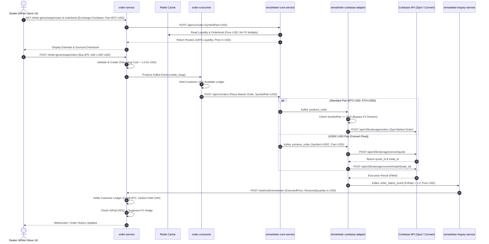

# 🚀 White Glove Dealer USD Swap Pair Support Implementation Plan

## 🎯 Goal & Overview

ยกระดับระบบการซื้อขายใน Dealer Flow (White Glove) ให้รองรับการเทรดสินทรัพย์ดิจิทัลด้วยสกุลเงิน **USD** (เช่น `BTC-USD`, `ETH-USD`, `USDT-USD`, `USDC-USD`) แบบ End-to-End ครอบคลุมทั้งฝั่ง **Order Domain** (`order-service`, `order-consumer`) และ **Platform Domain** (`remarketer-core-service`, `remarketer-coinbase-adaptor-service`, `remarketer-inquiry-service`, `dealer-core-service`) พร้อมรองรับการเทรด `USDC-USD` ผ่าน Coinbase Convert API

---

## 📋 Acceptance Criteria (AC)

| # | ข้อกำหนด (Acceptance Criteria) | ขอบเขตของระบบที่รับผิดชอบ |
|---|---|---|
| **AC 1** | หน้าจอ Overview (White Glove) รองรับการแสดงผลสกุลเงิน **USD** ใน Portfolio | `order-service` (Crypto Product / Portfolio) |
| **AC 2** | รองรับการเทรด (Swap) คู่เทรดสกุลเงิน USD ตั้งแต่ต้นจนจบธุรกรรม (End-to-End) | `order-service`, `order-consumer`, `remarketer-core`, `coinbase-adaptor` |
| **AC 3** | Implement ครบถ้วนทั้งฝั่ง Order Domain และ Platform Domain | ทุกเซอร์วิสที่เกี่ยวข้อง |
| **AC 4** | แสดง Orderbook ตาม Exchange ที่เลือกบนหน้าจอ White Glove | `order-service` (Orderbook Cache / Route) |
| **AC 5** | ข้อมูล Order แสดงผลถูกต้องในทุกหน้าที่เกี่ยวข้อง (Swap Estimate, Open Orders, Order History/Detail, Trading Menu) | `order-service` (DTO, Decimal & Currency Formatting) |
| **AC 6** | แสดง Liquidity ตามจริง 100% (Config = 100%) และรองรับสกุลเงิน USD | `remarketer-core-service` (Route & Liquidity Buffer) |
| **AC 7** | กำหนดค่า Average Cost = `1.0` สำหรับฝั่ง Fiat ใน Swap Transaction (ทั้ง THB และ USD) | `order-service` (Swap Request & Webhook Settlement) |
| **AC 8** | รองรับการเทรดคู่ `USDC-USD` บน Coinbase ผ่าน Convert API (`/convert/quote` & `/convert/trade/{trade_id}`) | `remarketer-coinbase-adaptor-service` (Convert Client & Flow) |
| **AC 9** | หากไม่มี Exchange ใดรองรับคู่เหรียญที่เลือก ให้ Return Error `"No Available Sourced Exchange"` | `order-service`, `remarketer-core-service` |
| **AC 10** | ซ่อน (Filter out) สกุลเงิน USD ออกจากเมนู Deposit และ Withdraw ของลูกค้า | `order-service` (Crypto Product Service) |
| **AC 11** | กรอง (Filter out) Order ที่เกิดจาก Dealer ออกจาก Recent Trades ของหน้าบ้าน (Retail Channels) | `order-service` (Order Trade Transaction Repository) |

---

## 🏗️ System Architecture & End-to-End Sequence



---

## ⚠️ Critical Findings & Technical Risks

จากการตรวจสอบโค้ดจริงในระบบอย่างละเอียด พบจุดเสี่ยงระดับวิกฤต (Critical Risks) ที่ต้องแก้ไขอย่างระมัดระวัง:

### 1. 🚨 Coinbase Adaptor หาร PlacedQuantity ด้วย FX Rate (~35)
* **ตำแหน่ง:** `remarketer-coinbase-adaptor-service/pkg/placeorder/service.go` ฟังก์ชัน `convertCurrencyInput` (L755)
* **ปัญหา:** โค้ดเดิมจะนำ `PlacedQuantity` หารด้วย `fxRate` เสมอเมื่อเป็นฝั่ง `buy` เพื่อแปลง THB $\rightarrow$ USD ก่อนส่งไป Coinbase
* **ผลกระทบ:** หาก Dealer ส่งคำสั่งซื้อด้วย 1,000 USD ระบบจะหาร 35 เหลือส่งไป Coinbase เพียง **$28.57 USD**!
* **แนวทางแก้ไข:** ตรวจสอบ `msg.SymbolPair == "USD"` หากเป็น USD ให้ **Bypass การหาร FX Rate โดยเด็ดขาด**

### 2. 🚨 Remarketer Core นำ Orderbook Price และ Liquidity คูณด้วย FX Rate
* **ตำแหน่ง:** 
  - `remarketer-core-service/pkg/route/service.go` ฟังก์ชัน `MatchOrderMarket` (L93, L222)
  - `remarketer-core-service/pkg/order/service.go` ฟังก์ชัน `ValidateLiquidity` (L589)
* **ปัญหา:** ระบบเดิมมองว่า Coinbase มี quote currency เป็น USD จึงต้องคูณ FX Rate (~35) เพื่อแปลงเป็นเงินบาท (THB) เสมอ
* **ผลกระทบ:** 
  - ราคา BTC-USD (~$60,000 USD) จะถูกคูณ 35 กลายเป็น **$2,100,000** บนหน้าจอ Swap!
  - ยอด Liquidity USD บน Coinbase จะถูกคูณ 35 ทำให้ยอดประเมินสภาพคล่องผิดพลาดมหาศาล
* **แนวทางแก้ไข:** หาก `route.SymbolPair == "USD"` ให้กำหนด `fxRate = 1.0` และไม่คูณ FX Rate ใน Orderbook และ Liquidity

### 3. 🚨 Webhook Event คูณ Executed Data ด้วย FX Rate นำไปสู่การเสกเงินลูกค้า (Disaster Risk)
* **ตำแหน่ง:** `remarketer-coinbase-adaptor-service/pkg/inquiry_order_status/service.go` ฟังก์ชัน `buildFillStatusEvent` (L466-L538)
* **ปัญหา:** เมื่อ Coinbase ส่งสถานะ Fill กลับมา Adaptor จะนำ `ExecutedPrice`, `ExecutedQuantity`, `ReceivedQuantity`, `ExchangeFee` คูณด้วย `FxRate` เพื่อส่งต่อให้ `order-service`
* **ผลกระทบ:** ใน `order-service/pkg/order_trade/service_ledger.go:L1300` ฟังก์ชัน settle ledger ฝั่งขาย BTC ได้ USD จะนำ `ReceivedQuantity` ไปเข้ากระเป๋า Available USD ของลูกค้า หากโดนคูณ 35 ลูกค้าขาย 1 BTC ได้ $60,000 USD ระบบจะบันทึกเงินเข้ากระเป๋าเป็น **$2,100,000 USD**!
* **แนวทางแก้ไข:** สำหรับคู่เทรด USD ต้องบังคับให้ `FxRate = 1.0` และคงค่า `ReceivedQuantity`, `ExecutedPrice` เป็นยอด USD จริงตามที่ Coinbase ส่งมา

### 4. 🚨 Order Service Webhook ยิง FX Hedge อัตโนมัติสำหรับรายการ USD
* **ตำแหน่ง:** `order-service/pkg/order_trade/webhook_service.go` (L402)
* **ปัญหา:** โค้ดเดิมมีเงื่อนไข `if flag && orderTradeExchanges[0].IsPairUSD() { ProduceOrderHedgeTransaction(...) }` เพื่อ hedge ความเสี่ยง FX ระหว่าง THB และ USD เมื่อเทรดบน Coinbase
* **ผลกระทบ:** ใน Dealer USD Flow ลูกค้าจ่ายและรับเป็นเงิน **USD** โดยตรง และ Coinbase เทรดด้วย USD บริษัทจึง **ไม่มี FX Exposure เลย (Zero Exposure)** หากระบบยังส่ง Hedge Transaction ไป KTB จะทำให้บริษัทเกิด Position ผิดพลาดและขาดทุนจาก FX สองต่อ
* **แนวทางแก้ไข:** เพิ่มเงื่อนไข `!orderTrade.IsPairUSD()` เพื่อปิดการส่ง Hedge เมื่อคำสั่งซื้อขายของลูกค้าเป็นคู่ USD

### 5. 🚨 กลไก Coinbase Convert API สำหรับคู่เหรียญ USDC-USD
* **ตำแหน่ง:** Coinbase ไม่รองรับ Standard Orderbook Spot Trading สำหรับคู่ `USDC-USD` แต่ให้บริการผ่าน **Convert API** (`POST /api/v3/brokerage/convert/quote` และ `POST /api/v3/brokerage/convert/trade/{trade_id}`)
* **พฤติกรรม:** Convert API เป็นการแปลงระหว่างกระเป๋า USD และ USDC ของบริษัทใน Coinbase ที่เรต 1:1 ไม่มีค่าธรรมเนียม (Zero Fee) และไม่มี Slippage
* **กรณีไม่มีเหรียญในกระเป๋า Coinbase:**
  - *ลูกค้าซื้อ USDC ด้วย USD:* กระเป๋า Coinbase มี 0 USDC ทำรายการได้ปกติ (Coinbase หัก USD แล้วเติม USDC ให้)
  - *ลูกค้าขาย USDC เป็น USD:* หากกระเป๋า Coinbase มี 0 USDC ระบบจะดักที่ Remarketer Core Pre-trade Check และปฏิเสธคำสั่งทันทีด้วย `"No Available Sourced Exchange"` และหากหลุดไปถึง Coinbase จะถูก Reject ด้วย `INSUFFICIENT_FUNDS` ซึ่ง Order Service จะทำการ Unheld เหรียญคืนลูกค้าอัตโนมัติ

---

## 🛠️ รายละเอียดการแก้ไขแยกตามเซอร์วิส (Component Breakdown)

---

### 1. 🗄️ Database & Master Data Configuration

#### 1.1 `dw_product` & `dw_sale`
* **`dw_product.product`**: ตรวจสอบและเพิ่ม USD ในฐานะ Fiat Product:
  ```sql
  -- AssetGroupCode: "50" (Fiat), ProductType: "FIAT", Symbol: "USD", Code: "USD"
  INSERT INTO dw_product.product (code, symbol, name_th, name_en, product_type, asset_group_code, is_active)
  VALUES ('USD', 'USD', 'ดอลลาร์สหรัฐ', 'US Dollar', 'FIAT', '50', true)
  ON CONFLICT (code) DO NOTHING;
  ```
* **`dw_product.product_digital_asset_extension`**: กำหนดจำนวนทศนิยมสำหรับ USD เป็น 2 ตำแหน่ง:
  ```sql
  INSERT INTO dw_product.product_digital_asset_extension (product_id, decimal_digit, min_trading_amount)
  VALUES ((SELECT id FROM dw_product.product WHERE code = 'USD'), 2, 1.00)
  ON CONFLICT (product_id) DO UPDATE SET decimal_digit = 2;
  ```
* **`dw_sale.digital_asset_trade_pair`**: เปิดใช้งานคู่เทรด USD สำหรับ Dealer:
  - `BTC-USD`, `ETH-USD`, `USDT-USD`, `USDC-USD`

#### 1.2 `dw_remarketer`
* **`dw_remarketer.source_strategy_mapping_dealer`**: ผูกคู่เทรด USD เข้ากับ Source Exchange `coinbase`:
  ```sql
  INSERT INTO dw_remarketer.source_strategy_mapping_dealer (symbol, symbol_pair, source_id, is_ui_active, is_system_active)
  VALUES 
    ('BTC', 'USD', 'coinbase', true, true),
    ('ETH', 'USD', 'coinbase', true, true),
    ('USDT', 'USD', 'coinbase', true, true),
    ('USDC', 'USD', 'coinbase', true, true)
  ON CONFLICT DO NOTHING;
  ```

---

### 2. 📦 `order-service`

#### 2.1 `pkg/crypto_product/service.go`
* **AC 1 & AC 10: Overview Portfolio & Deposit/Withdraw Filter**
  - ในฟังก์ชัน `GetSourceStrategy`: กำหนดให้สกุลเงิน `"USD"` พร้อมใช้งานเสมอสำหรับ Dealer:
    ```go
    sourceStrategy["USD"] = true
    ```
  - ในฟังก์ชัน `GetProductCrypto`: กรอง (Filter) เหรียญ `USD` ออกเมื่อคำสั่งเป็นประเภท Deposit หรือ Withdraw:
    ```go
    if (orderType == "deposit" || orderType == "withdraw") && p.Symbol == "USD" {
        continue
    }
    ```
  - ในฟังก์ชัน `GetSwapProductCrypto`: ตรวจสอบสถานะ Maintenance เฉพาะ Quote Currency ที่เกี่ยวข้อง (ไม่ผูกติดกับการเช็ค THB เสมอไป)

#### 2.2 `pkg/order_trade/swap_service.go` & `webhook_service.go`
* **AC 7: กำหนด Fiat Average Cost = 1.0**
  - ใน `MakeSwapOrderRequest`: เมื่อสินทรัพย์เป็น Fiat (`THB` หรือ `USD` หรือ `ProductType == "FIAT"`):
    ```go
    if orderTrade.IsPairFiat() || orderTrade.ProductSymbol() == "THB" || orderTrade.ProductSymbol() == "USD" {
        orderTrade.AverageCost = decimal.NewFromInt(1)
    }
    ```
  - ใน `resolveOrderTradeAverageCost` (`webhook_service.go`):
    ```go
    if orderTrade.IsPairFiat() || orderTrade.ProductSymbol() == "THB" || orderTrade.ProductSymbol() == "USD" {
        return decimal.NewFromInt(1), nil
    }
    ```

#### 2.3 `pkg/order_trade/webhook_service.go`
* **AC 2: ปิดการส่ง FX Hedge เมื่อเป็นรายการ USD**
  - ที่บรรทัด ~402 ในส่วน `ProduceOrderHedgeTransaction`:
    ```go
    // เดิม: if flag && orderTradeExchanges[0].IsPairUSD()
    // ปรับเป็น: ทำ Hedge เฉพาะกรณีที่ Exchange เทรด USD แต่ลูกค้าเทรดด้วย THB เท่านั้น
    if flag && orderTradeExchanges[0].IsPairUSD() && !orderTrade.IsPairUSD() {
        produceErr := s.producer.ProduceOrderHedgeTransaction(ctx, hedgeMsg)
        ...
    }
    ```

#### 2.4 `storages/postgres/ordertraderepository/order_trade_transaction_repository.go`
* **AC 11: กรองคำสั่งของ Dealer ออกจาก Recent Trades ของ Retail**
  - ในฟังก์ชัน `GetRecentTrades(symbol, symbolPair)`:
    เพิ่มการ JOIN ไปยังตาราง `order_trade` และตรวจสอบบัญชีลูกค้าที่ไม่ใช่ Dealer (`customer_tier != 10` หรือ Channel ไม่ใช่ Dealer):
    ```sql
    JOIN xpg_order.order_trade_information oti ON oti.id = ott.trade_information_id
    JOIN xpg_order.order_trade ot ON ot.id = oti.order_request_id
    WHERE ott.symbol = ? AND ott.symbol_pair = ? AND ott.status = 'FILLED'
      AND ot.customer_account_id NOT IN (
          SELECT id FROM dw_customer.customer_account WHERE customer_tier = 10
      )
    ORDER BY ott.created_at DESC LIMIT ?
    ```

#### 2.5 `handler/white_glove_handler.go` & `pkg/order_trade/service.go`
* **AC 4 & AC 9: Orderbook ตาม Exchange & Error จัดการ Route**
  - เพิ่ม Query Parameter `exchange` และ `symbol_pair` ใน `GetWhiteGloveOrderBook`
  - ดึงข้อมูล Orderbook จาก Redis Key `ORDERBOOK#[EXCHANGE]#[SYMBOL]-[SYMBOL_PAIR]#[SIDE]`
  - ใน `GetWhiteGloveSwapRoutes`: หาก Remarketer คืนค่า routes ว่างเปล่า (`len(routes) == 0`):
    ```go
    if len(routes) == 0 {
        return nil, apperror.NewCustomError(http.StatusBadRequest, "No Available Sourced Exchange")
    }
    ```

#### 2.6 `handler/white_glove_dto.go` & DTO Formatting
* **AC 5: ความถูกต้องของการแสดงผลข้อมูล Order**
  - แทนที่ Hardcoded `"THB"` ในหน้า Open Orders, Order History, Order Detail ด้วย `QuoteCurrency`
  - จัดรูปแบบทศนิยม 2 ตำแหน่งสำหรับยอดเงิน USD

---

### 3. 📦 `order-consumer`

#### 3.1 `pkg/digital-asset-order-request/swap.go`
* **AC 2: ตรวจสอบ Balance และการ Hold เงิน USD**
  - ในฟังก์ชัน `resolveBuyPlacedQuantity`: ตรวจสอบและดึงข้อมูล `decimal_digit = 2` สำหรับสกุลเงิน USD
  - ในฟังก์ชัน `isSufficientBalance`: ตรวจสอบยอด Available Balance ของ USD ใน Logical Ledger
  - ส่ง parameter `symbol_pair: "USD"` และ `client_type: "dealer"` ในการเรียก `remarketerService.Trade`

---

### 4. 📦 `remarketer-core-service`

#### 4.1 `pkg/route/service.go`
* **AC 2 & AC 6: Route Calculation & 100% Actual Liquidity Display**
  - ในฟังก์ชัน `MatchOrderMarket`:
    ```go
    // ตรวจสอบว่าเป็นคู่เทรด USD หรือไม่
    isUSDPair := route.SymbolPair != nil && strings.EqualFold(*route.SymbolPair, "USD")
    
    // หากเป็น USD Pair และมาจาก Exchange สกุล USD (เช่น Coinbase) ให้ใช้เรต 1.0 ไม่คูณ FX
    if isUSDPair && strings.EqualFold(route.SourceCurrency, "USD") {
        fxRate = decimal.NewFromInt(1)
    }
    ```
  - ในฟังก์ชัน `getBuyLiquidity`: ส่งคืนยอดสภาพคล่อง USD จริงตามที่ดึงได้จาก Redis โดยไม่คูณ FX Rate
  - ปรับค่า Liquidity Buffer Config ให้รองรับการตั้งค่าเป็น `0%` เพื่อแสดงผล 100% Actual Liquidity ตามความต้องการของ Dealer

#### 4.2 `pkg/order/service.go`
* **AC 2: Liquidity Pre-trade Validation**
  - ในฟังก์ชัน `ValidateLiquidity`:
    ```go
    if strings.EqualFold(input.SymbolPair, "USD") {
        // สำหรับคู่ USD ให้เปรียบเทียบยอด Quantity กับ Balance USD โดยตรง ไม่คูณ OriginalNavBuy
        if totalLiquidity.LessThan(input.Quantity) {
            return false, ErrInsufficientLiquidity
        }
    }
    ```

---

### 5. 📦 `remarketer-coinbase-adaptor-service`

#### 5.1 `pkg/placeorder/service.go`
* **AC 2: ป้องกันการหารด้วย FX Rate สำหรับคู่ USD**
  - ในฟังก์ชัน `convertCurrencyInput` (L755):
    ```go
    // อนุญาตให้แปลงเรตเฉพาะกรณีที่ส่งเข้ามาเป็น THB เท่านั้น
    if strings.EqualFold(msg.OrderSide, "buy") && !fxRate.IsZero() && !strings.EqualFold(msg.SymbolPair, "USD") {
        copied.PlacedQuantity = msg.PlacedQuantity.Div(fxRate).RoundDown(2)
    }
    ```

#### 5.2 `pkg/inquiry_order_status/service.go`
* **AC 2 & AC 3: ป้องกันการคูณ FX Rate ใน Webhook Event**
  - ในฟังก์ชัน `buildFillStatusEvent` (L466-L538):
    ```go
    // หากเป็นคู่ USD ให้กำหนด FxRate เป็น 1.0 เสมอ เพื่อรักษายอด Executed Data ให้เป็น Pure USD
    if strings.EqualFold(symbolPair, "USD") {
        event.FxRate = decimal.NewFromInt(1)
        event.ExecutedPrice = rawPrice
        event.ReceivedQuantity = rawReceivedQuantity
    }
    ```

#### 5.3 `third_party/coinbase/convert.go` [NEW] & `pkg/placeorder/service.go`
* **AC 8: Coinbase Convert API สำหรับ USDC-USD**
  - สร้าง Client Interface และ Implementation สำหรับ Coinbase Convert API:
    1. `CreateConvertQuote(ctx, fromAccount, toAccount, amount)`:
       - Endpoint: `POST /api/v3/brokerage/convert/quote`
       - คืนค่า `quote_id`, `trade_id`, `from_amount`, `to_amount`
    2. `CommitConvertTrade(ctx, tradeID)`:
       - Endpoint: `POST /api/v3/brokerage/convert/trade/{trade_id}`
       - ดำเนินการยืนยันการแปลงเหรียญ
  - ใน `pkg/placeorder/service.go`:
    ```go
    if (strings.EqualFold(msg.Symbol, "USDC") && strings.EqualFold(msg.SymbolPair, "USD")) ||
       (strings.EqualFold(msg.Symbol, "USD") && strings.EqualFold(msg.SymbolPair, "USDC")) {
        return s.executeCoinbaseConvert(ctx, msg)
    }
    // สกุลเงินอื่นส่งคำสั่ง Spot ปกติไปยัง Coinbase /orders
    return s.executeCoinbaseSpotOrder(ctx, msg)
    ```

---

## 🧪 แผนการทดสอบและการตรวจสอบ (Verification Plan)

### 1. Automated Tests

#### `order-service`
```bash
cd /Users/soratgessakorn/Work/Projects/xas/order-service
make test
```
*Test cases ที่ต้องเพิ่มและยืนยัน:*
- `TestGetProductCrypto_FiltersUSDOnDepositWithdraw`: ตรวจสอบว่า USD ไม่ปรากฏในรายการ Deposit/Withdraw
- `TestMakeSwapOrderRequest_FiatAverageCostIsOne`: ตรวจสอบว่า `AverageCost = 1.0` สำหรับทั้ง THB และ USD
- `TestProcessRemarketerWebhook_USDDoesNotTriggerHedge`: ตรวจสอบว่า webhook ของ order USD ไม่ส่ง message เข้า topic hedge
- `TestGetRecentTrades_ExcludesDealerOrders`: ตรวจสอบว่า Recent Trades ไม่คืนค่าคำสั่งที่เกิดจาก Dealer Account
- `TestGetWhiteGloveOrderBook_ByExchangeAndUSD`: ตรวจสอบการดึง Orderbook ตาม Exchange และ Pair USD

#### `order-consumer`
```bash
cd /Users/soratgessakorn/Work/Projects/xas/order-consumer
make test
```
*Test cases ที่ต้องเพิ่มและยืนยัน:*
- `TestProcessSwapOrder_USDBalanceHold`: ยืนยันการ Hold ยอดเงิน USD ใน Logical Ledger 2 ตำแหน่งทศนิยม
- `TestProcessSwapOrder_DealerRouting`: ยืนยันการส่ง Request ไปยัง Remarketer ด้วย parameter ที่ถูกต้อง

#### `remarketer-core-service`
```bash
cd /Users/soratgessakorn/Work/Projects/xas/remarketer/remarketer-core-service
go test -v ./pkg/route ./pkg/order
```
*Test cases ที่ต้องเพิ่มและยืนยัน:*
- `TestMatchOrderMarket_USDPair_NoFXMultiplier`: ตรวจสอบว่าราคาประเมินและเรตไม่ถูกคูณด้วย 35
- `TestValidateLiquidity_USDPair`: ตรวจสอบการ Validate ยอด Balance USD จริงบน Coinbase

#### `remarketer-coinbase-adaptor-service`
```bash
cd /Users/soratgessakorn/Work/Projects/xas/remarketer/remarketer-coinbase-adaptor-service
go test -v ./pkg/placeorder ./pkg/inquiry_order_status
```
*Test cases ที่ต้องเพิ่มและยืนยัน:*
- `TestConvertCurrencyInput_USDPair_BypassDiv`: ยืนยันว่า PlacedQuantity ไม่ถูกหารด้วย FX Rate
- `TestBuildFillStatusEvent_USDPair_FxRateOne`: ยืนยันว่า FxRate เป็น 1.0 และยอดเงินไม่ถูกคูณ 35
- `TestExecuteCoinbaseConvert_Success`: ยืนยันการเรียก Quote & Trade สำหรับ USDC-USD

---

### 2. Manual End-to-End Verification Checklist

| ขั้นตอนการทดสอบ | สิ่งที่ต้องสังเกต / คาดหวัง |
|---|---|
| **1. Overview Portfolio** | ตรวจสอบหน้า Overview ของ Dealer ว่าแสดงผลกระเป๋า USD พร้อมยอดเงินและทศนิยม 2 ตำแหน่งถูกต้อง |
| **2. Deposit/Withdraw Menus** | ตรวจสอบเมนู Deposit และ Withdraw ว่า **ไม่มี** ตัวเลือกสกุลเงิน USD แสดงขึ้นมา |
| **3. Sourced Orderbook** | เลือกคู่ `BTC-USD` และเลือก Exchange เป็น Coinbase ยืนยันว่า Orderbook แสดง Bids/Asks ตาม Coinbase ในหน่วย USD |
| **4. Swap Estimate & 100% Liquidity** | ตรวจสอบเรตหน้า Swap ว่าแสดงผลเป็นราคา USD (~$60,000) ไม่ใช่ราคาบาท (~2.1 ล้านบาท) และ Liquidity แสดงผล 100% |
| **5. Order Placement (BTC-USD)** | ส่งคำสั่งซื้อ BTC ด้วย 1,000 USD ตรวจสอบใน Coinbase Adaptor Log ว่าส่งคำสั่งด้วย 1,000 USD จริง (ไม่ถูกหารเหลือ $28.57) |
| **6. Convert Flow (USDC-USD)** | ส่งคำสั่งสลับคู่ `USDC-USD` ยืนยันว่าระบบเรียก Convert API บน Coinbase สำเร็จแบบ 1:1 ไม่มี Slippage |
| **7. No Sourced Exchange Error** | เลือกลองเทรดคู่ที่ไม่มี Exchange รองรับ ระบบต้องตอบ Error `400 Bad Request` พร้อมข้อความ `"No Available Sourced Exchange"` |
| **8. Settlement & Zero FX Hedge** | ตรวจสอบสถานะ Order เมื่อ Filled ว่าเงินตัด/เข้าถูกต้อง และ **ไม่มีการส่งคำสั่ง Hedge** เข้า Kafka |
| **9. Recent Trades Privacy** | เปิดหน้า Recent Trades ของลูกค้ารายย่อย (Retail Mobile/Web) ยืนยันว่า **ไม่พบ** รายการเทรดของ Dealer |
