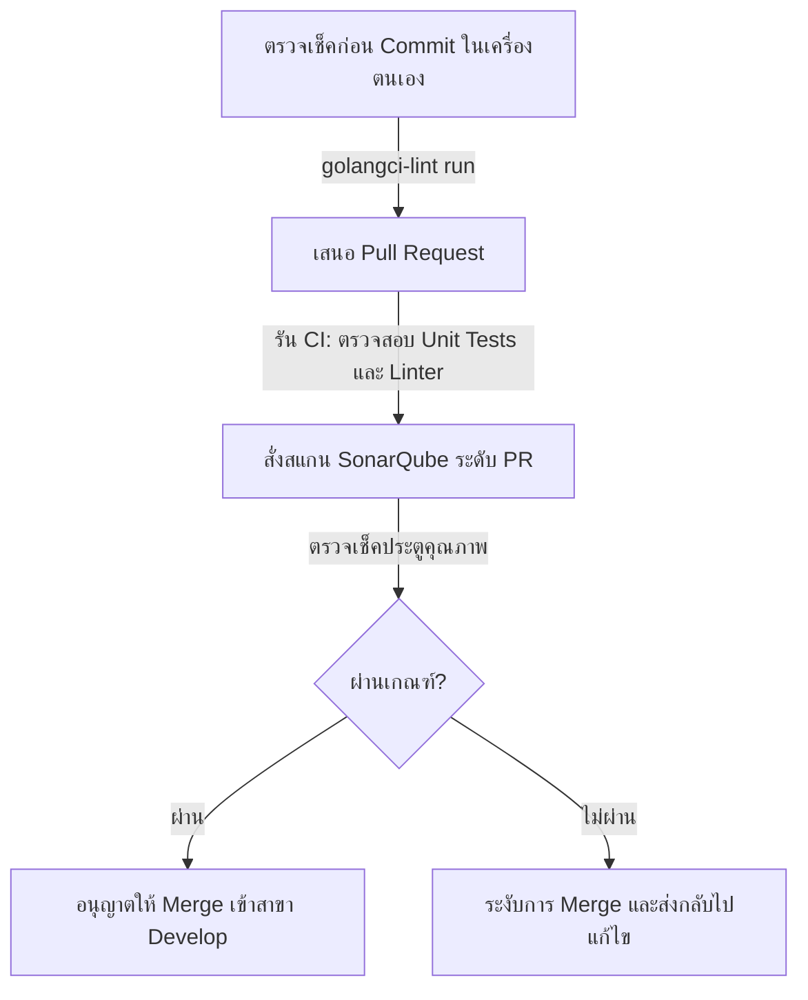

# แนวปฏิบัติที่ดีที่สุด (Best Practices) สำหรับ Logging และ Sonar Code Quality

เอกสารนี้สรุปข้อค้นพบจากการตรวจสอบ (Audit Findings) การตั้งค่า Logging และ SonarQube ในโปรเจกต์ `order-service` พร้อมข้อเสนอแนะเกี่ยวกับแนวปฏิบัติที่ดีที่สุดและรูปแบบมาตรฐาน (Best Practices & Patterns) เพื่อใช้เป็นแนวทางอ้างอิงและอภิปรายในประชุม **Application Log Pattern / Sonar Pattern** ของทีม

---

## ส่วนที่ 1: มาตรฐานการเขียน Log (Application Log Pattern)

### 1. ปัญหาปัจจุบันที่พบใน `order-service`

#### A. การใช้ข้อความ Log หลักแบบคงที่ (Static Primary Log Messages)
ใน [log.go](file:///Users/soratgessakorn/Work/Projects/xas/order-service/utils/log.go) ฟังก์ชันตัวช่วยการเขียน log ส่วนใหญ่ถูกกำหนดให้ใช้ข้อความเริ่มต้นคงที่ เช่น:
```go
// utils/log.go
func InfoLog(funcName, str string) {
	log.WithFields(log.Fields{
		"application": os.Getenv("APP_NAME"),
		"function":    funcName,
		"message":     str,
		"timestamp":   time.Now(),
	}).Info("Log") // <-- ข้อความหลักแบบคงที่: "Log"
}
```
* **ผลกระทบ:** ในระบบรวมรวม Log (เช่น Elasticsearch, Kibana, AWS CloudWatch) ข้อความหลักของ log ทุกบรรทัดจะแสดงคำว่า `"Log"` หรือ `"Internal Error"` เหมือนกันหมด ทำให้ไม่สามารถค้นหา คัดกรอง หรือจัดกลุ่มตามเหตุการณ์จริงที่เกิดขึ้นในระดับหน้าแรกได้เลย

#### B. ความเสี่ยงต่อการเกิด Elasticsearch Type Conflict (Mapping Conflict)
* ตัวอย่างชนิดข้อมูลที่ขัดแย้งกันในโค้ด:

```go
// 1. ส่งเป็น String
map[string]any{logs.ErrorLog: "fail to bind query params"}

// 2. ส่งเป็น Error Type
map[string]any{logs.ErrorLog: err}

// 3. ส่งเป็น Nested Map (โครงสร้าง Object ซ้อน)
map[string]interface{}{logs.ErrorLog: map[string]interface{}{"err": err, "order_request_id": orderRequestId.String()}}
```

* **ผลกระทบ:** ระบบจัดการ Log เช่น Elasticsearch จะทำดัชนี (Index) ฟิลด์แบบไดนามิกตามเอกสารแรกที่ได้รับ หากจุดหนึ่งส่งเป็นข้อความธรรมดา (String) แต่อีกจุดหนึ่งส่งเป็น Object/JSON ซ้อนในชื่อฟิลด์เดียวกัน (`error_log`) จะเกิด **Type Mapping Conflict** ซึ่งส่งผลให้ Elasticsearch **ปฏิเสธและทิ้ง Log บรรทัดนั้นๆ โดยไม่มีการบันทึก (Dropped Logs)** ทำให้ข้อมูล Log ที่สำคัญสูญหายไปในระบบการผลิต

#### C. การใช้ชื่อฟังก์ชันเป็นข้อความหลักของ Log
ในส่วน Handler (เช่น [confirmation_handler.go](file:///Users/soratgessakorn/Work/Projects/xas/order-service/handler/confirmation_handler.go)) บ่อยครั้งที่มีการส่งชื่อฟังก์ชันหลักแบบสั้นหรือคงที่เป็นข้อความหลักของ Log แทนคำอธิบายเหตุการณ์จริง:
```go
// handler/confirmation_handler.go
logs.ErrorWithContext(ctx, "ConfirmWithdrawOrder", map[string]interface{}{logs.ErrorLog: err})
```
* **ผลกระทบ:** บนหน้าจอ Dashboard คอลัมน์ข้อความหลักจะแสดงเพียงชื่อฟังก์ชันแบบคงที่ เช่น `ConfirmWithdrawOrder` ซึ่งไม่ได้ระบุสถานะจริงว่าความล้มเหลวเกิดที่ส่วนใด (เช่น Token Expired, Database error หรือ User mismatch) และตัวแปรที่สำคัญของ request เช่น `confirmationID` หรือ `request.User` ไม่ได้ถูกบันทึกแวดล้อมลงไปด้วย

#### D. การจัดรูปแบบข้อมูลแบบ Unstructured (การต่อ String)
มีการใช้การแปลงโครงสร้างข้อมูลตัวแปร (Struct) ให้กลายเป็นข้อความเดียวผ่าน `fmt.Sprintf` หรือ `utils.AnyToString` ก่อนบันทึกลง Log:
```go
// handler/order_handler.go
logs.InfoWithContext(ctx, "UploadDocument", map[string]interface{}{logs.DataLog: fmt.Sprintf("request from : %+v", dataLogValue)})
```
#### E. การสูญเสีย Trace ID จากการใช้ฟังก์ชัน Legacy Helper ที่ไม่มี Context
ในระบบมีฟังก์ชันผู้ช่วยด้านการบันทึก Log ดั้งเดิมใน [log.go](file:///Users/soratgessakorn/Work/Projects/xas/order-service/utils/log.go) คือ `utils.ErrorLog(...)` และ `utils.InfoLog(...)` ซึ่งกระจายอยู่ทั่วโปรเจกต์ (ในระดับ Handler, Service, Repository และ Audit Log) **รวมกันเกือบ 200 จุด** 

โดยฟังก์ชันดั้งเดิมเหล่านี้ **ไม่ได้ถูกออกแบบให้รับพารามิเตอร์ `context.Context`** เช่น:
```go
// handler/confirmation_handler.go (Line 176)
if saveErr := auditService.SaveAuditLogWithoutClaims(nil, auditLog, req, updatedBy); saveErr != nil {
    utils.ErrorLog("SaveAuditLog", auditLog.OrderID, saveErr) // <-- ไม่มี ctx ส่งเข้าไป
}
```
* **ผลกระทบ:** ทุกครั้งที่คำสั่งดั้งเดิมเหล่านี้ทำงาน จะได้ข้อมูล Log เป็นฟิกซ์เมสเสจ `"Internal Error"` หรือ `"Log"` และ **ไม่มีข้อมูล `trace_id` หรือ `request_id` แนบติดไปด้วยเลย** ส่งผลให้สายสัมพันธ์ของ Log ขาดตอน เมื่อเกิดปัญหาขึ้นแล้วนำ Trace ID ไปค้นหาในระบบ Kibana จะไม่พบเหตุการณ์ความล้มเหลวที่เกิดขึ้นจากจุดเหล่านี้เลย

---

### 2. แนวทางปฏิบัติที่ดีที่สุดสำหรับ Logging

#### กฎข้อที่ 1: ใช้ข้อความหลักของ Log ที่ระบุเหตุการณ์จริงและไม่ซ้ำซาก (Action-Oriented)
ข้อความหลัก (ข้อความพารามิเตอร์แรกของ Library) ต้องบอกว่าเกิด**เหตุการณ์อะไร**ขึ้นอย่างกระชับและเฉพาะเจาะจง ห้ามใช้คำกว้างๆ เช่น `"Log"`, `"Error"` หรือใช้เฉพาะชื่อฟังก์ชัน

* **ไม่ควรทำ:**
```go
logs.ErrorWithContext(ctx, "ConfirmWithdrawOrder", ...)
```
* **ควรทำ:**
```go
logs.ErrorWithContext(ctx, "Failed to verify confirmation token", ...)
```

#### กฎข้อที่ 2: รักษาความสม่ำเสมอของประเภทข้อมูลอย่างเคร่งครัด (Schema Consistency)
ระมัดระวังคีย์มาตรฐานให้ส่งข้อมูลประเภทเดิมเสมอ เพื่อป้องกันการถูกโยนทิ้งจากคลังข้อมูล:
* ฟิลด์ `logs.ErrorLog` ควรส่งเป็น **String เสมอ** (เช่นใช้ `err.Error()`)
* หากต้องการส่งข้อมูลบริบทเพิ่ม ให้ประกาศคีย์ระดับบนแยกออกมาโดยตรง ไม่นำไปซ้อนไว้ใน `ErrorLog` หรือ `DataLog`

#### กฎข้อที่ 3: ใช้ Structured Key-Value Pairs สำหรับข้อมูลแวดล้อม
ห้ามใช้วิธีแปลงทั้ง Struct เป็น String (เช่น `fmt.Sprintf` หรือ `AnyToString`) แต่ให้ระบุเป็น Field แยกคู่คีย์-ค่า เพื่อให้ Elasticsearch ทำดัชนีและค้นหาค่าของแต่ละฟิลด์ได้อย่างอิสระ

* **ไม่ควรทำ:**
```go
map[string]any{logs.DataLog: fmt.Sprintf("request with %+v %+v %+v", id, page, orderType)}
```
* **ควรทำ:**

```go
logs.InfoWithContext(ctx, "GetHistoryOrderList request received", map[string]any{
    "user_id":     id.String(),
    "page":        page,
    "order_type":  orderType,
})
```

#### กฎข้อที่ 4: แยกข้อมูลชื่อฟังก์ชัน/ชื่อไฟล์ไปเป็น Metadata
ให้ยกระดับชื่อฟังก์ชันและชื่อไฟล์ไปเป็นข้อมูลเสริม (Metadata Fields) แทนที่จะเขียนทับไปในช่องข้อความหลัก โดยแนะนำให้ตั้งค่า Middleware/Library เพื่อดึงค่าบรรทัดและฟังก์ชันอัตโนมัติ หรือส่งแยกฟิลด์อย่างเป็นระบบ:
```go
logs.ErrorWithContext(ctx, "Failed to verify confirmation token", map[string]any{
    "function": "WhiteGloveHandler.ConfirmWithdrawOrder",
    "error":    err.Error(),
})
```

#### กฎข้อที่ 5: ใช้ระดับของ Log (Log Levels) ให้เหมาะสมตามความรุนแรง
* **DEBUG:** ข้อมูลสำหรับผู้พัฒนาใช้ไล่โค้ดชั่วคราว (ไม่เปิดใช้งานบน Production)
* **INFO:** เหตุการณ์สำคัญทางธุรกิจหรือสถานะการทำงานปกติของระบบ (เช่น `"Order processed successfully"`)
* **WARN:** ปัญหาผิดปกติที่เกิดขึ้น แต่ระบบยังสามารถจัดการต่อเองได้โดยไม่ต้องตอบกลับเป็น Error แก่ลูกค้า (เช่น `"Payment gateway connection timeout, retrying request"`)
* **ERROR:** ข้อผิดพลาดที่ทำให้การทำงานนั้นๆ ล้มเหลวและต้องการการตรวจสอบด่วน (เช่น `"Database query failed"`, `"External API return 5xx"`)

> [!NOTE]
> **ทำไมโค้ดใน Handler แทบไม่มีการเขียน Info Log ด้วยตัวเอง?**
> เนื่องจากตัวแปรเซิร์ฟเวอร์หลัก `httpserv.New()` (ที่ประกาศใน [main.go](file:///Users/soratgessakorn/Work/Projects/xas/order-service/cmd/main.go)) ได้ลงทะเบียน **Access Log Middleware** จาก Library ส่วนกลางไว้แล้วโดยอัตโนมัติ ซึ่งทำหน้าที่บันทึกข้อมูลการเข้า-ออกของ API ทั้งหมด (เช่น HTTP Method, Path, Status Code, Latency และ Trace ID) อยู่แล้ว ดังนั้นนักพัฒนาจึง**ไม่จำเป็นต้องเรียกใช้ Info Log ซ้ำซ้อนในระดับ Handler** อีก ยกเว้นเมื่อเกิดกระบวนการสำคัญที่เป็น Milestone หรือส่วนที่ไม่มี Middleware ครอบอยู่ (เช่น Background Worker, Cron Job หรือ Kafka Consumer)

#### กฎข้อที่ 6: แนวคิด "บันทึก Log เพียงครั้งเดียวที่ขอบนอกสุด และส่งต่อ Error พร้อมข้อมูลบริบท" (Log Once, Wrap with Context)
เพื่อหลีกเลี่ยงการพ่น Log ข้อผิดพลาดเดิมซ้ำซ้อนหลายครั้งในระบบ (Log Noise) ซึ่งเป็นสาเหตุของการสิ้นเปลืองทรัพยากรจัดเก็บ และรบกวนสมาธิผู้ดูแลระบบ ให้ยึดถือหลักการดังนี้:

* **ชั้นโค้ดด้านใน (Database / Repository / Service Layer):** 
  ห้ามบันทึก Log ในระดับ `ERROR` โดยเด็ดขาด (ยกเว้นเคสที่มีการ Recovery หรือการ Swallow Error เพื่อใช้ Logic สำรอง) แต่ให้ใช้กระบวนการ **Wrap Error** พร้อมแนบข้อมูลแวดล้อม (Context) แล้วส่งต่อ (Return) ขึ้นไปหาผู้เรียกใช้งานเสมอ:
```go
// ตัวอย่างระดับ Service
func (s *OrderService) GetOrder(ctx context.Context, orderID string) (*Order, error) {
    order, err := s.db.FindOrder(orderID)
    if err != nil {
        // ห้ามพ่น log ในชั้นนี้เด็ดขาด แต่ให้ห่อหุ้ม context แล้ว return ขึ้นไป
        return nil, fmt.Errorf("failed to retrieve order data (ID: %s): %w", orderID, err)
    }
    return order, nil
}
```

* **ชั้นโค้ดขอบนอกสุด (Handler / Controller / Consumer / Worker):** 
  เป็นจุดเดียวในวงจรชีวิต (Lifecycle) ของงานนั้นๆ ที่รับผิดชอบการบันทึก Log ข้อผิดพลาดจริง เพื่อรวบรวมร่องรอยและข้อมูลประกอบทั้งหมดเข้าด้วยกัน:
```go
// ตัวอย่างระดับ Handler
func (h *OrderHandler) GetDetail(req *httpserv.Request) (*httpserv.Response, error) {
    ctx := req.Request.Context()
    orderID := req.Param("id")

    order, err := h.orderService.GetOrder(ctx, orderID)
    if err != nil {
        // บันทึก Log ERROR แค่จุดนี้จุดเดียวของ Request
        logs.ErrorWithContext(ctx, "Failed to retrieve order transaction detail", map[string]any{
            "error_log": err.Error(), // จะแสดงร่องรอยการต่อสายข้อผิดพลาดทั้งหมดอย่างเป็นระเบียบ
            "order_id":  orderID,
        })
        return &httpserv.Response{StatusCode: 500, Message: "Internal Server Error"}, err
    }
    return &httpserv.Response{StatusCode: 200, Data: order}, nil
}
```

#### กฎข้อที่ 7: บังคับส่งต่อ Context เพื่อสแตมป์ Trace ID (Trace ID Context Propagation)
Trace ID (หรือ Request ID) คือหัวใจสำคัญในการสืบสวนหาต้นตอข้อผิดพลาดในสถาปัตยกรรม Microservices เพราะเมื่อเกิดปัญหาขึ้น ระบบจะใช้ Trace ID เดียวกันนี้ในการดึงข้อความ Log ทั้งหมดจากทุกบริการที่เกี่ยวข้อง (เช่น Gateway -> Order-Service -> DB -> Kafka -> Consumer) ออกมาเรียงตามเวลาการเกิดเหตุได้

* **การทำงานระดับ Library และคีย์จัดเก็บ (Key & Library Behavior):** 
  ฟังก์ชัน `logs.ErrorWithContext(ctx, ...)` และ `logs.InfoWithContext(ctx, ...)` ของทีมเรา (`git.xspringas.com/xas/library/logger/logs`) ได้รับการพัฒนาเพื่อดึงข้อมูล Trace ID ออกมาจาก `context.Context` โดยค้นหาจากคีย์ **`X-Correlation-ID`** (ซึ่งถูกส่งออกมาเป็นตัวแปรระดับ Global ในไลบรารีชื่อ **`logs.CorrelationId`**) และทำการสแตมป์ตัวแปรลงใน JSON Log ของระบบปลายทางให้อัตโนมัติ

* **แนวทางการดึงและตั้งค่า Trace ID ในโค้ด Go (Get/Set Trace ID Best Practice):**
  เพื่อหลีกเลี่ยงการเขียนเป็น string ดิบ (Magic String) เช่น `"X-Correlation-ID"` ตรงๆ ในซอร์สโค้ด ให้ใช้ตัวแปรระดับ Global ที่ไลบรารีส่งออกมาเป็นหลัก:
  
  1. **การดึง Trace ID จาก Context (Get):**
```go
import "git.xspringas.com/xas/library/logger/logs"

func GetTraceID(ctx context.Context) string {
    // ใช้ logs.CorrelationId เป็นคีย์ในการดึงค่าจาก ctx.Value
    if traceID, ok := ctx.Value(logs.CorrelationId).(string); ok {
        return traceID
    }
    return ""
}
```
  2. **การตั้งค่า Trace ID ลงใน Context ใหม่ (Set):**
```go
import "git.xspringas.com/xas/library/logger/logs"

// สวมค่า traceID ลงใน context ก่อนส่งต่อหรือบันทึก log
ctx := context.WithValue(context.Background(), logs.CorrelationId, traceID)
```

* **แนวปฏิบัติทั่วไปเพื่อไม่ให้สายสัมพันธ์ Trace ID หลุดหาย:**
  1. **ห้ามละทิ้ง Context กลางทาง:** ห้ามสร้าง Context ใหม่แบบลอยๆ (เช่นใช้ `context.Background()` หรือ `context.TODO()`) ในฟังก์ชันระดับ Service หรือ Repository เพราะจะทำให้สายสัมพันธ์การเชื่อมโยง Trace ID ขาดออกจากกันทันที
  2. **ส่งผ่าน Context ลงไปในทุกชั้นการทำงาน:** ทุกฟังก์ชัน (DB Call, Redis, Kafka, HTTP Outgoing Call) ต้องรับพารามิเตอร์ `ctx context.Context` เป็นพารามิเตอร์ตัวแรก และส่งต่อไปยังไลบรารีปลายทางเสมอ
  3. **การทำงานแบบ Asynchronous:** หากจำเป็นต้องแตกเทรดทำงานเบื้องหลัง (Goroutine) ห้ามส่ง `ctx` หลักลงไปตรงๆ เพราะอาจจะเจอปัญหา Context Cancellation เมื่อ Request เดิมทำงานเสร็จ ให้สร้าง Context ใหม่แล้วทำการคัดลอกเฉพาะคีย์ Trace ID จาก Context หลักแปะเข้าไปแทน

* **การส่งต่อ Trace ID ผ่าน Kafka (Kafka Context Propagation):**
  เมื่อมีการส่งข้อความ (Produce Message) ไปยัง Kafka เราจำเป็นต้องส่งต่อ `trace_id` ไปกับข้อความด้วย เพื่อให้ฝั่ง Consumer สามารถสืบทอด context ไปใช้งานต่อได้:
  1. **Layer Produce ต้องรับ Context:** ปรับปรุงฟังก์ชันใน `ProduceService` ให้รับพารามิเตอร์ `ctx context.Context` เป็นตัวแรก เพื่อให้เข้าถึง `trace_id` ของ Request ต้นทางได้
  2. **สแตมป์ Trace ID ลงใน Message:** ดึง `trace_id` จาก Context มาจัดเก็บลงใน JSON payload ของ Message (เช่น ฟิลด์ `TraceID` ใน `ProduceStandardMessage`) หรือใส่ผ่าน Kafka Headers:
```go
// ตัวอย่างการส่งผ่าน JSON Payload
message.ProduceStandardMessage = entities.ProduceStandardMessage{
    MessageKey:     key,
    MessageEvent:   event,
    UpdatedTime:    time.Now().UTC(),
    TraceID:        utils.GetTraceIDFromContext(ctx), // ดึง Trace ID แปะไปด้วย
}
```
  3. **Consumer ดึงมาสร้าง Context ใหม่:** เมื่อ Consumer ดึงข้อความมาประมวลผล ต้องนำ `trace_id` ที่แนบมากับ message ไปทำการตั้งค่าไว้ใน `context.Context` (ไม่ใช่การสุ่มสร้าง Correlation ID ขึ้นมาใหม่) ก่อนจะส่งต่อเข้าไปยังชั้น Business Logic ของฝั่ง Consumer:
```go
import "git.xspringas.com/xas/library/logger/logs"

// ฝั่ง Consumer (ใช้ logs.CorrelationId เป็นคีย์)
traceID := message.TraceID
ctx := context.WithValue(context.Background(), logs.CorrelationId, traceID)
```

* **การจัดการ Trace ID สำหรับ Background Jobs / Cron / Workers:**
  ในกรณีที่จุดเริ่มต้นของการทำงานไม่ได้มาจาก HTTP Request ของผู้ใช้ แต่เริ่มทำงานจากตัวระบบเอง (เช่น Cron Job หรือ Airflow DAG):
  1. **Job ทำหน้าที่เป็นจุดกำเนิด (Root):** ให้ตัว Job ทำการสุ่มสร้าง Trace ID ขึ้นมาใหม่ตั้งแต่บรรทัดแรกที่ทำงาน (เช่นใช้ UUIDv4)
  2. **ผูกเข้ากับ Context และส่งต่อ:** นำ Trace ID นั้นผูกเข้ากับ `context.Context` แล้วส่งผ่านไปยังฟังก์ชันลูกอื่นๆ ทั้งหมด รวมถึงการ Produce Message ไปยัง Kafka:
```go
import "git.xspringas.com/xas/library/logger/logs"

func RunBatchJob() {
    jobTraceID := uuid.New().String()
    ctx := context.WithValue(context.Background(), logs.CorrelationId, jobTraceID)
    
    logs.InfoWithContext(ctx, "Job started", nil)
    
    // ทุกการทำงานถัดจากนี้จะใช้ Trace ID เดียวกันทั้งหมด
    err := processBusinessLogic(ctx)
}
```

---

### 3. เปรียบเทียบรูปแบบผลลัพธ์ Log (Log Output Comparison)

เพื่อให้เห็นภาพผลกระทบจริงในระบบเก็บ Log (เช่น Kibana / Elasticsearch) ด้านล่างนี้คือตัวอย่างเปรียบเทียบผลลัพธ์ JSON ระหว่างโครงสร้างเดิมและแบบใหม่ที่เสนอ:

#### 🔴 รูปแบบเดิม (Current Log Structure)

**Log เส้นที่ 1 (ระดับ Handler - บันทึกชื่อฟังก์ชันเป็น Message):**
```json
{
  "level": "error",
  "time": "2026-06-06T11:00:00+07:00",
  "message": "ConfirmWithdrawOrder",
  "error_log": "fail to verify confirmation token",
  "X-Correlation-ID": "a1b2c3d4-e5f6-7a8b-9c0d-1e2f3a4b5c6d",
  "app_name": "order-service"
}
```

**Log เส้นที่ 2 (ระดับ Service - ส่งข้อมูลแบบโครงสร้างซ้อนเร้น Nested Map):**
```json
{
  "level": "error",
  "time": "2026-06-06T11:01:00+07:00",
  "message": "failed to process order and update status",
  "error_log": {
    "err": "database connection timeout",
    "order_request_id": "c19b38de-824f-4d32-8419-f538bb8b191c"
  },
  "X-Correlation-ID": "a1b2c3d4-e5f6-7a8b-9c0d-1e2f3a4b5c6d",
  "app_name": "order-service"
}
```

> [!CAUTION]
> **เกิด Elasticsearch Type Conflict!**
> สังเกตคีย์ `error_log` ใน Log เส้นที่ 1 ส่งข้อมูลประเภท **String** แต่ใน Log เส้นที่ 2 ส่งข้อมูลประเภท **Object** เมื่อ Elasticsearch บันทึก Log ตัวแรกไปแล้ว ดัชนีจะถูกตั้งค่าให้ฟิลด์นี้เก็บเฉพาะ String ส่งผลให้ Log เส้นที่ 2 (และเส้นต่อๆ ไปที่เป็น Object) **โดนทิ้งและไม่บันทึกในระบบค้นหาทันที**

---

#### 🟢 รูปแบบใหม่ที่เสนอ (Proposed Log Structure)

**Log เส้นที่ 1 (ระดับ Handler - ปรับปรุงหัวข้อและแยกคีย์ Metadata):**
```json
{
  "level": "error",
  "time": "2026-06-06T11:00:00+07:00",
  "message": "Failed to verify confirmation token",
  "error_log": "fail to verify confirmation token",
  "function": "WhiteGloveHandler.ConfirmWithdrawOrder",
  "X-Correlation-ID": "a1b2c3d4-e5f6-7a8b-9c0d-1e2f3a4b5c6d",
  "app_name": "order-service"
}
```

**Log เส้นที่ 2 (ระดับ Service - แปลงข้อมูลเป็นคีย์แบนราบเดี่ยวๆ Flat Fields):**
```json
{
  "level": "error",
  "time": "2026-06-06T11:01:00+07:00",
  "message": "Failed to process order and update status",
  "error_log": "database connection timeout",
  "order_request_id": "c19b38de-824f-4d32-8419-f538bb8b191c",
  "X-Correlation-ID": "a1b2c3d4-e5f6-7a8b-9c0d-1e2f3a4b5c6d",
  "app_name": "order-service"
}
```

> [!NOTE]
> คีย์ `error_log` มีข้อมูลเป็น **String เสมอ** ปราศจากปัญหา Type Conflict และข้อมูลบริบทอย่าง `order_request_id` หรือ `function` ถูกดันไปอยู่ในฟิลด์ระดับบนสุด ทำให้สามารถนำไป Query/Filter ค้นหาได้ง่ายขึ้น

---

#### 📊 ตารางเปรียบเทียบข้อดีและข้อเสีย (Pros & Cons)

| คุณสมบัติ / รูปแบบ | 🔴 รูปแบบเดิม (Current Pattern) | 🟢 รูปแบบใหม่ที่เสนอ (Proposed Pattern) |
| --- | --- | --- |
| **ความปลอดภัยของข้อมูล (Data Loss)** | ⚠️ **เสี่ยงสูงมาก** (Log โดนทิ้งจาก Type Conflict) | ✅ **ปลอดภัย 100%** (ชนิดข้อมูลประเภทคีย์ตรงกันสม่ำเสมอ) |
| **ความสะดวกในการไล่โค้ด (Readability)** | ❌ **ต่ำ** (ต้องเปิดเข้าไปขยายดู Log รายบรรทัด) | ✅ **สูง** (หน้าต่าง Message ชัดเจน แสดงเหตุการณ์จริง) |
| **การสืบค้นย้อนหลัง (Queryability)** | ❌ **ยาก** (ข้อมูลปนเปและกระจุกอยู่ในฟิลด์ข้อความยาวๆ) | ✅ **ง่ายมาก** (ฟิลเตอร์คีย์อย่าง `order_request_id` ได้ตรงๆ) |
| **ความเร็วในการพัฒนาระยะสั้น** | ✅ **เร็ว** (เขียนส่งๆ อะไรเข้าไปก็ได้ ไม่ต้องแยกคีย์) | ⚠️ **ต้องใช้ความใส่ใจเพิ่มขึ้น** (ต้องปฏิบัติตามฟิลด์มาตรฐานของทีม) |

---


---

## ส่วนที่ 2: มาตรฐานการตั้งค่าวิเคราะห์โค้ด (Sonar & Code Quality Pattern)

### 1. ปัญหาปัจจุบันที่พบใน `order-service`

#### A. ไม่ระบุพาธ `sonar.sources`
ในไฟล์ [sonar-project.properties](file:///Users/soratgessakorn/Work/Projects/xas/order-service/sonar-project.properties) มีการปิดคอมเมนต์ส่วนกำหนดพาธซอร์สโค้ดไว้:
```properties
# sonar.sources=pkg,utils,third_party
```
* **ผลกระทบ:** SonarQube จะทำการสแกนไฟล์ทุกโฟลเดอร์ในโปรเจกต์โดยอัตโนมัติ ส่งผลให้ระบบไปตรวจวิเคราะห์ไฟล์ภายนอก ไฟล์ที่สร้างจำลองขึ้นมา (mock/fake) หรือผลลัพธ์จากการ Build ซึ่งทำให้การสแกนใช้เวลาช้านานโดยไม่จำเป็น และเกิดรายงานปลอม (False Positives)

#### B. ขาดการรัน Linter บนระบบ CI Pipeline
แม้ว่าจะมีการตั้งค่าข้อกำหนดโค้ดในไฟล์ `.golangci.yml` ไว้อย่างเรียบร้อยแล้ว แต่ในไฟล์ [Jenkinsfile](file:///Users/soratgessakorn/Work/Projects/xas/order-service/Jenkinsfile) กลับ **ไม่มีการใส่ขั้นตอนในการรันคำสั่งตรวจสอบ (Linter)**
* **ผลกระทบ:** นักพัฒนาอาจละเลยการรัน `make lint` ในเครื่องของตนเอง ทำให้โค้ดที่ไม่ได้มาตรฐาน มีตัวแปรทิ้งร้าง หรือมีจุดเสี่ยง ถูกอัปโหลดขึ้นสู่คลังโค้ดส่วนกลางโดยไม่ถูกสกัดกั้น

#### C. ตรวจสอบคุณภาพและประตูคุณภาพล่าช้าเกินไป (Late Quality Gate)
ขั้นตอนการสแกนของ SonarQube และ Quality Gate จะทำงานเฉพาะเมื่อมีกิจกรรมบนสาขา `origin/develop` (หลังจากการ Merge โค้ดเสร็จสิ้นแล้วเท่านั้น)
* **ผลกระทบ:** เมื่อเกิดข้อผิดพลาดด้านความปลอดภัยหรือโค้ดไม่ได้มาตรฐาน โค้ดเหล่านั้นจะหลุดเข้าไปรวมกับสาขาพัฒนาหลักเรียบร้อยแล้ว ซึ่งควรจะตรวจพบและบล็อกตั้งแต่ในขั้นตอนเสนอ Pull Request (PR)

#### D. มีการปิดคอมเมนต์ส่วนการทดสอบแบบบูรณาการ (Integration Tests)
คำสั่งสำหรับรัน Integration test ถูกปิดการใช้งานไว้ใน Jenkinsfile ส่งผลให้การทดสอบในระดับ CI ขาดการทดสอบระบบแบบปลายทางถึงปลายทาง

---

### 2. แนวทางปฏิบัติที่ดีที่สุดสำหรับ Sonar & Code Quality



#### กฎข้อที่ 1: กำหนดพาธ Sources และ Exclusions ใน Sonar ให้ชัดเจน
ระบุเฉพาะโฟลเดอร์ที่เขียนซอร์สโค้ดของบริการในการสแกน และเขียนปฏิเสธไฟล์จำลองหรืองานเอกสารภายนอก:
```properties
# สแกนเฉพาะพาธซอร์สโค้ดการทำงานหลักของระบบ
sonar.sources=cmd,handler,pkg,utils,internal

# ละเว้นโฟลเดอร์ mock, เอกสารสเปค หรือชุดทดสอบ เพื่อไม่ให้ค่าสถิติปนเปื้อน
sonar.exclusions=internal/fake/**, **/*_test.go, **/z_mock*.go, docs/**, third_party/**
```

#### กฎข้อที่ 2: เพิ่มขั้นตอนตรวจสอบ `golangci-lint` เข้าสู่ CI Pipeline โดยตรง
ใส่ขั้นตอนวิเคราะห์ความสะอาดของโค้ดใน Jenkinsfile ก่อนขั้นตอน Unit Test เสมอ หากไม่ผ่านให้หยุดการ Build ทันที
```groovy
stage('Linting') {
    steps {
        script {
            sh 'golangci-lint run --timeout 5m'
        }
    }
}
```

#### กฎข้อที่ 3: เปิดใช้งานสแกนและตรวจสอบประตูคุณภาพระดับ Pull Request (Shift-Left)
ปรับเปลี่ยนให้ระบบสแกน SonarQube ทำงานตั้งแต่ระยะเสนอ Pull Request (PR) เพื่อเป็นด่านสกัดกั้นแรกไม่ให้โค้ดคุณภาพต่ำหลุดเข้าสู่สาขาหลัก

#### กฎข้อที่ 4: บังคับใช้ Pre-Commit Hook ในโปรเจกต์ (Husky)
ตั้งค่า Git Hook ในโปรเจกต์ผ่านเครื่องมือเช่น Husky เพื่อให้ระบบสั่งรัน `golangci-lint` อัตโนมัติในเครื่องของผู้พัฒนาก่อนที่จะกดยืนยันการ Commit โค้ดลง Git:
```json
// package.json (ตัวอย่างการตั้งค่า)
"husky": {
  "hooks": {
    "pre-commit": "golangci-lint run"
  }
}
```

---

## ส่วนที่ 3: แผนการปรับปรุงโค้ดระบบ Logging (Logging Refactoring Plan)

เพื่อการปรับปรุงระบบ Logging ของ `order-service` อย่างเป็นขั้นตอนและยั่งยืน ขอเสนอแผนงานแบ่งออกเป็น 4 ระยะ (Phases) ดังนี้:

### ระยะที่ 1: การลดความซับซ้อนและยกเลิก Utility ที่ซ้ำซ้อนใน [log.go](file:///Users/soratgessakorn/Work/Projects/xas/order-service/utils/log.go)
* **เป้าหมาย:** ลบฟังก์ชัน Logging Wrapper ที่ซ้ำซ้อนในส่วนกลางออก และผลักดันให้ใช้งาน Library กลางโดยตรง
* **การดำเนินการ:**
  1. **Deprecate และเตรียมลบ `utils.InfoLog` และ `utils.ErrorLog` ออก:** เนื่องจากเรามี Library ส่วนกลาง `git.xspringas.com/xas/library/logger/logs` ที่มีความสามารถในการจัดการ Log อยู่แล้ว การสร้าง Wrapper ครอบทับใน `utils/log.go` นอกจากจะสร้างความซ้ำซ้อนแล้ว ยังเป็นสาเหตุที่ทำให้เกิด Log ข้อความแบบคงที่ (Static message) และสูญเสีย Context การทำงานอีกด้วย
  2. **เปลี่ยนไปเรียกใช้งานฟังก์ชันของ Library กลางโดยตรง:** ปรับปรุงโค้ดให้เรียกใช้งาน `logs.InfoWithContext` และ `logs.ErrorWithContext` จาก Library ส่วนกลางโดยตรง เพื่อบังคับใช้ Context และพ่นรายละเอียดข้อความแบบ Dynamic
  3. **คงเหลือเฉพาะฟังก์ชันประเภท Helper ตกแต่งข้อมูล:** เช่น `utils.AnyToString` หรือฟังก์ชันล้างข้อมูลส่วนตัวลูกค้า (Sensitive Masking) เท่านั้น
* **การปรับปรุงโค้ดที่ต้องการเปลี่ยน (ยกเลิกการเขียน Wrapper ครอบใน utils/log.go):**

```go
// ❌ ลบฟังก์ชันห่อหุ้มเหล่านี้ออกจาก utils/log.go
func InfoLog(funcName, str string) { ... }
func ErrorLog(funcName string, key string, err error) { ... }

// ✅ ปรับโค้ดให้เรียกใช้งาน Library กลางโดยตรงในส่วนต่างๆ:
logs.ErrorWithContext(ctx, "Failed to verify confirmation token", map[string]any{
    "error_log":       err.Error(), // บังคับแปลงเป็น string ป้องกัน Type Conflict
    "confirmation_id": confirmationID.String(),
})
```

### ระยะที่ 2: ปรับปรุงจุดเรียกใช้และบันทึก Log ในระดับ Handler และ Service
* **เป้าหมาย:** กำจัดจุดพ่น Log ที่ขาด context เพื่อรักษาสายสัมพันธ์ Trace ID และปรับ Log Message ให้ชัดเจน
* **การดำเนินการ:**
  1. **สแกนและเปลี่ยนจุดที่เรียกใช้ `utils.ErrorLog` และ `utils.InfoLog` (ที่มีมากกว่า 200 จุด):** ปรับแก้ให้หันมาเรียกใช้ `logs.ErrorWithContext(ctx, ...)` หรือ `logs.InfoWithContext(ctx, ...)` ของไลบรารีส่วนกลางโดยส่งผ่าน `ctx` เข้าไปเสมอ
  2. เปลี่ยนอาร์กิวเมนต์ตัวข้อความหลัก (Log Message) ของ Handler ทั้งหมดให้ระบุเหตุการณ์จริง เช่น `"Failed to verify confirmation token"`, `"Unauthorized token claims"` แทนการใส่ชื่อฟังก์ชันแบบคงที่
  3. แยกข้อมูล request params จากเดิมที่เป็น string ฟอร์แมตรวม ย้ายไปใส่ใน map แยกทีละคีย์-ค่า (เช่น `"page": input.Page`, `"order_type": input.OrderType`)

### ระยะที่ 3: ปรับโครงสร้าง Object ซ้อนในชั้น Business Logic (`pkg/`)
* **เป้าหมาย:** เอา Nested Maps ออกจากคีย์ `logs.ErrorLog` เพื่อป้องกันดัชนีพังบน Elasticsearch
* **การดำเนินการ:**
  1. **ตรวจสอบจุดที่ส่ง nested map ไปที่คีย์ `logs.ErrorLog`:**
     ❌ ไม่ควรทำ (Nested Map ใน ErrorLog):
```go
map[string]any{
    logs.ErrorLog: map[string]any{"err": err, "order_request_id": id},
}
```
  2. **ดึงค่าของแอตทริบิวต์แวดล้อมออกมาเป็นคีย์ระดับบน และส่งข้อมูล `logs.ErrorLog` เป็น String:**
     🟢 ควรทำ (Flat structure):
```go
map[string]any{
    logs.ErrorLog:      err.Error(), // แปลงเป็น string ป้องกัน Type Conflict
    "order_request_id": id.String(), // ดึงขึ้นมาเป็นคีย์ระดับบนสุดเดี่ยวๆ
}
```
  3. **คัดกรองข้อมูลก่อนการบันทึก (Data Masking):** ปิดบังข้อมูลสำคัญของลูกค้า (Sensitive Data) เช่น รหัส OTP หรือเบอร์โทรศัพท์ก่อนเขียนลง log

### ระยะที่ 4: การตั้งกฎควบคุมและการรีวิว (Governance & Continuous Verification)
* **เป้าหมาย:** บังคับใช้มาตรฐานและสร้างความยั่งยืนในทีม
* **การดำเนินการ:**
  1. ประกาศข้อตกลงร่วมกันเรื่องข้อกำหนดมาตรฐานของชื่อคีย์หลักของระบบ เช่น `error_log`, `data_log`, `request_id`
  2. ใส่หัวข้อเรื่องการตรวจสอบมาตรฐาน Logging เข้าไปใน Pull Request Template ของทีม
  3. สแกนหาฟังก์ชัน logging รูปแบบเดิมที่ยกเลิกแล้ว (Deprecated logs helpers) ในขั้นตอน Linting บนระบบ CI เพื่อแจ้งเตือนนักพัฒนาโดยอัตโนมัติ

