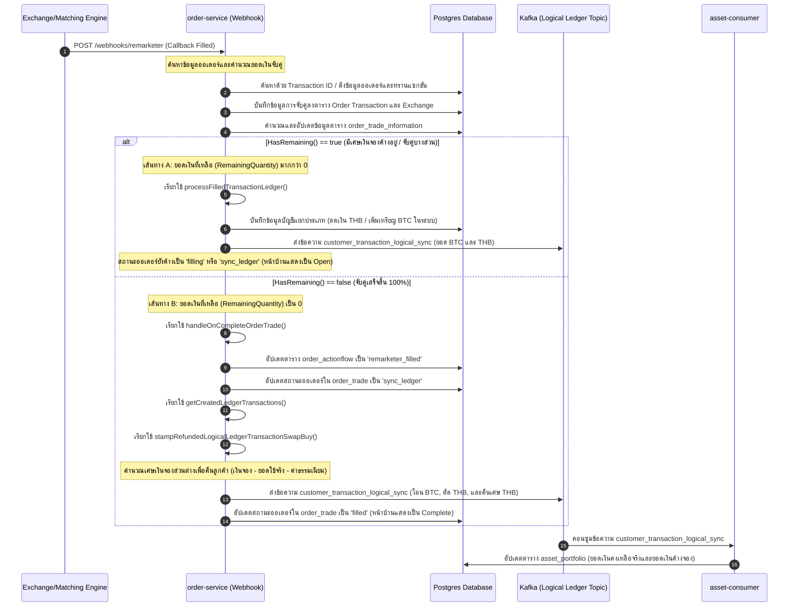

# คู่มือและการวิเคราะห์เชิงเทคนิค: ปัญหาข้อมูลไม่ตรงกันระหว่างประวัติออเดอร์และยอดเงินจองในพอร์ตโฟลิโอ (ปัญหาการค้างล็อกของเงินจอง THB)

## 1. บทนำ (Executive Summary)
เอกสารฉบับนี้จัดทำขึ้นเพื่อวิเคราะห์เชิงลึกเกี่ยวกับปัญหาความไม่สอดคล้องของข้อมูลระหว่าง ยอดเงินคงเหลือในพอร์ตโฟลิโอ (Portfolio Balance), ประวัติออเดอร์ (Order History), และยอดเงินที่ถูกล็อกในระบบ (`In Order`) สำหรับลูกค้า **บริษัท ดิจิ โทไนซ์ จำกัด** (`6d338dca-95b0-46af-b504-cc21ea1df875`)

### อาการของปัญหาที่พบ:
1. **ออเดอร์ค้างสถานะ Open**: ออเดอร์หมายเลข `50-260604-000017` ซื้อเหรียญ BTC สำเร็จและระบบโอนเหรียญเข้าบัญชีลูกค้าเรียบร้อยแล้ว แต่สถานะออเดอร์บนหน้าบ้านยังคงค้างแสดงเป็น "Open" (เปิด) นานถึง 8 วัน (ตั้งแต่วันที่ 4 มิ.ย. ถึง 12 มิ.ย. 2026)
2. **ยอดเงินค้างล็อกในพอร์ต**: มีเงินสกุล THB จำนวน `0.03 บาท` ค้างอยู่ในช่องยอดเงินค้างจอง (`In Order`) ของลูกค้าอย่างถาวร แม้ว่าออเดอร์ทั้งสองรายการจะถูกอัปเดตเป็นสถานะสำเร็จ (`filled`) ในระบบแล้วก็ตาม

---

## 2. สถาปัตยกรรมระบบและลำดับการทำงาน (System Architecture & Webhook Execution Flow)
แผนภาพลำดับการทำงาน (Sequence Diagram) ด้านล่างแสดงขั้นตอนที่ระบบ `order-service` ประมวลผลข้อมูลผ่านฟังก์ชัน [handleOnRemarketerCallbackFilled](file:///Users/soratgessakorn/Work/Projects/xas/order-service/pkg/order_trade/webhook_service.go#L296) เมื่อได้รับ Webhook แจ้งเตือนผลการจับคู่จาก Exchange



---

## 3. การวิเคราะห์ข้อมูลในฐานข้อมูลเชิงตัวเลข (Database Records Analysis)

### ก. การเปรียบเทียบข้อมูลของทั้ง 2 ออเดอร์

| ข้อมูลรายละเอียดออเดอร์ | ออเดอร์ที่ 1 (`50-260604-000016`) | ออเดอร์ที่ 2 (`50-260604-000017`) |
| :--- | :--- | :--- |
| **UUID ของออเดอร์** | `1d28d19f-0bb3-4db6-85bd-5aa1fc576c6c` | `1ef4c7ff-d8f0-4e2c-9a6a-b20a5c8f1ce3` |
| **วงเงินตั้งจองสิทธิ์ (`order_quantity`)** | `70,484.670000000000000000` บาท | `70,484.670000000000000000` บาท |
| **มูลค่าจับคู่จริง (`sum_executed_quantity`)** | `70,308.890000000000000000` บาท | `70,308.880000000000000000` บาท |
| **ค่าธรรมเนียมเทรด (`sum_order_fee`)** | `175.77` บาท (คิดเป็น 0.25% ของ `70,308.89`) | `175.76` บาท (คิดเป็น 0.25% ของ `70,308.88`) |
| **ยอดใช้จ่ายจริงทั้งหมด (ยอดจับคู่ + ค่าธรรมเนียม)** | **`70,484.66` บาท** | **`70,484.64` บาท** |
| **ยอดเศษเงินเหลือค้างจองจริงตามคณิตศาสตร์** | **`0.01` บาท** | **`0.03` บาท** |
| **ยอดคงค้างรอจับคู่จาก Exchange (`remaining_quantity`)** | `0.010000000000000000` บาท | `0.019690761100039900` บาท (~`0.02` บาท) |
| **วันเวลาที่ออเดอร์ถูกอัปเดตเป็น Complete** | `2026-06-04 07:18:11` (ทำงานสำเร็จทันที) | `2026-06-12 09:41:04` (ค้างในระบบ 8 วัน) |

### ข. ตรรกะการเกิดยอดล็อกค้างสะสม 0.03 บาท
ยอดเงินค้างจอง (`In Order`) ในตารางพอร์ตโฟลิโอ (`pending_out_unit_balance` ในตาราง `asset_portfolio`) เกิดจากการรวมเศษเงินค้างที่ไม่ได้ถูกทำรายการปลดล็อกคืนสู่กระเป๋าเงินหลักของลูกค้า ดังนี้:
* **เศษเงินค้างออเดอร์ที่ 1**: `0.010000000000000000` บาท
* **เศษเงินค้างออเดอร์ที่ 2**: `0.019690761100039900` บาท (ระบบปัดเศษแสดงผลเป็น `0.02` บาท)
* **รวมยอดเงินค้างจองสะสม**: `0.01 + 0.02 = 0.03` บาท

---

## 4. การวิเคราะห์สาเหตุเชิงลึกในระดับโค้ด (Code-Level Root Cause Analysis)

### สาเหตุที่ 1: ออเดอร์ที่สองค้างที่สถานะ "Open" นาน 8 วัน
ในโค้ดส่วนประมวลผล Webhook [webhook_service.go](file:///Users/soratgessakorn/Work/Projects/xas/order-service/pkg/order_trade/webhook_service.go) มีการเช็คเงื่อนไขปริมาณเงินค้างผ่านฟังก์ชัน `input.HasRemaining()`:
```go
if input.HasRemaining() {
    err := s.processFilledTransactionLedger(orderTradeTransaction, orderTradeExchanges, tx, orderTrade, userUpdate)
    // ...
} else {
    err = s.handleOnCompleteOrderTrade(ctx, tx, orderTrade, &orderTradeTransaction, orderTradeExchanges, input)
    // ...
}
```
สำหรับ **ออเดอร์ที่ 2** ระบบ Exchange ปลายทางระบุว่ามียอดเงินค้างรอจับคู่ (`RemainingQuantity`) เท่ากับ `0.0196907611` บาท
* เนื่องจากค่าดังกล่าวมีค่ามากกว่า 0 ฟังก์ชัน `input.HasRemaining()` จึงคืนค่ากลับมาเป็น `true` และวิ่งเข้าไปทำงานในฟังก์ชัน `processFilledTransactionLedger()`
* ตัวฟังก์ชัน `processFilledTransactionLedger()` จะทำการบันทึกข้อมูลโอนเหรียญ BTC เข้าพอร์ตของลูกค้าโดยเฉพาะ (จึงทำให้ลูกค้าได้เหรียญเรียบร้อย) แต่**ไม่มีขั้นตอนในการปรับปรุงสถานะออเดอร์หลัก (`order_trade`) ให้เป็น `filled` (Complete)**
* สถานะออเดอร์หลักจึงยังค้างอยู่ที่ `filling` หรือ `sync_ledger` ซึ่งในระบบหน้าบ้านจะนำสถานะเหล่านี้ไปแมปแสดงผลเป็นสถานะ **"Open"** ส่งผลให้ออเดอร์ค้างเป็น Open บนประวัติรายการของลูกค้า

### สาเหตุที่ 2: ปัญหาเศษเงินจองส่วนต่างไม่ถูกคืนอัตโนมัติ (Hold Leak)
ปัญหายอดเงินจอง `0.01` บาท (จากออเดอร์แรก) และ `0.02` บาท (จากออเดอร์ที่สอง) ไม่ถูกคืนเข้าบัญชีหลักของลูกค้า

1. **กรณีของออเดอร์ที่ 1 (Complete ตั้งแต่วันแรก)**:
   * ยอดเงินค้างจากการซื้อจริงคือ `0.01` บาท ซึ่งต่ำกว่าเกณฑ์ขั้นต่ำสุดที่ระบบปลายทางจะจับคู่ต่อได้ ทำให้ Exchange ปิดการทำงานและส่งข้อมูลกลับมาว่าจับคู่เสร็จสมบูรณ์ (`RemainingQuantity` เป็น 0) ส่งผลให้วิ่งเข้าเส้นทาง `handleOnCompleteOrderTrade()`
   * ตัวฟังก์ชันนี้จะเรียกทำงานต่อกันเป็นทอดเพื่อประมวลผลการคืนเงินผ่านฟังก์ชัน `stampRefundedLogicalLedgerTransactionSwapBuy()`
   * ตัวแปรคืนเงินคำนวณจากโครงสร้างตรรกะใน [swap_refund_calculated.go](file:///Users/soratgessakorn/Work/Projects/xas/order-service/internal/domain/swap_refund_calculated.go#L36):
     $$\text{ReturnedQuantity} = \text{OrderQuantity} - (\text{ExecutedQuantity} + \text{OrderFee})$$
     $$70,484.67 - (70,308.89 + 175.77) = 0.01 \text{ บาท}$$
   * **จุดบกพร่อง**: แม้ว่าจะเกิดคำขอสร้างทรานแซกชันคืนเศษเงิน `0.01` บาทขึ้น แต่ไม่มีการนำไปประมวลผลต่อเพื่อปรับปรุงลดยอด `pending_out_unit_balance` ในพอร์ตโฟลิโอจริง ทำให้เศษเงินดังกล่าวยังคงติดล็อกค้างอยู่
2. **กรณีของออเดอร์ที่ 2**:
   * เมื่อวันที่ 12 มิ.ย. 2026 ระบบทำการปิดออเดอร์หลักให้เป็นสำเร็จ (`filled`) แต่กลไกการปลดคืนเงินจองสะสมจำนวน `0.02` บาท ไม่ได้ถูกกระตุ้นให้ทำงาน ยอดนี้จึงยังคงค้างอยู่ในพอร์ตของลูกค้าเช่นเดียวกัน

---

## 5. แนวทางการแก้ไขปัญหา (Remediation Plan)

### 1. การแก้ไขปัญหาเฉพาะหน้า (Manual Database Adjustment)
ทำธุรกรรมบนฐานข้อมูลโดยตรงเพื่อปลดล็อกยอดเงินจองสะสมจำนวน `0.03` บาท คืนกลับไปที่ยอดเงินที่พร้อมใช้งาน (Available Balance) ของลูกค้าบัญชี `6d338dca-95b0-46af-b504-cc21ea1df875`:
```sql
BEGIN;

-- 1. ลดจำนวนเงินที่ถูกล็อกในระบบ (Deduct Locked Hold) ลง 0.03 บาท
UPDATE asset_portfolio
SET pending_out_unit_balance = pending_out_unit_balance - 0.03
WHERE customer_account_id = '6d338dca-95b0-46af-b504-cc21ea1df875' AND product_code = 'THB';

-- 2. คืนเงินส่วนดังกล่าวกลับเข้ายอดพร้อมใช้งานของลูกค้า (Refund to Available Balance)
UPDATE asset_portfolio
SET unit_balance = unit_balance + 0.03
WHERE customer_account_id = '6d338dca-95b0-46af-b504-cc21ea1df875' AND product_code = 'THB';

COMMIT;
```

### 2. แนวทางการปรับปรุงโค้ดระบบในระยะยาว (Long-Term Code Fixes)
1. **การตรวจสอบเกณฑ์เศษเงินขั้นต่ำอัตโนมัติ (Dust Limit Auto-Close)**:
   * ปรับปรุงโค้ดฟังก์ชัน `HasRemaining()` ในไฟล์ [input.go](file:///Users/soratgessakorn/Work/Projects/xas/order-service/pkg/order_trade/input.go#L192) ให้ตรวจสอบยอดเศษเงินที่เหลือค้างจริงว่าต่ำกว่าเกณฑ์การส่งคำสั่งซื้อขายหรือไม่ (เช่น น้อยกว่า `0.1` บาท)
   * หากต่ำกว่าเกณฑ์ ให้ฟังก์ชันส่งกลับมาเป็น `false` เพื่อไปเรียกใช้งาน `handleOnCompleteOrderTrade()` เพื่อจบออเดอร์และทำรายการคืนเงินส่วนที่จองค้างกลับคืนลูกค้าโดยทันที
2. **เพิ่มระบบบันทึกและตรวจสอบคำสั่งปลดล็อกเงินจอง (Audit Hold Release Logs)**:
   * เพิ่มกลไกการตรวจสอบและบันทึก Log ในฟังก์ชัน `stampRefundedLogicalLedgerTransactionSwapBuy` ให้มีความเข้มงวดมากขึ้น เพื่อให้มั่นใจว่าทุกครั้งที่ออเดอร์เปลี่ยนสถานะเป็นสำเร็จเสร็จสิ้น ยอดเงินค้างในระบบทั้งหมดจะถูกนำไปอัปเดตลดทอนในตารางพอร์ตโฟลิโอจริงเสมอ
