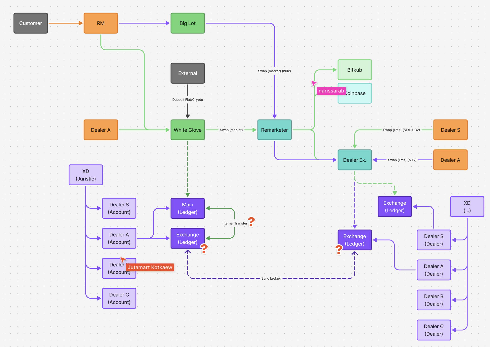

# Big Lot Flow Summary

สรุปกระบวนการทำงานของ **Big Lot** อ้างอิงจากภาพ `FlowBiglot.png`:

## 1. จุดเริ่มต้น (Entry Point)
*   **Customer** (ลูกค้า) ติดต่อผ่าน **RM** (Relationship Manager).
*   RM ส่งคำสั่งเข้าสู่ช่องทาง **Big Lot** (แยกจากช่องทาง White Glove ปกติ).

## 2. การดำเนินการ (Execution)
*   ระบบ Big Lot ส่งคำสั่งแบบ **Swap (market) (bulk)** ไปยัง **Remarketer**.
*   ระบุชัดเจนว่าเป็นคำสั่งซื้อขายปริมาณมาก (Bulk).

## 3. การจัดการสภาพคล่อง (Liquidity Sourcing)
*   **Remarketer** ส่งต่อคำสั่งไปยัง **Dealer Ex.** (Dealer Exchange).
*   **Dealer Ex.** ทำการ **Swap (limit) (bulk)** กับ **Dealer A** เพื่อปิดรายการ.

## 4. ส่วนการลงบัญชี (Ledger)
*   ธุรกรรมถูกบันทึกและเชื่อมโยงข้อมูล (Sync Ledger) ระหว่าง Main Ledger, Exchange Ledger และบัญชี Dealer A.

> **Note:** Flow นี้ออกแบบมาเพื่อรองรับธุรกรรมขนาดใหญ่ (Bulk) โดยมีการส่งคำสั่งแบบ Bulk ตั้งแต่ต้นทางจนถึงปลายทาง.

**Source:** [Figma Architecture Board](https://www.figma.com/board/2zrIDLt7IyWgnumVwxVhAA/Architecture?node-id=15024-39493&t=el9TZfd9S5IBo0QV-4)
