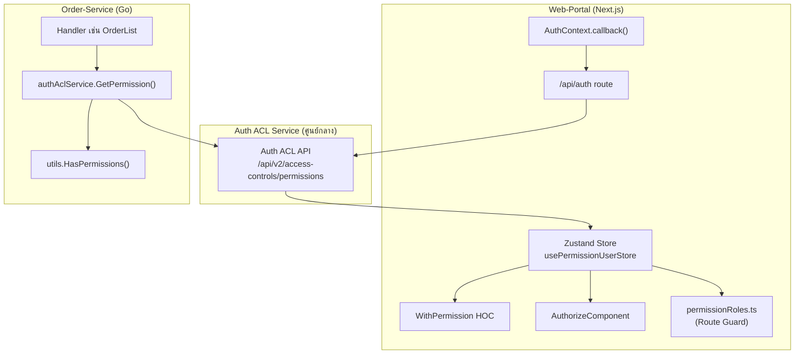
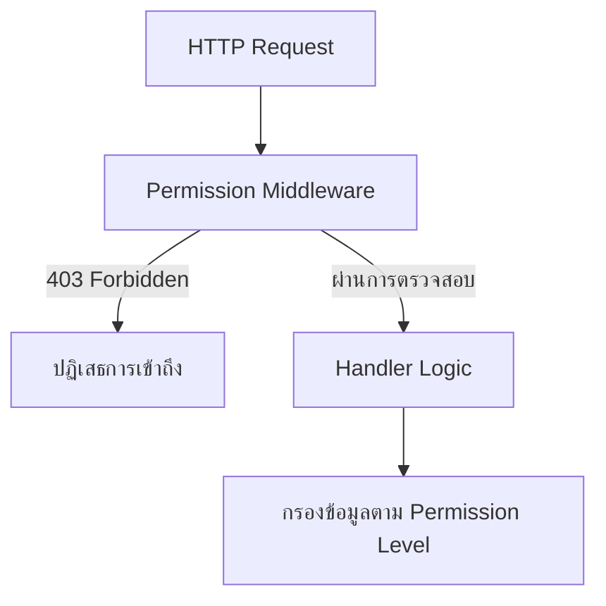

# แผนการเพิ่ม Permission Validation ใน API (Order-Service)

> ให้ API ตรวจสอบสิทธิ์เหมือนกับที่ Web-Portal ทำอยู่แล้วในฝั่ง UI

---

## สถาปัตยกรรมปัจจุบัน



---

## ปัญหาที่พบ

> [!CAUTION]
> ปัจจุบัน `OrderList` ใช้ permission แค่ **กรองข้อมูล** (เพิ่ม AMC code) แต่**ไม่ได้บล็อก**ผู้ใช้ที่ไม่มีสิทธิ์ ทำให้ผู้ใช้ที่มี token แต่ไม่มี permission `fund_order:list:view` ยังสามารถเรียก API ได้ — UI guard อย่างเดียว**ไม่เพียงพอ**สำหรับความปลอดภัย

### โค้ดปัจจุบันใน `OrderList`

```go
// 1. ดึง token จาก header
authHeader := req.Gctx.GetHeader("Authorization")

// 2. เรียก auth-acl service เพื่อดึง permissions
permission, err := handler.authAclService.GetPermission(authHeader)

// 3. ตรวจสอบ permission เฉพาะ
hasPermission := utils.HasPermissions(
    permission.Data.XspringBackoffice.Permissions, 
    authacl.FUND_ORDER_DETAIL_AM_APPROVE.String(),
)

// 4. ใช้ผลลัพธ์แค่กรองข้อมูล (ไม่ได้บล็อกการเข้าถึง)
if hasPermission {
    amcCode = append(amcCode, enum.XSpringIssuer.String())
}
```

---

## Permission Keys ที่ Web-Portal ใช้สำหรับ Fund Order

| Permission Key | ใช้ที่ไหนใน Web-Portal |
|---------------|----------------------|
| `fund_order:list:view` | Route guard สำหรับหน้า `/fund-order` |
| `fund_order:detail:view` | Route guard สำหรับหน้า `/fund-order/:id` |
| `fund_order:detail:sa_approve` | ปุ่ม Approve/Reject ใน `container.tsx`, payment actions |
| `fund_order:detail:am_approve` | Payment method actions ใน `payment-method.tsx` |

---

## สถาปัตยกรรมที่แนะนำ



---

## ขั้นตอนการ Implement

### ขั้นตอนที่ 1: กำหนด Permission Keys — สองทางเลือก

---

#### ทางเลือก A: Hardcoded Enum (แบบเดิม)

เพิ่ม permission keys ใน `auth-acl/enum.go` โดยตรง:

```diff
 const (
     CUST_ONBOARD_DETAIL_WS_EDIT        UserPermissions = "cust_onboard:detail:ws_edit"
     FUND_ORDER_DETAIL_AM_APPROVE       UserPermissions = "fund_order:detail:am_approve"
+    FUND_ORDER_LIST_VIEW               UserPermissions = "fund_order:list:view"
+    FUND_ORDER_DETAIL_VIEW             UserPermissions = "fund_order:detail:view"
+    FUND_ORDER_DETAIL_SA_APPROVE       UserPermissions = "fund_order:detail:sa_approve"
     WHITE_GLOVE_LIST_DEALER_VIEW       UserPermissions = "white_glove:list:dealer_view"
 )
```

---

#### ทางเลือก B: Config Map (แนะนำสำหรับความยืดหยุ่น) ⭐

ย้าย permission-to-route mapping ออกจากโค้ดไปเป็น **config file (YAML)** — สามารถเพิ่ม permission ใหม่ได้โดยไม่ต้อง compile หรือ deploy ใหม่

**ไฟล์ Config** (`config/permissions.yaml`):

```yaml
route_permissions:
  # Fund Order
  - method: GET
    path: /api/v1/order/list
    permissions:
      - "fund_order:list:view"

  - method: GET
    path: /api/v1/order/:order_id/order-information
    permissions:
      - "fund_order:detail:view"
      - "fund_order:detail:sa_approve"
      - "fund_order:detail:am_approve"

  - method: POST
    path: /api/v1/order/validate
    permissions:
      - "fund_order:detail:sa_approve"
      - "fund_order:detail:am_approve"

  - method: POST
    path: /api/v1/order/:order_type
    permissions:
      - "fund_order:detail:sa_approve"

  # White Glove
  - method: GET
    path: /api/v1/white-glove/list
    permissions:
      - "white_glove:list:rm_view"
      - "white_glove:list:dealer_view"
```

**Go Config Struct** (`internal/config/permission_config.go`):

```go
package config

// RoutePermission จับคู่ API route กับ permissions ที่จำเป็น
type RoutePermission struct {
    Method      string   `yaml:"method"      json:"method"`
    Path        string   `yaml:"path"        json:"path"`
    Permissions []string `yaml:"permissions" json:"permissions"`
}

// PermissionConfig เก็บ route-permission mappings ทั้งหมดที่โหลดจาก config
type PermissionConfig struct {
    RoutePermissions []RoutePermission `yaml:"route_permissions" json:"route_permissions"`
}

// LookupKey สร้าง key สำหรับค้นหา route
func (rp RoutePermission) LookupKey() string {
    return rp.Method + ":" + rp.Path
}
```

**Permission Registry** (`utils/permission_registry.go`):

```go
package utils

import "git.xspringas.com/xas/transaction/order/order-service/internal/config"

// PermissionRegistry ให้การค้นหา permissions ที่จำเป็นตาม route แบบรวดเร็ว
type PermissionRegistry struct {
    routeMap map[string][]string // key: "METHOD:/path" → permissions
}

// NewPermissionRegistry สร้าง registry จาก config
func NewPermissionRegistry(cfg config.PermissionConfig) *PermissionRegistry {
    m := make(map[string][]string, len(cfg.RoutePermissions))
    for _, rp := range cfg.RoutePermissions {
        m[rp.LookupKey()] = rp.Permissions
    }
    return &PermissionRegistry{routeMap: m}
}

// GetRequiredPermissions คืน permissions สำหรับ method+path ที่กำหนด
// คืน nil ถ้าไม่มี permissions ที่ตั้งค่าไว้ (เข้าถึงได้อิสระ)
func (r *PermissionRegistry) GetRequiredPermissions(method, path string) []string {
    return r.routeMap[method+":"+path]
}
```

---

#### ตารางเปรียบเทียบ

| เกณฑ์ | ทางเลือก A: Enum | ทางเลือก B: Config Map |
|-------|-----------------|----------------------|
| **Type Safety** | ✅ ตรวจสอบตอน compile | ⚠️ ต้อง validate ตอน runtime |
| **เพิ่ม permission ใหม่** | ❌ ต้องแก้โค้ด + deploy ใหม่ | ✅ แก้ config + restart เท่านั้น |
| **อ่านง่าย** | ✅ เห็น permissions ในโค้ด | ✅ YAML รวมศูนย์ เห็นภาพรวม |
| **Sync กับ web-portal** | ⚠️ ต้อง sync enum ด้วยมือ | ✅ diff กับ `permissionRoles.ts` ได้ง่าย |
| **Hot-reload ได้** | ❌ ไม่ได้ | ✅ ได้ (ถ้ามี file watcher) |
| **เสี่ยงพิมพ์ผิด** | ✅ ต่ำ (compiler จับได้) | ⚠️ ปานกลาง (string ผิด = fail เงียบ) |
| **เหมาะกับ** | Permission set เล็ก, ไม่เปลี่ยนบ่อย | Permission set ที่โตเรื่อยๆ, หลายทีม |

> [!TIP]
> **แนะนำ Hybrid**: ใช้ทางเลือก B สำหรับ route-to-permission mapping (เปลี่ยนบ่อย) แต่เก็บ Enum ไว้สำหรับ **data-level filtering** ใน handler (เช่น `FUND_ORDER_DETAIL_AM_APPROVE` สำหรับกรอง AMC code)

---

### ขั้นตอนที่ 2: สร้าง Permission Middleware ที่ใช้ซ้ำได้

Middleware นี้ใช้ได้กับ**ทั้งสอง**ทางเลือก — รับ `[]string` ของ permission keys

```go
// utils/permission_middleware.go
package utils

import (
    "net/http"
    "git.xspringas.com/xas/library/httputil/httpserv"
    "git.xspringas.com/xas/library/httputil/middleware"
    authacl "git.xspringas.com/xas/transaction/order/order-service/third_party/auth-acl"
)

// PermissionGuard ครอบ handler และตรวจสอบ permission ก่อนดำเนินการ
// requiredPermissions ใช้ OR logic — ผู้ใช้ต้องมีอย่างน้อย 1 permission ที่ตรง
func PermissionGuard(
    authAclService authacl.IAuthAclService,
    requiredPermissions []string,
    next func(req *httpserv.Request) (*httpserv.Response, error),
) func(req *httpserv.Request) (*httpserv.Response, error) {
    return func(req *httpserv.Request) (*httpserv.Response, error) {
        // 1. ตรวจสอบว่ามี JWT claims
        _, ok := req.Claims.(middleware.PortalClaims)
        if !ok {
            return nil, &httpserv.Response{
                StatusCode: http.StatusUnauthorized,
                Code:       http.StatusText(http.StatusUnauthorized),
                Message:    "failed to authorize with token",
            }
        }

        // 2. ดึง permissions จาก Auth ACL
        authHeader := req.Gctx.GetHeader("Authorization")
        permission, err := authAclService.GetPermission(authHeader)
        if err != nil {
            return &httpserv.Response{
                StatusCode: http.StatusUnauthorized,
                Code:       http.StatusText(http.StatusUnauthorized),
                Message:    "failed to get permissions",
            }, nil
        }

        // 3. ตรวจสอบ permissions (OR logic เหมือน web-portal)
        hasPermission := HasPermissions(
            permission.Data.XspringBackoffice.Permissions,
            requiredPermissions...,
        )
        if !hasPermission {
            return nil, &httpserv.Response{
                StatusCode: http.StatusForbidden,
                Code:       http.StatusText(http.StatusForbidden),
                Message:    "insufficient permissions",
            }
        }

        // 4. ส่งต่อไปยัง handler
        return next(req)
    }
}
```

> [!NOTE]
> OR logic ตรงกับ `WithPermission` ของ web-portal:
> ```tsx
> const hasPermission = requiredPermissions.some((p) => permissions.includes(p))
> ```

---

### ขั้นตอนที่ 3: ลงทะเบียน Route พร้อม Middleware

#### ใช้กับทางเลือก A (Enum)

```go
router.GET("/api/v1/order/list", 
    utils.PermissionGuard(
        authAclService,
        []string{authacl.FUND_ORDER_LIST_VIEW.String()},
        orderHandler.OrderList,
    ),
)

router.GET("/api/v1/order/:order_id/order-information",
    utils.PermissionGuard(
        authAclService,
        []string{
            authacl.FUND_ORDER_DETAIL_VIEW.String(),
            authacl.FUND_ORDER_DETAIL_SA_APPROVE.String(),
            authacl.FUND_ORDER_DETAIL_AM_APPROVE.String(),
        },
        orderHandler.GetOrderInformation,
    ),
)
```

#### ใช้กับทางเลือก B (Config Map)

```go
// โหลด config ครั้งเดียวตอน startup
permRegistry := utils.NewPermissionRegistry(cfg.PermissionConfig)

// Helper function สำหรับลงทะเบียน route พร้อม permission guard จาก config
registerWithPermission := func(method, path string, handler func(*httpserv.Request) (*httpserv.Response, error)) {
    perms := permRegistry.GetRequiredPermissions(method, path)
    if len(perms) > 0 {
        handler = utils.PermissionGuard(authAclService, perms, handler)
    }
    switch method {
    case "GET":
        router.GET(path, handler)
    case "POST":
        router.POST(path, handler)
    }
}

// ลงทะเบียน route แบบสะอาด ไม่ต้องระบุ permission ในโค้ด
registerWithPermission("GET", "/api/v1/order/list", orderHandler.OrderList)
registerWithPermission("GET", "/api/v1/order/:order_id/order-information", orderHandler.GetOrderInformation)
registerWithPermission("POST", "/api/v1/order/validate", orderHandler.ValidateOrder)
registerWithPermission("POST", "/api/v1/order/:order_type", orderHandler.OrderCreate)
```

---

### ขั้นตอนที่ 4: ปรับ Handler ที่มีอยู่

หลังจากเพิ่ม middleware แล้ว สามารถลบโค้ดตรวจสอบสิทธิ์ที่ซ้ำซ้อนออกจาก handler ได้ — handler มีหน้าที่แค่**กรองข้อมูล**เท่านั้น:

```go
func (handler *OrderHandler) OrderList(req *httpserv.Request) (*httpserv.Response, error) {
    ctx := req.Request.Context()
    ctx = context.WithValue(ctx, constants.ContextLogFunction, "OrderList")

    // ✅ การตรวจสอบ claims และ permission GATE จัดการโดย middleware แล้ว
    // ⬇ Handler ทำแค่กรองข้อมูลตามระดับ permission

    authHeader := req.Gctx.GetHeader("Authorization")
    permission, _ := handler.authAclService.GetPermission(authHeader)

    var amcCode []string
    // Data-level: ผู้ใช้ AM เห็นเฉพาะ orders ของ XSpringAM
    if utils.HasPermissions(
        permission.Data.XspringBackoffice.Permissions,
        authacl.FUND_ORDER_DETAIL_AM_APPROVE.String(),
    ) {
        amcCode = append(amcCode, enum.XSpringIssuer.String())
    }

    // ... โค้ดที่เหลือของ handler
}
```

---

### ขั้นตอนที่ 5: ตาราง Permission-to-Route Mapping

ต้อง sync ตารางนี้กับ `permissionRoles.ts` ของ web-portal เสมอ:

| API Endpoint | Permissions ที่จำเป็น (OR) | Route ใน Web-Portal |
|-------------|--------------------------|---------------------|
| `GET /api/v1/order/list` | `fund_order:list:view` | `/fund-order` |
| `GET /api/v1/order/:id/order-information` | `fund_order:detail:view`, `fund_order:detail:sa_approve`, `fund_order:detail:am_approve` | `/fund-order/:id` |
| `POST /api/v1/order/validate` | `fund_order:detail:sa_approve`, `fund_order:detail:am_approve` | Fund order actions |
| `POST /api/v1/order/:order_type` | `fund_order:detail:sa_approve` | สร้าง Order |

---

## สรุป Best Practices

| หลักการ | คำอธิบาย |
|---------|---------|
| **Single Source of Truth** | Permission keys มาจาก Auth ACL service — ใช้ string เดียวกันทั้ง Go enum และ TS enum |
| **Defense in Depth** | Web-portal guard UI + API guard access = ทั้งสองฝั่งต้องตรวจสอบ |
| **Middleware แทน Inline** | แยกการตรวจสอบ permission เป็น middleware ที่ใช้ซ้ำได้ แทนการ copy-paste ในทุก handler |
| **OR Logic สอดคล้องกัน** | ทั้ง `WithPermission` ของ web-portal และ API middleware ใช้ "มีอย่างน้อยหนึ่ง" ที่ตรง |
| **แยก Gate vs Filter** | Middleware = **บล็อก**ผู้ใช้ที่ไม่มีสิทธิ์ / Handler = **กรอง**ข้อมูลตามระดับ permission |
| **Sync Mapping ให้ตรงกัน** | ดูแลตาราง permission-route mapping ให้ตรงกับ `permissionRoles.ts` เสมอ |
