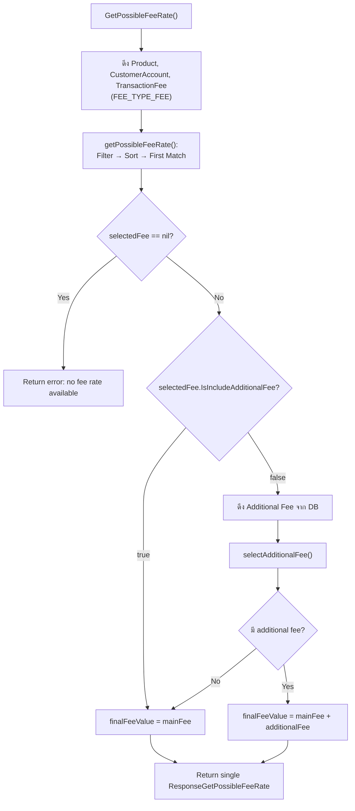
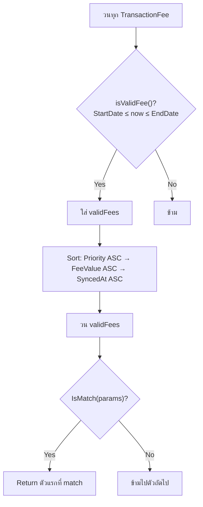
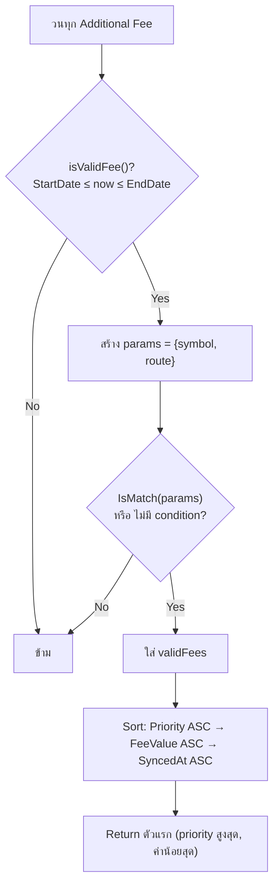
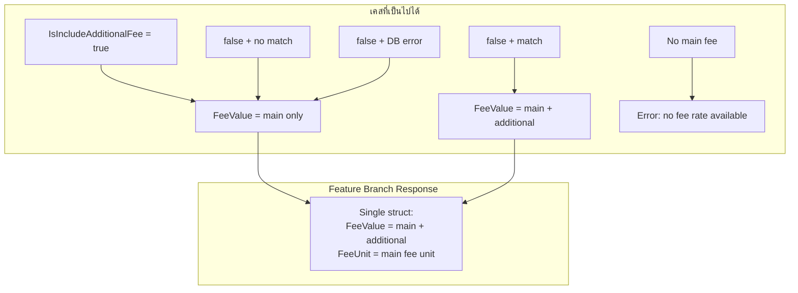

# Additional Fee — Deep Dive (branch `feature/apply-addtional-fee`)

> **File**: `order-service/pkg/order_trade/service_fee_rate.go`
> **Branch**: `feature/apply-addtional-fee`
> **Date**: 2026-02-15

---

## 1. Additional Fee คืออะไร

Additional Fee คือ **ค่าธรรมเนียมเพิ่มเติม** ที่แยกจาก Main Fee โดยจัดเก็บใน DB ด้วย `fee_type = "additional_fee"`

ใน feature branch นี้ Additional Fee **ถูกรวมเข้ากับ Main Fee ก่อน return** → caller ได้รับ **ค่ารวมสุทธิ** ใน `FeeValue` เดียว

### Response Struct (เปลี่ยนจาก main)

```go
// feature branch — ไม่มี IsIncludeAdditionalFee แล้ว
type ResponseGetPossibleFeeRate struct {
    TransactionType enum.OrderType
    FeeType         string
    Name            string
    FeeValue        decimal.Decimal  // ← ค่ารวม (main + additional)
    FeeUnit         string           // ← unit จาก Main Fee เท่านั้น
}
```

> [!IMPORTANT]
> **เปลี่ยนจาก main branch**: Return type เปลี่ยนจาก `[]ResponseGetPossibleFeeRate` (array) → `ResponseGetPossibleFeeRate` (single struct)
> Field `IsIncludeAdditionalFee` ถูก**ลบออก**จาก response

---

## 2. Flow การทำงานของ Additional Fee

### 2.1 ภาพรวม



### 2.2 ขั้นตอนที่ 1 — เลือก Main Fee (`getPossibleFeeRate`, line 152-194)



**Filter params** (ส่งทั้งหมดใน `IsMatch` ครั้งเดียว):
- `customer_tier` — จาก customerAccount
- `route` — จาก request
- `onboarding_day` — คำนวณจาก openDate
- `onboarding_date` — format จาก openDate
- `volume_size` — จาก request
- `symbol` — จาก product

> [!NOTE]
> **ต่างจาก main**: ใช้ `isValidFee()` ที่เช็คทั้ง StartDate **และ** EndDate
> ส่ง filter params ทั้งหมดใน `IsMatch()` **ครั้งเดียว** (ไม่แยกเช็คหลายครั้ง)

### 2.3 ขั้นตอนที่ 2 — เช็คว่าต้องดึง Additional Fee หรือไม่ (line 67)

```go
if !selectedFee.Data.IsIncludeAdditionalFee {
    // ดึง additional fee จาก DB
}
```

**gate condition**: จะดึง additional fee **เฉพาะ**เมื่อ `IsIncludeAdditionalFee == false`

### 2.4 ขั้นตอนที่ 3 — ดึงและเลือก Additional Fee (line 68-94)

```go
additionalFeeList, err := s.transactionFeeRepository.GetTransactionFeeTx(
    nil,
    constants.COMPANY_CODE_XD,
    request.TransactionType.String(),
    constants.FEE_TYPE_ADDITIONAL_FEE,
)

if err == nil && len(additionalFeeList) > 0 {
    additionalFee := selectAdditionalFee(additionalFeeList, product.Symbol, request.RouteName)
    // ...
}
```

> [!NOTE]
> ถ้า DB error → **ไม่ทำอะไร** (silent fail) → ใช้ main fee อย่างเดียว

### 2.5 ขั้นตอนที่ 4 — `selectAdditionalFee()` (line 198-248)



**ต่างจาก main**:
- ✅ เช็ค EndDate ด้วย (`isValidFee`)
- ไม่มี MIN/MAX toggle — **เลือก fee ที่ priority สูงสุด + ค่าน้อยสุดเสมอ**

### 2.6 ขั้นตอนที่ 5 — รวม Fee (line 86-87)

```go
additionalFeeValue := utils.ToNilUnPointer(additionalFee.Data.FeeValue)
finalFeeValue = finalFeeValue.Add(additionalFeeValue)
// ← บวกตรงๆ โดยไม่เช็ค FeeUnit!
```

### 2.7 ขั้นตอนที่ 6 — Return Response (line 97-103)

```go
return ResponseGetPossibleFeeRate{
    FeeType:  selectedFee.Data.FeeType,         // ← จาก Main Fee
    FeeValue: finalFeeValue,                     // ← ค่ารวม (main + additional)
    FeeUnit:  utils.ToNilUnPointer(selectedFee.Data.FeeUnit), // ← จาก Main Fee
}, nil
```

---

## 3. ทุกเคสที่เป็นไปได้

### เคสที่ 1: `IsIncludeAdditionalFee = true`

```
Main Fee: FeeValue=0.25, FeeUnit="percent", IsIncludeAdditionalFee=true
```

**Flow**: ไม่ดึง additional fee เลย (skip ทั้ง block)

**Response**:
```json
{ "FeeValue": 0.25, "FeeUnit": "percent" }
```

---

### เคสที่ 2: `IsIncludeAdditionalFee = false` + มี Additional Fee ที่ match

```
Main Fee:       FeeValue=0.25, FeeUnit="percent", IsIncludeAdditionalFee=false
Additional Fee: FeeValue=0.01, FeeUnit="percent", Condition=[{symbol: "BTC"}]
Product:        Symbol="BTC"
```

**Response**:
```json
{ "FeeValue": 0.26, "FeeUnit": "percent" }
```
→ `0.25 + 0.01 = 0.26`

---

### เคสที่ 3: `IsIncludeAdditionalFee = false` + ไม่มี Additional Fee ใน DB

```
Main Fee: FeeValue=0.25, IsIncludeAdditionalFee=false
DB: ไม่มี additional fee
```

**Flow**: query ได้ list ว่าง → `len(additionalFeeList) > 0` = false → skip

**Response**:
```json
{ "FeeValue": 0.25, "FeeUnit": "percent" }
```

---

### เคสที่ 4: `IsIncludeAdditionalFee = false` + Additional Fee ไม่ match

```
Main Fee:       FeeValue=0.25, IsIncludeAdditionalFee=false
Additional Fee: FeeValue=0.01, Condition=[{symbol: "ETH"}]
Product:        Symbol="BTC"
```

**Flow**: `selectAdditionalFee()` → ไม่มี validFees → return nil → skip

**Response**:
```json
{ "FeeValue": 0.25, "FeeUnit": "percent" }
```

---

### เคสที่ 5: Query Additional Fee Error

```
DB: GetTransactionFeeTx(..., FEE_TYPE_ADDITIONAL_FEE) → return error
```

**Flow** (line 75):
```go
if err == nil && len(additionalFeeList) > 0 {
    // ← err != nil → ทั้ง block ถูก skip
}
```

**Response**: ใช้ main fee อย่างเดียว (ไม่ error, ไม่ log error)

---

### เคสที่ 6: ไม่มี Main Fee ที่ match

```
getPossibleFeeRate() → return nil
```

**Flow** (line 56-58):
```go
if selectedFee == nil {
    return ResponseGetPossibleFeeRate{}, errors.New("no fee rate available")
}
```
→ **Return error** (ไม่ดึง additional fee เลย)

---

### เคสที่ 7: Additional Fee ไม่มี Condition

```
Additional Fee: FeeValue=0.01, Condition=[]
```

**Flow** (line 224):
```go
if matched || len(af.Data.Condition) == 0 {
    validFees = append(validFees, af)
}
```
→ match ทุกกรณี (default additional fee)

---

### เคสที่ 8: Additional Fee หมดอายุแล้ว

```
Additional Fee: StartDate=2025-01-01, EndDate=2025-12-31
Now: 2026-02-15
```

**Flow**: `isValidFee()` → `now.After(EndDate)` = true → **ข้ามไป** ✅

> [!TIP]
> Bug EndDate ที่มีใน `main` branch ถูก **แก้ไขแล้ว** ใน feature branch ผ่าน `isValidFee()`

---

### เคสที่ 9: หลาย Additional Fee match — เลือกตัวไหน?

```
Additional Fee A: FeeValue=0.05, Priority=1
Additional Fee B: FeeValue=0.01, Priority=1
Additional Fee C: FeeValue=0.01, Priority=2
```

**Sort order**: Priority ASC → FeeValue ASC → SyncedAt ASC

**ผลลัพธ์**: เลือก **B** (Priority=1, FeeValue=0.01 < 0.05)

> [!NOTE]
> ไม่มี MIN/MAX toggle — เลือก **FeeValue น้อยสุดเสมอ** (เมื่อ priority เท่ากัน)

---

## 4. Bugs ทั้งหมด 🐛

### Bug #1: Cross-Unit Addition (Main = percent, Additional = baht) 🔴

**ที่**: line 87

```go
finalFeeValue = finalFeeValue.Add(additionalFeeValue)
// ← ไม่เช็ค FeeUnit ก่อนบวก
```

**ผลกระทบ**:
```
Main Fee:       FeeValue=0.25, FeeUnit="percent"
Additional Fee: FeeValue=15,   FeeUnit="baht"

→ finalFeeValue = 0.25 + 15 = 15.25
→ FeeUnit = "percent"  ← ❌ ผิด!
```

Caller จะเห็น fee = 15.25% ซึ่งไม่ถูกต้อง → ส่งผลให้:
- `CalculateFeeAmountForSell`: `matchedBookAmount × (15.25 / 100)` → คิด fee เยอะเกินจริง
- `CalculateFeeAmountForBuy`: คำนวณจำนวนเงินผิด

---

### Bug #2: Response FeeUnit มาจาก Main Fee เท่านั้น 🔴

**ที่**: line 102

```go
FeeUnit: utils.ToNilUnPointer(selectedFee.Data.FeeUnit),
// ← ใช้ unit ของ main fee เสมอ
```

**ผลกระทบ**: เมื่อ main + additional มี unit ต่างกัน → `FeeUnit` ไม่สะท้อนค่า `FeeValue` ที่แท้จริง

> [!WARNING]
> ใน `main` branch ปัญหานี้ไม่มี เพราะ response แยก item พร้อม `FeeUnit` ของตัวเอง
> Feature branch ทำให้ปัญหานี้ **แย่ลง** โดยการรวมค่าเป็น single value

---

### Bug #3: Silent Error — ไม่ log เมื่อ Additional Fee query ล้มเหลว 🟡

**ที่**: line 75

```go
if err == nil && len(additionalFeeList) > 0 {
    // ← ถ้า err != nil → เงียบ, ไม่มี log
}
```

**ผลกระทบ**: ถ้า DB มีปัญหา → fee จะขาดส่วน additional → คิด fee ต่ำกว่าที่ควร ** โดยไม่มีการแจ้งเตือน**

---

### Bug #4: ไม่มี MIN/MAX Toggle — Breaking Change 🟡

**ที่**: function `selectAdditionalFee` (line 198) + `getPossibleFeeRate` (line 152)

**ผลกระทบ**: 
- `main` branch มี `request.FeeRateType` (MIN_FEE_RATE / MAX_FEE_RATE) เพื่อเลือก fee
- Feature branch **ลบ logic นี้ออกทั้งหมด** → เลือก fee ที่ priority สูงสุด + ค่าน้อยสุดเสมอ
- **ถ้า caller ต้องการ MAX_FEE_RATE** → จะได้ผลลัพธ์ผิด

> [!NOTE]
> ถ้า business ตกลงแล้วว่าไม่ต้องการ MAX → ไม่ใช่ bug

---

### Bug #5: FeeType ใน Response เป็นของ Main Fee เสมอ 🟢

**ที่**: line 99

```go
FeeType: selectedFee.Data.FeeType,  // ← "fee"
```

**ผลกระทบ**: แม้ว่า `FeeValue` จะรวม additional fee แล้ว แต่ `FeeType` จะเป็น `"fee"` เสมอ → caller ไม่มีทางรู้ว่าค่านี้มี additional fee รวมอยู่

---

### Bug #6: `json.Marshal` Error ไม่หยุดการทำงาน 🟢

**ที่**: line 51-54

```go
jsonFee, err := json.Marshal(selectedFee)
if err != nil {
    logs.InfoWithContext(...) // ← log แล้วไปต่อ
}
logs.InfoWithContext(..., string(jsonFee)) // ← ใช้ jsonFee แม้ marshal ล้มเหลว
```

**ผลกระทบ**: ถ้า `json.Marshal` ล้มเหลว → `jsonFee` เป็น nil → `string(jsonFee)` = `""` → log ไม่มีประโยชน์ แต่ไม่ crash

---

## 5. เปรียบเทียบ Bugs กับ `main` branch

| Bug | `main` | `feature` | สถานะ |
|---|---|---|---|
| ไม่เช็ค EndDate (Main Fee) | 🐛 มี | ✅ แก้แล้ว | **Fixed** |
| ไม่เช็ค EndDate (Additional Fee) | 🐛 มี | ✅ แก้แล้ว | **Fixed** |
| Fee ซ้ำ 2 ครั้ง (no condition) | 🐛 มี | ✅ แก้แล้ว | **Fixed** |
| `SelectedCalculatedFee` set ก่อนเวลา | 🐛 มี | ✅ ลบ function | **Fixed** |
| Cross-unit comparison (MIN/MAX) | 🐛 มี | ❌ ลบ logic แล้ว แต่ยังบวกข้าม unit | **Partially Fixed** |
| Cross-unit `FeeValue` ใน response | ✅ ไม่มี (แยก item) | 🐛 มี (รวมเป็นค่าเดียว) | **New Bug** |
| `CalculateTotalFeeRate` บวกข้าม unit | 🐛 มี | ✅ ลบ function แล้ว | **Fixed** |
| Silent error (additional fee query) | 🟡 swallow แต่ยัง set list ว่าง | 🟡 swallow + ไม่ log | **Worse** |
| ไม่มี MIN/MAX toggle | ❌ N/A | 🟡 Breaking change? | **New** |

---

## 6. สรุป



| ระดับ | จำนวน Bugs | รายการ |
|---|---|---|
| 🔴 สูง | 2 | Cross-unit addition (#1), FeeUnit ผิด (#2) |
| 🟡 ปานกลาง | 2 | Silent error (#3), ไม่มี MIN/MAX (#4) |
| 🟢 ต่ำ | 2 | FeeType misleading (#5), json.Marshal swallow (#6) |

> [!CAUTION]
> **Bug #1 และ #2 เป็นปัญหาใหม่ที่ไม่มีใน `main` branch** เกิดจากการรวม FeeValue เป็นค่าเดียวก่อน return ถ้า data ใน DB มี fee ต่าง unit (percent กับ baht) จะทำให้คำนวณ fee ผิดอย่างร้ายแรง
