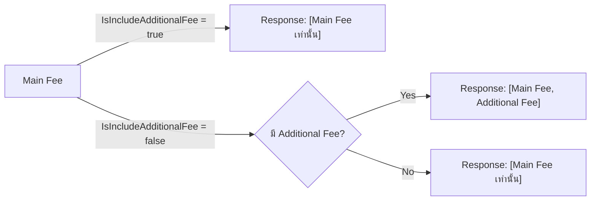
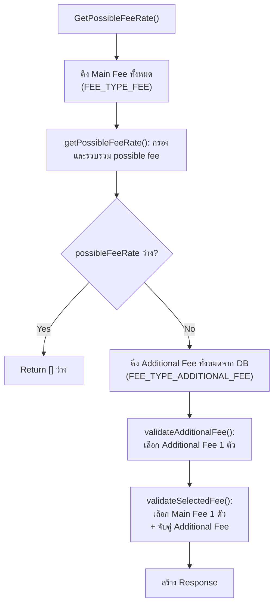
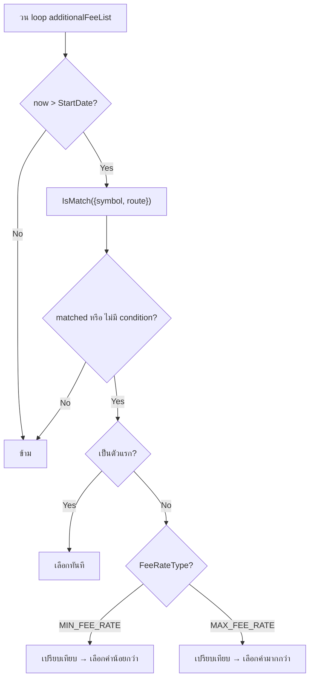
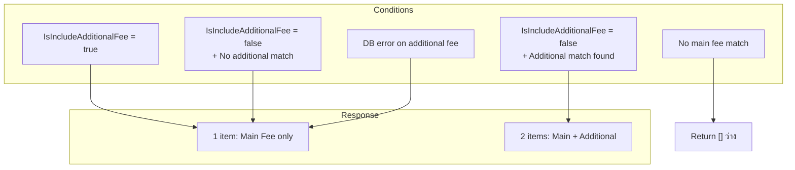

# Additional Fee — Deep Dive (branch `main`)

> **File**: `order-service/pkg/order_trade/service_fee_rate.go`
> **Branch**: `main`
> **Date**: 2026-02-15

---

## 1. Additional Fee คืออะไร

Additional Fee คือ **ค่าธรรมเนียมเพิ่มเติม** ที่แยกจาก Main Fee (base fee) โดยถูกจัดเก็บในฐานข้อมูลด้วย `fee_type = "additional_fee"` ส่วน Main Fee จะเป็น `fee_type = "fee"`

### Data Model (`TransactionFeeDB`)

```go
type TransactionFeeDB struct {
    FeeType                string           // "fee" หรือ "additional_fee"
    FeeValue               *decimal.Decimal // ค่า fee เช่น 0.25
    FeeUnit                *string          // หน่วย เช่น "percent" หรือ "baht"
    IsIncludeAdditionalFee bool             // flag บอกว่า main fee รวม additional แล้วหรือยัง
    Condition              json.RawMessage  // เงื่อนไขในการ match (symbol, route, etc.)
    Priority               int              // ลำดับความสำคัญ (เลขน้อย = priority สูง)
    StartDate              time.Time        // วันเริ่มใช้งาน
    EndDate                *time.Time       // วันหมดอายุ (nullable)
}
```

### ความสัมพันธ์กับ Main Fee



---

## 2. Flow การทำงานของ Additional Fee

### 2.1 ภาพรวม



### 2.2 ขั้นตอนที่ 1 — ดึง Additional Fee จาก DB (line 32-40)

```go
additionalFeeList, err := s.transactionFeeRepository.GetTransactionFeeTx(
    nil,
    constants.COMPANY_CODE_XD,
    request.TransactionType.String(),
    constants.FEE_TYPE_ADDITIONAL_FEE,  // ← ดึง fee_type = "additional_fee"
)
if err != nil {
    additionalFeeList = []domain.TransactionFee{} // ← error = ใช้ list ว่าง, ไม่ return error
}
```

> [!NOTE]
> ถ้าดึง additional fee จาก DB ไม่สำเร็จ → **ไม่ error** แต่ใช้ list ว่างแทน → เสมือนไม่มี additional fee

### 2.3 ขั้นตอนที่ 2 — เลือก Additional Fee 1 ตัว (`validateAdditionalFee`, line 227-249)



**Filter conditions**:
- `StartDate < now` (ยังไม่เช็ค EndDate ⚠️)
- `IsMatch({symbol, route})` — ต้อง match กับ symbol ของ product และ routeName

**Selection strategy** (ขึ้นอยู่กับ `request.FeeRateType`):

| FeeRateType | เลือกแบบไหน |
|---|---|
| `MIN_FEE_RATE` | เลือก FeeValue ต่ำสุด |
| `MAX_FEE_RATE` | เลือก FeeValue สูงสุด |

**Tie-breaking** (เมื่อค่าเท่ากัน):
1. **Priority** — ค่า priority น้อยกว่าชนะ
2. **StartDate** — วันที่ใหม่กว่าชนะ

### 2.4 ขั้นตอนที่ 3 — จับคู่ Additional Fee กับ Main Fee (`validateSelectedFee`, line 89-154)

สำหรับ **แต่ละ** possible main fee:

```go
calculatedFeeValue := mainFeeValue
if !isIncludeAdditionalFee && hasMatchedAdditionalFee {
    calculatedFeeValue = calculatedFeeValue.Add(*matchedAdditionalFeeValue)
    // ← บวกตรงๆ โดยไม่เช็ค FeeUnit
}
```

- **ใช้ `calculatedFeeValue` (main + additional) เพื่อเปรียบเทียบ MIN/MAX**
- ถ้า main fee ตัวนี้ถูกเลือก **และ** `IsIncludeAdditionalFee == false` → set `selectedAdditionalFee`

### 2.5 ขั้นตอนที่ 4 — สร้าง Response (line 62-86)

```go
result := []ResponseGetPossibleFeeRate{}

// Item 0: Main Fee (เสมอ)
result = append(result, ResponseGetPossibleFeeRate{
    FeeValue:               mainFEE.FeeValue,      // ค่าของ main fee เท่านั้น
    FeeUnit:                mainFEE.FeeUnit,        // unit ของ main fee
    IsIncludeAdditionalFee: mainFEE.IsIncludeAdditionalFee,
})

// Item 1: Additional Fee (conditional)
if selectedAdditionalFee != nil {
    result = append(result, ResponseGetPossibleFeeRate{
        FeeValue: additionalFEE.FeeValue,  // ค่าของ additional fee
        FeeUnit:  additionalFEE.FeeUnit,   // unit ของ additional fee
    })
}
```

---

## 3. ทุกเคสที่เป็นไปได้

### เคสที่ 1: Main Fee มี `IsIncludeAdditionalFee = true`

```
DB Data:
  Main Fee:       FeeValue=0.25, FeeUnit="percent", IsIncludeAdditionalFee=true
  Additional Fee: FeeValue=0.01, FeeUnit="percent" (มีอยู่ใน DB)
```

**Flow**:
1. ดึง additional fee จาก DB → ได้ list
2. `validateAdditionalFee()` → เลือกได้ 1 ตัว, `hasMatchedAdditionalFee = true`
3. `validateSelectedFee()` → เช็ค `isIncludeAdditionalFee = true`
   - **ไม่บวก** additional fee เข้า `calculatedFeeValue`
   - **ไม่ set** `selectedAdditionalFee`
4. Response: **1 item** — Main Fee เท่านั้น

```json
[
  { "FeeValue": 0.25, "FeeUnit": "percent", "IsIncludeAdditionalFee": true }
]
```

---

### เคสที่ 2: Main Fee มี `IsIncludeAdditionalFee = false` + มี Additional Fee ที่ match

```
DB Data:
  Main Fee:       FeeValue=0.25, FeeUnit="percent", IsIncludeAdditionalFee=false
  Additional Fee: FeeValue=0.01, FeeUnit="percent", Condition=[{symbol: "BTC"}]
  Product:        Symbol="BTC"
```

**Flow**:
1. `validateAdditionalFee()` → match BTC → `hasMatchedAdditionalFee = true`
2. `validateSelectedFee()` → `isIncludeAdditionalFee = false`
   - `calculatedFeeValue = 0.25 + 0.01 = 0.26` (ใช้เปรียบเทียบ)
   - set `selectedAdditionalFee`
3. Response: **2 items**

```json
[
  { "FeeValue": 0.25, "FeeUnit": "percent", "FeeType": "fee" },
  { "FeeValue": 0.01, "FeeUnit": "percent", "FeeType": "additional_fee" }
]
```

---

### เคสที่ 3: Main Fee มี `IsIncludeAdditionalFee = false` + ไม่มี Additional Fee ใน DB

```
DB Data:
  Main Fee:       FeeValue=0.25, FeeUnit="percent", IsIncludeAdditionalFee=false
  Additional Fee: (ไม่มีข้อมูลใน DB)
```

**Flow**:
1. Query additional fee → list ว่าง
2. `validateAdditionalFee()` → `hasMatchedAdditionalFee = false`
3. `validateSelectedFee()` → `!isIncludeAdditionalFee && hasMatchedAdditionalFee` = `false`
   - **ไม่บวก** additional
   - **ไม่ set** `selectedAdditionalFee`
4. Response: **1 item** — Main Fee เท่านั้น

```json
[
  { "FeeValue": 0.25, "FeeUnit": "percent", "IsIncludeAdditionalFee": false }
]
```

---

### เคสที่ 4: Main Fee มี `IsIncludeAdditionalFee = false` + Additional Fee ไม่ match

```
DB Data:
  Main Fee:       FeeValue=0.25, IsIncludeAdditionalFee=false
  Additional Fee: FeeValue=0.01, Condition=[{symbol: "ETH"}]
  Product:        Symbol="BTC"  ← ไม่ตรงกับ ETH
```

**Flow**:
1. `validateAdditionalFee()` → ETH ≠ BTC → ไม่ match + มี condition → ข้าม
2. `hasMatchedAdditionalFee = false`
3. Response: **1 item** — Main Fee เท่านั้น

---

### เคสที่ 5: Query Additional Fee Error

```
DB: GetTransactionFeeTx(..., FEE_TYPE_ADDITIONAL_FEE) → return error
```

**Flow** (line 38-40):
```go
if err != nil {
    additionalFeeList = []domain.TransactionFee{} // swallow error
}
```

1. Error ถูกกลืน → ใช้ list ว่าง
2. `hasMatchedAdditionalFee = false`
3. Response: **1 item** — Main Fee เท่านั้น (ไม่มี error ส่งกลับ)

---

### เคสที่ 6: ไม่มี Main Fee ที่ match

```
possibleFeeRate = [] (ว่าง)
```

**Flow** (line 28-30):
- Return `[]ResponseGetPossibleFeeRate{}` ทันที
- **ไม่ดึง additional fee เลย** (short circuit)

---

### เคสที่ 7: Additional Fee ไม่มี Condition (no condition)

```
DB Data:
  Additional Fee: FeeValue=0.01, Condition=[] (empty array)
```

**Flow** (line 241):
```go
if matched || len(af.Data.Condition) == 0 {
    // ← condition ว่าง = match ทุก product/route
}
```

Additional Fee ที่ไม่มี condition จะ **match ทุกกรณี** → เป็น default additional fee

---

### เคสที่ 8: หลาย Main Fee มี `IsIncludeAdditionalFee` ต่างกัน

```
DB Data:
  Main Fee A: FeeValue=0.10, IsIncludeAdditionalFee=true   (campaign)
  Main Fee B: FeeValue=0.25, IsIncludeAdditionalFee=false  (tier fee)
  Additional Fee: FeeValue=0.01
```

**Flow** (FeeRateType = MIN_FEE_RATE):
- Fee A: `calculatedFeeValue = 0.10` (ไม่บวก additional)
- Fee B: `calculatedFeeValue = 0.25 + 0.01 = 0.26`
- เลือก A (0.10 < 0.26) → **ไม่มี additional fee ใน response** เพราะ A มี `IsIncludeAdditionalFee=true`

**Flow** (FeeRateType = MAX_FEE_RATE):
- เลือก B (0.26 > 0.10) → **มี additional fee ใน response**

---

## 4. Bugs ทั้งหมด 🐛

### Bug #1: ไม่เช็ค EndDate ของ Additional Fee

**ที่**: `validateAdditionalFee()` line 237

```go
if nowTime.Unix() > af.Data.StartDate.Unix() {
    // ← เช็คแค่ StartDate, ไม่เช็ค EndDate!
}
```

**ผลกระทบ**: Additional fee ที่ **หมดอายุแล้ว** (EndDate < now) ยังสามารถถูกเลือกได้

**ตัวอย่าง**:
```
Additional Fee: StartDate=2025-01-01, EndDate=2025-12-31, FeeValue=0.01
Now: 2026-02-15
→ ยังถูกเลือกได้! เพราะเช็คแค่ now > StartDate
```

---

### Bug #2: ไม่เช็ค EndDate ของ Main Fee

**ที่**: `getPossibleFeeRate()` line 349

```go
if nowTime.Unix() > tf.Data.StartDate.Unix() {
    // ← เช็คแค่ StartDate, ไม่เช็ค EndDate!
}
```

**ผลกระทบเหมือนกัน**: Main fee ที่หมดอายุก็ถูก select ได้

---

### Bug #3: Main Fee ที่ไม่มี Condition ถูกใส่ซ้ำ 2 ครั้ง

**ที่**: `checkMatchCustomerTierAndRoute()` line 366-376

```go
func checkMatchCustomerTierAndRoute(...) []domain.TransactionFee {
    if matched || len(tf.Data.Condition) == 0 {        // ← ครั้งที่ 1
        possibleFeeRate = append(possibleFeeRate, tf)
    }
    if matchedExchange || len(tf.Data.Condition) == 0 { // ← ครั้งที่ 2
        possibleFeeRate = append(possibleFeeRate, tf)
    }
    return possibleFeeRate
}
```

**ผลกระทบ**: Main fee ที่ไม่มี condition (`len(condition) == 0`) จะถูก **ใส่ 2 ครั้ง** ใน `possibleFeeRate`  
→ อาจทำให้ fee ตัวเดียวถูกเปรียบเทียบกับตัวเอง หรือถูกเลือกซ้ำ

**ตัวอย่าง**:
```
Fee A: Condition=[], FeeValue=0.25
→ possibleFeeRate = [FeeA, FeeA]  ← ซ้ำ!
```

---

### Bug #4: Cross-Unit Addition (Main Fee = percent, Additional Fee = baht)

**ที่**: `validateSelectedFee()` line 109-111

```go
if !isIncludeAdditionalFee && hasMatchedAdditionalFee {
    calculatedFeeValue = calculatedFeeValue.Add(*matchedAdditionalFeeValue)
    // ← บวกตรงๆ โดยไม่เช็ค FeeUnit!
}
```

**ผลกระทบ**: ถ้า main fee เป็น `percent` แต่ additional fee เป็น `baht`:
- `calculatedFeeValue = 0.25 + 15.00 = 15.25`
- ค่านี้ใช้เปรียบเทียบ MIN/MAX กับ fee อื่น → **ผลการเปรียบเทียบผิดพลาด**

> [!CAUTION]
> **Note**: Response ยังแยก item → caller เห็น `FeeUnit` แยกกัน แต่ **logic การเลือก fee ผิด**

---

### Bug #5: `CalculateTotalFeeRate` บวกข้าม Unit

**ที่**: `CalculateTotalFeeRate()` line 390-398

```go
func (s *orderTradeService) CalculateTotalFeeRate(feeRate []ResponseGetPossibleFeeRate) decimal.Decimal {
    sum := decimal.Zero
    for _, fee := range feeRate {
        sum = sum.Add(fee.FeeValue) // ← บวกโดยไม่สนใจ FeeUnit
    }
    return sum
}
```

**Callers** (3 จุด):
| ไฟล์ | Line |
|---|---|
| `pkg/order_trade/service.go` | 1260 |
| `pkg/order_trade/service.go` | 1349 |
| `pkg/order_crypto/service.go` | 822 |

**ผลกระทบ**: ถ้า fee ต่าง unit:
```
Main Fee:       FeeValue=0.25, FeeUnit="percent"
Additional Fee: FeeValue=15,   FeeUnit="baht"
→ CalculateTotalFeeRate = 0.25 + 15 = 15.25  ← ไม่มีความหมาย!
```

ค่านี้ถูกนำไปใช้คำนวณ `CalculateFeeAmountForBuy/Sell` ซึ่งคิดเป็น **percent** เสมอ → ผิดพลาดอย่างร้ายแรง

---

### Bug #6: `setSelectedFeeForMinType` ตั้ง `SelectedCalculatedFee` ก่อนเวลา

**ที่**: line 209-210

```go
if pfr.Data.Priority == selectedFee.SelectedFeeRate.Data.Priority {
    selectedFee.SelectedCalculatedFee = &calculatedFeeValue // ← ตั้งค่าก่อน!
    if pfr.Data.StartDate.Unix() > selectedFee.SelectedFeeRate.Data.StartDate.Unix() {
        selectedFee.SelectedFeeRate = pfr
        // ...
    }
}
```

**ผลกระทบ**: เมื่อ priority เท่ากัน `SelectedCalculatedFee` จะถูก overwrite **แม้ว่า StartDate ไม่ได้ใหม่กว่า** → ค่า `SelectedCalculatedFee` อาจไม่ตรงกับ `SelectedFeeRate` ที่ถูกเลือกจริง

> [!NOTE]
> bug นี้ไม่มีใน `setSelectedFeeForMaxType` — ที่นั่น `SelectedCalculatedFee` ถูกตั้งภายใน `if` block อย่างถูกต้อง

---

### Bug #7: Additional Fee ตัวแรกที่ match ถูกเลือกทันที ไม่ว่า FeeRateType จะเป็นอะไร

**ที่**: `getMatchAddFeeAndMatchAddFeeValue()` line 259-262

```go
if !hasMatchedAdditionalFee {
    matchedAdditionalFee = &af      // ← เลือกทันทีเป็นตัวแรก
    matchedAdditionalFeeValue = &afValue
    hasMatchedAdditionalFee = true
}
```

**ไม่ใช่ bug ที่ร้ายแรง** แต่เป็น behavioral note: ตัวแรกที่ match ถูกเลือกเป็น default → ตัวถัดๆ ไปจะถูกเปรียบเทียบแบบ MIN/MAX
**ถ้า list มีแค่ 1 ตัว** → ถูกเลือกโดยไม่สนใจว่า FeeRateType เป็น MIN หรือ MAX

---

## 5. สรุป



| Bug # | รายละเอียด                                         | ความร้ายแรง                   |
| ----- | -------------------------------------------------- | ----------------------------- |
| #1    | ไม่เช็ค EndDate ของ Additional Fee                 | 🔴 สูง                        |
| #2    | ไม่เช็ค EndDate ของ Main Fee                       | 🔴 สูง                        |
| #3    | Main Fee ไม่มี condition ซ้ำ 2 ครั้ง               | 🟡 ปานกลาง                    |
| #4    | บวก percent + baht ตอนเปรียบเทียบ MIN/MAX          | 🔴 สูง (ถ้ามี data ต่าง unit) |
| #5    | `CalculateTotalFeeRate` บวกข้าม unit               | 🔴 สูง (ถ้ามี data ต่าง unit) |
| #6    | `SelectedCalculatedFee` ถูก set ก่อนเวลาใน MinType | 🟡 ปานกลาง                    |
| #7    | ตัวแรกถูกเลือกไม่สนใจ FeeRateType                  | 🟢 ต่ำ (behavioral)           |
