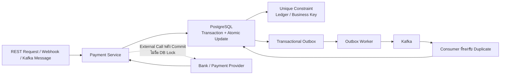
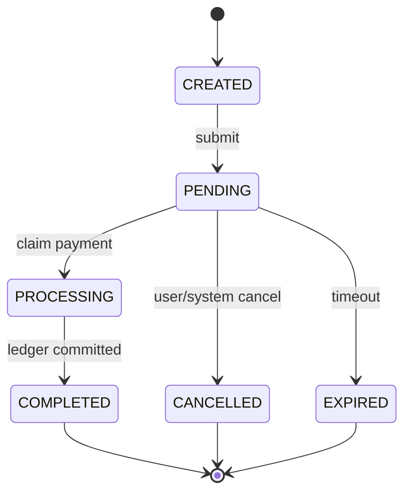
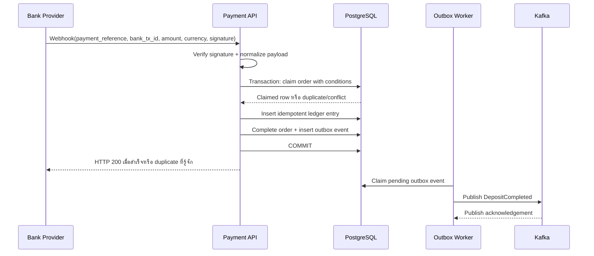
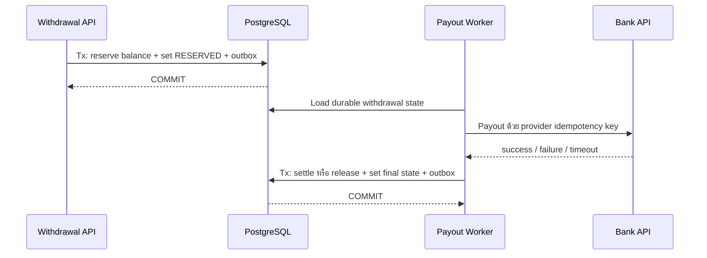

เอกสารนี้เป็น Design Guide สำหรับ Software Engineer ระดับ Senior ที่กำลังพัฒนาไปสู่ Staff Engineer เนื้อหามุ่งอธิบายวิธีคิดและ Trade-off ของระบบที่เกี่ยวข้องกับเงิน โดยใช้ตัวอย่างจาก Go, GORM, PostgreSQL, Kafka, REST API, Microservices และ Transactional Outbox

ถ้าต้องการอ่านแบบแบ่งเป็นช่วงสั้น ๆ ให้ใช้ [System Design Fundamentals Learning Sessions](/learning-sessions/system-design-fundamentals-learning-sessions/) ซึ่งจัดเนื้อหานี้เป็น 6 session พร้อมแบบฝึกคิดและ checklist สำหรับทบทวนในอนาคต

> **ขอบเขตและสมมติฐาน**
>
> - ตัวอย่างใช้ PostgreSQL เป็น Source of Truth ของ Order, Balance, Ledger และ Outbox ภายในขอบเขตเดียวกันเท่าที่ทำได้
> - Kafka มีพฤติกรรมแบบ At-least-once ในระดับ Application: Message อาจถูกส่งซ้ำเมื่อ Consumer Crash หรือ Retry
> - การเรียก Bank หรือ External Provider ไม่ได้อยู่ใน Database Transaction เดียวกับระบบเรา
> - จำนวนเงินใช้ `NUMERIC` ใน Database และใช้ `decimal` หรือชนิดที่ไม่สูญเสียความแม่นยำใน Go ไม่ใช้ `float64`
> - ชื่อ Table, Column, Status และ Error ในตัวอย่างเป็น Design Example ต้องปรับตาม Business Requirement จริง
> - คำว่า “ตอบสำเร็จ” ในเอกสารหมายถึง Business Effect ถูกทำแล้ว หรือเป็น Duplicate ที่ระบบรู้จักและไม่ต้องทำซ้ำ ไม่ได้หมายความว่า HTTP Request ถูกส่งออกไปอย่างเดียว

## Table of Contents

1. [บทนำ](#1-บทนำ)
2. [Shared Mutable State และการตรวจหาจุดเสี่ยง](#2-shared-mutable-state-และการตรวจหาจุดเสี่ยง)
3. [Check-Then-Act Race Condition](#3-check-then-act-race-condition)
4. [Validation แต่ละประเภท](#4-validation-แต่ละประเภท)
5. [Atomic Conditional Update](#5-atomic-conditional-update)
6. [ข้อจำกัดของ RowsAffected](#6-ข้อจำกัดของ-rowsaffected)
7. [SELECT FOR UPDATE](#7-select-for-update)
8. [Optimistic Locking](#8-optimistic-locking)
9. [Database Transaction](#9-database-transaction)
10. [Unique Constraint](#10-unique-constraint)
11. [Idempotency](#11-idempotency)
12. [Order State Machine](#12-order-state-machine)
13. [Deposit Webhook Design](#13-deposit-webhook-design)
14. [Withdrawal และ Balance Concurrency](#14-withdrawal-และ-balance-concurrency)
15. [Fund Reservation](#15-fund-reservation)
16. [Kafka กับ Concurrency](#16-kafka-กับ-concurrency)
17. [Transactional Outbox](#17-transactional-outbox)
18. [Decision Guide](#18-decision-guide)
19. [Anti-Patterns](#19-anti-patterns)
20. [Common Mistakes ที่พบบ่อย](#20-common-mistakes-ที่พบบ่อย)
21. [Staff Engineer Perspective](#21-staff-engineer-perspective)
22. [Checklist สำหรับ Code Review](#22-checklist-สำหรับ-code-review)
23. [Summary Cheat Sheet](#23-summary-cheat-sheet)

## 1. บทนำ

ระบบ Payment ไม่ได้วัดความสำเร็จจากการตอบ HTTP ได้เร็ว หรือการรับ Message ได้จำนวนมากเพียงอย่างเดียว จุดสำคัญกว่าคือ **ระบบต้องไม่สร้างผลทางธุรกิจที่ผิด** แม้มี Request ซ้ำ, Worker หลายตัว, Network Timeout, Pod Crash หรือ Event มาผิดลำดับ

สำหรับระบบทั่วไป Availability และ Throughput อาจเป็นตัวชี้วัดหลัก แต่สำหรับระบบเงิน ความผิดพลาดเล็กน้อยอาจกลายเป็นความเสียหายที่แก้ยากและกระทบความเชื่อมั่นโดยตรง เช่น:

- Credit เงินเข้าบัญชีลูกค้าซ้ำจาก Webhook เดิม
- ถอนเงินสองครั้งจาก Balance ก้อนเดียวกันจนเกิด Overdraw
- Order ถูก `COMPLETED` และ `CANCELLED` พร้อมกันจากสอง Actor
- Database Commit สำเร็จ แต่ Kafka Event ไม่ถูกส่ง ทำให้ระบบถัดไปไม่รู้ว่าเงินเปลี่ยนสถานะแล้ว
- Consumer ประมวลผล Message เดิมซ้ำแล้วสร้าง Ledger ซ้ำ
- ระบบตอบ Timeout ให้ Client ทั้งที่ Transaction Commit ไปแล้ว ทำให้ Client Retry และสร้างคำสั่งซ้ำ

### 1.1 Correctness มาก่อน Availability และ Throughput อย่างไร

คำว่า Correctness ในบริบทนี้หมายถึงระบบรักษา **Business Invariant** ได้ภายใต้ทุกลำดับเหตุการณ์ที่เป็นไปได้ ไม่ใช่เพียงทำงานได้ในกรณีปกติ

ตัวอย่างเช่น ถ้า Webhook ถูกส่งซ้ำ 10 ครั้ง ระบบที่ถูกต้องอาจตอบช้าลงเพราะต้องรอ Row Lock หรือใช้เวลาอ่านสถานะปัจจุบัน แต่ต้องไม่ Credit เงิน 10 ครั้งเพื่อแลกกับ Latency ที่ต่ำลง ในทางกลับกัน ไม่ได้หมายความว่าต้องใช้ Lock ทุกจุดจนระบบช้า เราสามารถรักษา Correctness แล้วเพิ่ม Throughput ด้วย Atomic Update, Short Transaction, Queue, Reservation และการแยก External Call ออกจาก Database Lock

หลักคิดคือ:

```text
Business Invariant
        ↓
เลือกจุดที่เป็น Authoritative Write
        ↓
ให้ Database หรือ State Machine บังคับเงื่อนไข
        ↓
ออกแบบ Retry และ Duplicate ให้ปลอดภัย
        ↓
เพิ่ม Async Processing โดยไม่ย้าย Correctness ไปไว้ใน Queue เพียงอย่างเดียว
```

### 1.2 Business Invariant คืออะไร

**Business Invariant** คือกฎที่ต้องเป็นจริงเสมอในมุมมองของธุรกิจ แม้มีการประมวลผลพร้อมกันหรือระบบล้มเหลวระหว่างทาง

ตัวอย่าง Invariant ที่พบบ่อยใน Payment:

| Business Invariant | ความหมายเชิงระบบ | กลไกที่อาจใช้ร่วมกัน |
| :--- | :--- | :--- |
| Bank Transaction หนึ่งรายการ Credit เงินได้ไม่เกินหนึ่งครั้ง | Webhook เดิมต้องไม่สร้างผลทางการเงินซ้ำ | Unique Constraint + Idempotency + Transaction |
| Withdrawal หนึ่งรายการ Reserve เงินได้ไม่เกินหนึ่งครั้ง | การ Retry ต้องไม่ลด Available Balance ซ้ำ | Atomic State Transition + Unique Business Key |
| Available Balance ต้องไม่ติดลบ | สอง Withdrawal พร้อมกันต้องใช้เงินก้อนเดียวกันซ้ำไม่ได้ | Atomic Conditional Update หรือ Row Lock |
| `COMPLETED` เป็น Terminal State | รายการที่จบแล้วไม่ย้อนกลับไป `PENDING` โดยตรง | State Machine + Conditional Update |
| Ledger Entry สำหรับ Business Effect เดียวเกิดได้หนึ่งชุด | Commit ซ้ำต้องไม่ Double Credit | Unique Business Effect Key |
| Aggregate กับ Outbox Event ต้องสอดคล้องกัน | ถ้า Order เปลี่ยนเป็นสำเร็จ ต้องมี Event ที่ส่งต่อได้ | Database Transaction + Transactional Outbox |

ไม่มีกลไกเดียวที่แก้ทุก Invariant ได้ เช่น Atomic Status Update ช่วยป้องกัน Worker สองตัว Claim Order เดียวกัน แต่ไม่ได้ป้องกัน Ledger ซ้ำโดยอัตโนมัติ ต้องใช้ Unique Constraint หรือ Idempotency Key เพิ่ม

### 1.3 ภาพรวมชั้นป้องกัน Correctness



ภาพนี้แยกหน้าที่ของแต่ละชั้นอย่างชัดเจน:

- **Atomic Update หรือ Row Lock** ป้องกันการตัดสินใจบนข้อมูลที่กำลังถูกเปลี่ยนพร้อมกัน
- **Unique Constraint** ป้องกันผลธุรกิจซ้ำแม้มี Bug, Retry หรือ Consumer ซ้ำ
- **Transaction** ทำให้หลาย Statement ใน Database สำเร็จหรือ Rollback ไปด้วยกัน
- **Idempotency** ทำให้การส่ง Request หรือ Event ซ้ำไม่สร้างผลเพิ่ม
- **Outbox** แก้ปัญหา Database Commit กับ Kafka Publish สำเร็จไม่พร้อมกัน
- **Recovery และ Reconciliation** ทำให้ระบบกลับมาจัดการงานที่ค้างหรือสถานะที่ไม่แน่ใจได้

## 2. Shared Mutable State และการตรวจหาจุดเสี่ยง

### 2.1 ความหมายของ Shared Mutable State

**Shared Mutable State** คือข้อมูลที่มีคุณสมบัติสองอย่างพร้อมกัน:

1. Actor มากกว่าหนึ่งตัวสามารถอ่านหรือเขียนข้อมูลชุดเดียวกันได้
2. ค่าของข้อมูลเปลี่ยนแปลงระหว่างช่วงเวลาที่ระบบกำลังตัดสินใจ

Actor อาจเป็น HTTP Request หลายรายการ, หลาย Pod, Background Worker, Kafka Consumer, Scheduled Job หรือ Admin Tool ก็ได้ ดังนั้น Application Mutex ใน Process เดียวไม่เพียงพอเมื่อระบบมีหลาย Instance

ตัวอย่างข้อมูลที่ต้องระวัง:

| Shared Mutable State | การเปลี่ยนแปลงที่พบบ่อย | Invariant ที่ต้องรักษา |
| :--- | :--- | :--- |
| `order.status` | `PENDING` → `PROCESSING` หรือ `CANCELLED` | Transition ต้องไม่ชนกันและไม่ข้ามขั้น |
| `account.available_balance` | ลดเมื่อ Reserve หรือเพิ่มเมื่อ Release | ต้องไม่ติดลบและไม่ลดซ้ำ |
| `account.reserved_balance` | เพิ่มตอน Reserve, ลดตอน Settle/Release | ต้องสัมพันธ์กับ Withdrawal ที่ยังค้าง |
| `inventory.available_quantity` | ลดเมื่อจองสินค้า | จำนวนรวมต้องไม่ติดลบหรือขายเกิน |
| `daily_limit_used` | เพิ่มเมื่อมี Transaction | ต้องไม่เกิน Limit จาก Concurrent Request |
| `bank_transaction_id` | จากว่างเป็น Transaction ID | Bank Transaction เดียวต้องผูกกับผลธุรกิจที่ถูกต้องเพียงครั้งเดียว |

`bank_transaction_id` ดูเหมือนเป็นเพียง Field สำหรับ Audit แต่ช่วงที่ยังว่างแล้วมีหลาย Webhook พยายามเขียนพร้อมกัน มันกลายเป็น Shared Mutable State และต้องมี Concurrency Control เช่นกัน

### 2.2 Checklist ตรวจ Operation ที่มีความเสี่ยง

ก่อนเขียน Code ให้ถามทุก Operation ตาม Checklist นี้:

1. มีหลาย Request, Pod, Worker หรือ Consumer แตะข้อมูลเดียวกันได้หรือไม่
2. ข้อมูลนั้นเปลี่ยนระหว่างการประมวลผลได้หรือไม่
3. ถ้าสอง Operation ทำพร้อมกัน Business Invariant จะผิดหรือไม่
4. Request หรือ Message ถูก Retry ได้หรือไม่
5. Operation นี้ต้องเกิดได้เพียงครั้งเดียวหรือไม่
6. Event ที่มาผิดลำดับมีผลหรือไม่

ถ้าตอบ “ใช่” อย่างน้อยหนึ่งข้อ ให้ระบุให้ชัดว่าจะใช้กลไกใด:

| ลักษณะปัญหา | กลไกที่ควรพิจารณา |
| :--- | :--- |
| เปลี่ยน Row ตามเงื่อนไขเดียว | Atomic Conditional Update |
| ต้องอ่านค่าปัจจุบันแล้วคำนวณหลายขั้น | `SELECT FOR UPDATE` |
| Conflict น้อยและ Retry ได้ | Optimistic Locking |
| ผลลัพธ์ห้ามซ้ำ | Unique Constraint หรือ Idempotency Key |
| หลาย Statement ต้องสำเร็จพร้อมกัน | Database Transaction |
| ส่งต่อ Event หลัง Commit | Transactional Outbox |
| Workflow ข้าม Service/Database | Saga, Durable State และ Reconciliation |

### 2.3 แยก Source of Truth กับ Cached State

Balance ที่เก็บใน `account_balances` อาจเป็น Cached Projection จาก Ledger หรืออาจเป็นยอดที่ระบบอนุญาตให้แก้โดยตรง การเลือกแบบใดเป็น **Design Decision** ที่ต้องเขียนไว้ เพราะวิธีควบคุม Concurrency ต่างกัน:

- ถ้า Ledger เป็น Source of Truth และ Balance เป็น Projection ต้องมี Version/Sequence และ Recovery สำหรับ Rebuild Projection
- ถ้า Balance เป็น Authoritative Aggregate การ Update Balance กับ Ledger ต้องอยู่ Transaction เดียวกันใน Database เดียวกัน
- ถ้า Balance กับ Ledger อยู่คนละ Service จะไม่มี Local Transaction เดียวครอบได้ ต้องใช้ Outbox/Saga และ Reconciliation แทนการสมมติว่า Kafka ทำให้ทั้งสองฝั่ง Atomic

## 3. Check-Then-Act Race Condition

### 3.1 รูปแบบของปัญหา

รูปแบบที่ต้องระวังคือ:

```text
Check condition
Then perform an action
```

ตัวอย่างที่ไม่ปลอดภัย:

```go
order, err := repo.GetOrder(ctx, orderID)
if err != nil {
    return err
}

if order.Status == StatusPending {
    return repo.UpdateStatus(ctx, orderID, StatusProcessing)
}
```

ปัญหาไม่ได้อยู่ที่ `if` หรือการแยก Function แต่อยู่ที่การอ่านและการเขียนไม่ใช่ Atomic Operation เดียวกัน ถ้า `UpdateStatus` มีเงื่อนไขเพียง `WHERE id = ?` ทั้งสอง Pod อาจ Update สำเร็จได้

### 3.2 Timeline ของสอง Pod ที่อ่าน `PENDING` พร้อมกัน

สมมติว่า `GetOrder` และ `UpdateStatus` เป็นคนละ Statement และไม่มี Lock:

| เวลา | Pod A | Pod B | Database State ที่ Commit แล้ว |
| :--- | :--- | :--- | :--- |
| T0 | - | - | `order.status = PENDING` |
| T1 | `SELECT` ได้ `PENDING` | - | `PENDING` |
| T2 | - | `SELECT` ได้ `PENDING` | `PENDING` |
| T3 | `UPDATE status = PROCESSING` สำเร็จ | - | `PROCESSING` |
| T4 | - | `UPDATE status = PROCESSING` สำเร็จเช่นกัน | `PROCESSING` |
| T5 | ทั้งสองอาจสร้าง Ledger/เรียก Bank ต่อ | ทั้งสองอาจสร้าง Ledger/เรียก Bank ต่อ | Business Effect อาจเกิดซ้ำ |

ถ้า `UpdateStatus` ใช้ `WHERE id = ? AND status = 'PENDING'` ปัญหาของการ Claim จะลดลง แต่ถ้า Ledger ถูก Insert แยก Transaction และไม่มี Unique Constraint ก็ยังมีช่องให้ผลธุรกิจซ้ำจาก Retry หรือ Flow อื่นได้

### 3.3 Check-Then-Act ไม่ได้ผิดเสมอไป

การอ่านแล้วตรวจเงื่อนไขใน Application ใช้ได้เมื่อเงื่อนไขนั้นไม่สามารถถูก Actor อื่นเปลี่ยนจนทำให้ Invariant เสีย หรือมี Mechanism อื่นครอบช่วง Check และ Act ไว้แล้ว เช่น:

- Validation ข้อมูล Local ใน Request เช่น Amount ต้องมากกว่าศูนย์
- ข้อมูล Immutable ที่ไม่มีใครแก้หลังสร้าง
- Reference Data ที่เปลี่ยนน้อยและ Business ยอมรับ Request ที่เริ่มก่อนการแก้ Master Data ได้
- มี Lock ครอบ Check และ Act
- อยู่ใน Transaction เดียวกันพร้อม `SELECT FOR UPDATE`
- ใช้ Version หรือ Database Constraint ตรวจ Conflict ตอน Write

การ Pre-check ใน Application ยังมีประโยชน์ด้าน UX และลดงาน Database แต่ต้องไม่ถูกเข้าใจว่าเป็นตัว Enforce Invariant เมื่อข้อมูลเป็น Shared Mutable State

### 3.4 TOCTOU: Time of Check to Time of Use

**TOCTOU (Time of Check to Time of Use)** คือช่วงเวลาระหว่างการตรวจเงื่อนไขกับการนำผลตรวจนั้นไปใช้ ซึ่งข้อมูลอาจเปลี่ยนไปแล้ว:

```text
T0: Check  → order = PENDING, balance = 10,000
T1: Other Actor เปลี่ยน order หรือใช้ balance ไปแล้ว
T2: Use    → ระบบทำงานต่อโดยอิงผลตรวจเก่า
```

แนวทางแก้คือย้ายเงื่อนไขไปอยู่ใน Write (`UPDATE ... WHERE ...`), ล็อก Row ก่อนอ่าน, ใช้ Version หรือให้ Constraint เป็นด่านสุดท้าย ไม่ใช่พยายามแก้ TOCTOU ด้วยการเพิ่ม Delay หรือ Application Mutex

## 4. Validation แต่ละประเภท

Validation ไม่ใช่ทุกชนิดที่ต้องใช้ Lock การเลือกกลไกต้องดูว่า Validation นั้นอิงข้อมูลที่ใครเปลี่ยนได้และผลผิดพลาดทำให้ Business Invariant เสียหรือไม่

### 4.1 Local Request Validation

เป็น Validation ที่ใช้ข้อมูลจาก Request เองและ Request อื่นไม่สามารถเปลี่ยนค่าระหว่างตรวจได้:

```go
if input.Amount.LessThanOrEqual(decimal.Zero) {
    return ErrInvalidAmount
}

if input.Currency == "" {
    return ErrInvalidCurrency
}
```

**Why:** ไม่ได้อ่าน Shared Mutable State จึงไม่มี Race Condition ระหว่าง Check

**When:** ตรวจ Format, Required Field, Range พื้นฐาน, UUID Format, Decimal Precision และ Schema ของ Request

**Trade-off:** ถ้าตรวจเฉพาะใน Application จะยังไม่พอเมื่อ Database มี Constraint เพิ่มเติม เช่น Currency ต้องตรงกับ Order หรือ Amount ต้องตรงกับยอดที่บันทึกไว้ จึงควร Validate ซ้ำใน Authoritative Write เมื่อเงื่อนไขนั้นเป็น Business Invariant

โดยทั่วไปไม่ต้องใช้ Row Lock สำหรับ Validation ประเภทนี้

### 4.2 Reference หรือ Master Data Validation

ตัวอย่าง:

- Currency Code มีอยู่หรือไม่
- Bank Code ถูกต้องหรือไม่
- Product รองรับ Currency หรือไม่
- Country หรือ Fee Configuration มีอยู่หรือไม่

**Why:** ข้อมูลมักเปลี่ยนน้อยและไม่ได้ถูกใช้เป็น Counter ที่ต้องแข่งขันทุก Request

**When:** อ่าน Reference Data ด้วย Read Query ปกติได้ หาก Business ยอมรับให้ Request ที่เริ่มก่อน Master Data เปลี่ยน ใช้ค่าที่อ่านได้ในช่วงสั้น ๆ

**Trade-off:** การไม่ Lock ช่วยให้ Throughput สูงและลด Lock Contention แต่ Request อาจเห็น Master Data คนละ Version กับตอน Commit ถ้าความถูกต้องเข้มงวด เช่น Currency/Product Mapping มีผลต่อการคำนวณเงิน ให้ใช้ทางเลือกที่ชัดเจน เช่น:

- เก็บ `master_data_version` แล้วตรวจ Version ตอน Write
- ใช้ Effective Date แทนการพึ่ง Snapshot ที่ไม่ระบุเวลา
- ทำ Validation และ Effect ใน Transaction เดียวกัน
- ใช้ Constraint หรือ Foreign Key เมื่อเป็นความสัมพันธ์เชิงโครงสร้าง

การใช้ Lock หรือไม่ใช้ Lock ในกลุ่มนี้เป็น Design Decision ตามความเสี่ยง ไม่ใช่กฎตายตัว

### 4.3 Shared Mutable State Validation

ตัวอย่าง:

- Customer ยัง `ACTIVE` หรือไม่
- Order ยัง `PENDING` หรือไม่
- Balance เพียงพอหรือไม่
- Daily Limit ยังเหลือหรือไม่
- Inventory ยังเพียงพอหรือไม่

**Why:** Actor อื่นสามารถเปลี่ยนข้อมูลหลังจาก Read ได้ และการใช้ผลเก่าอาจทำให้ Invariant ผิด

**When:** ต้องพิจารณา Concurrency Control เสมอ โดยเลือกตามรูปแบบ Logic:

- เงื่อนไขง่ายและ Update ใน Row เดียว → Atomic Conditional Update
- ต้องอ่านค่าปัจจุบัน คำนวณ หรือแตะหลาย Row → `SELECT FOR UPDATE`
- Conflict ไม่บ่อยและสามารถ Retry ได้ → Optimistic Locking
- ผลธุรกิจห้ามซ้ำ → Unique Constraint/Idempotency เพิ่ม แม้มี Lock แล้ว

**Trade-off:** Lock เพิ่มความถูกต้องในช่วง Critical Section แต่ลด Concurrent Throughput และอาจสร้าง Deadlock ถ้าล็อกหลาย Row ไม่เป็นลำดับเดียวกัน ส่วน Optimistic Lock เพิ่ม Retry และความซับซ้อนในการเลือก Error

### 4.4 รูปแบบที่ใช้จริง: Fast Pre-check + Authoritative Check

รูปแบบที่สมดุลคือ:

1. ตรวจ Local Request และ Reference Data เพื่อ Fail Fast
2. ส่งเงื่อนไขที่เป็น Invariant เข้า Atomic Update หรือ Transaction
3. ให้ Database เป็นผู้ตัดสินผลสุดท้าย
4. เมื่อ Conflict ให้ Classify จาก Current State แล้วเลือก Retry, Duplicate Success หรือ Business Error

การ Pre-check มีไว้เพื่อประสบการณ์และประสิทธิภาพ ส่วน Authoritative Check มีไว้เพื่อ Correctness

## 5. Atomic Conditional Update

### 5.1 รวม Check และ Act ใน SQL Statement เดียว

แทนที่จะอ่าน `PENDING` แล้วค่อย Update ให้รวมเงื่อนไขไว้ใน `UPDATE`:

```sql
UPDATE deposit_orders
SET status = 'PROCESSING',
    bank_transaction_id = :transaction_id,
    updated_at = NOW()
WHERE id = :order_id
  AND status = 'PENDING';
```

Database จะเลือก Row, จัดการ Lock ภายใน Statement และตรวจ Predicate ของ `WHERE` ขณะทำ Update ผลลัพธ์ที่สำคัญคือจำนวน Row ที่ถูก Update:

```text
RowsAffected = 1
Operation นี้ชนะและทำงานต่อได้

RowsAffected = 0
เงื่อนไขไม่ผ่าน หรือ Operation อื่นชนะไปแล้ว
```

**Why:** ลด TOCTOU เพราะ Check และ Act อยู่ใน Database Operation เดียวกัน

**When:** เหมาะกับ State Transition หรือ Counter Update ที่เงื่อนไขและผลลัพธ์เขียนเป็น Predicate ได้ชัดเจน

**Trade-off:** Code มีความกระชับและ Lock สั้น แต่ Logic หลายขั้นหรือ Invariant ข้ามหลาย Row อาจอ่านยากและต้องใช้ Transaction/Row Lock แทน

### 5.2 Concurrent Update สองรายการ

สมมติ Pod A และ Pod B Update Order เดียวกันด้วย `WHERE status = 'PENDING'`:

| เวลา | Pod A | Pod B | ผลที่ PostgreSQL เห็น |
| :--- | :--- | :--- | :--- |
| T0 | เริ่ม `UPDATE` | - | Row เป็น `PENDING` |
| T1 | ได้ Row Lock และกำลัง Update | เริ่ม `UPDATE` | Pod B รอ Lock ของ Pod A |
| T2 | Commit `PROCESSING` | ยังรอ | Row เป็น `PROCESSING` |
| T3 | - | ได้ Lock ต่อ | PostgreSQL ตรวจ Predicate ใหม่กับ Version ล่าสุด |
| T4 | - | `status = 'PENDING'` ไม่จริง | Pod B ได้ `RowsAffected = 0` |

รายละเอียดการ Re-check ขึ้นกับ Isolation Level และ Database Behavior แต่ที่ `READ COMMITTED` ซึ่งเป็นค่าเริ่มต้นของ PostgreSQL การ Update ที่รอ Row Lock จะประเมินเงื่อนไขกับ Row Version ล่าสุด ไม่ใช้ผลอ่านเก่าต่อไปแบบไม่มีเงื่อนไข หากใช้ Isolation ที่เข้มขึ้น อาจได้ `serialization failure` แทน และ Application ต้อง Retry Transaction ตาม Policy

### 5.3 เพิ่มหลายเงื่อนไขใน Atomic Update

เงื่อนไขไม่จำเป็นต้องมีเพียง Status:

```sql
UPDATE deposit_orders
SET status = 'PROCESSING',
    bank_transaction_id = :transaction_id,
    updated_at = NOW()
WHERE payment_reference = :payment_reference
  AND status = 'PENDING'
  AND expected_amount = :amount
  AND currency = :currency
  AND expires_at > NOW()
  AND bank_transaction_id IS NULL;
```

ตัวอย่างนี้บังคับให้การ Claim สำเร็จได้เฉพาะเมื่อ:

- Match Order ด้วย Payment Reference
- Order ยังอยู่ใน State ที่รับ Payment ได้
- Amount และ Currency ตรงกับที่สร้าง Order
- Order ยังไม่หมดอายุ
- ยังไม่มี Bank Transaction อื่นผูกไว้

เงื่อนไขจำนวนมากช่วยป้องกันข้อมูลผิด แต่ทำให้ `RowsAffected = 0` อธิบายสาเหตุไม่ได้โดยตรง ต้องใช้ Pattern ในหัวข้อถัดไป

### 5.4 ใช้ PostgreSQL `RETURNING`

ถ้าต้องการข้อมูล Row ที่ Claim ได้ทันที ใช้ `RETURNING`:

```sql
UPDATE deposit_orders
SET status = 'PROCESSING',
    bank_transaction_id = :transaction_id,
    updated_at = NOW()
WHERE payment_reference = :payment_reference
  AND status = 'PENDING'
RETURNING id, customer_id, expected_amount, currency;
```

ข้อดีคือข้อมูลที่ได้เป็นผลจาก Row ที่ Update สำเร็จจริง ไม่ต้องทำ `SELECT` เพิ่มหลัง Update และลดโอกาสที่ Read จะเห็นข้อมูลจากคนละจังหวะ

### 5.5 Go/GORM: ตรวจ `RowsAffected`

ตัวอย่างนี้เน้นแนวคิดของ GORM v2 กับ PostgreSQL:

```go
func (r *DepositOrderRepository) ClaimPending(
    ctx context.Context,
    orderID uuid.UUID,
    transactionID string,
) (bool, error) {
    result := r.db.WithContext(ctx).
        Model(&DepositOrder{}).
        Where("id = ? AND status = ? AND bank_transaction_id IS NULL",
            orderID,
            StatusPending,
        ).
        Updates(map[string]any{
            "status":              StatusProcessing,
            "bank_transaction_id": transactionID,
            "updated_at":          gorm.Expr("NOW()"),
        })

    if result.Error != nil {
        return false, result.Error
    }
    if result.RowsAffected > 1 {
        // id เป็น Primary Key จึงไม่ควรเกิดขึ้น; ถือเป็น Data/Query Anomaly
        return false, ErrUnexpectedRowCount
    }

    return result.RowsAffected == 1, nil
}
```

การได้ `claimed = false` ไม่ควรตีความเป็น Error ทันที อาจเป็น Duplicate ที่ทำเสร็จแล้ว, Order หมดอายุ หรือมี Worker อื่นชนะไปแล้ว ต้อง Classify Current State ตามหัวข้อ 6

### 5.6 Go/GORM: ใช้ `RETURNING`

GORM v2 รองรับ PostgreSQL `RETURNING` ผ่าน `clause.Returning` ตัวอย่างเชิงแนวคิด:

```go
func (r *DepositOrderRepository) ClaimAndLoad(
    ctx context.Context,
    paymentReference string,
    transactionID string,
) (*DepositOrder, error) {
    var order DepositOrder

    result := r.db.WithContext(ctx).
        Model(&order).
        Clauses(clause.Returning{
            Columns: []clause.Column{
                {Name: "id"},
                {Name: "customer_id"},
                {Name: "expected_amount"},
                {Name: "currency"},
            },
        }).
        Where("payment_reference = ? AND status = ?", paymentReference, StatusPending).
        Updates(map[string]any{
            "status":              StatusProcessing,
            "bank_transaction_id": transactionID,
            "updated_at":          gorm.Expr("NOW()"),
        })

    if result.Error != nil {
        return nil, result.Error
    }
    if result.RowsAffected == 0 {
        return nil, ErrOrderNotClaimed
    }
    return &order, nil
}
```

รูปแบบการ Populate Model ของ `RETURNING` อาจขึ้นกับ Version และ Query Shape ของ GORM หากต้องการความชัดเจนสูงใน Critical Payment Path ให้ใช้ Explicit SQL ผ่าน `database/sql` หรือ `Raw` แล้ว `Scan` ผล `RETURNING` โดยตรง และยังตรวจ `RowsAffected`/`sql.ErrNoRows` เสมอ

## 6. ข้อจำกัดของ RowsAffected

`RowsAffected = 0` เป็นผลของ Atomic Update แต่ไม่ได้บอกสาเหตุโดยตรง อาจเกิดจาก:

- Order ไม่พบ
- Status ไม่ถูกต้อง
- Order หมดอายุ
- Amount ไม่ตรง
- Currency ไม่ตรง
- Transaction ถูกใช้แล้ว
- Concurrent Request ชนะไปก่อนแล้ว

ดังนั้นอย่า Map `RowsAffected = 0` เป็น Error เดียว เช่น `ErrConflict` โดยไม่แยกกรณี เพราะ Client, Retry Worker, Alert และ Reconciliation ต้องการการตัดสินใจที่ต่างกัน

### 6.1 Pattern: Update ก่อน แล้ว Read เพื่อ Classify

```text
Atomic Update
    |
RowsAffected = 0
    |
Read current state
    |
Classify the result
```

ตัวอย่างการ Classify Deposit:

| Current State หลัง Update ไม่สำเร็จ | เงื่อนไข | การตอบสนองที่เหมาะสม |
| :--- | :--- | :--- |
| ไม่พบ Order | Payment Reference ไม่ตรง | เก็บ Unmatched Webhook/ส่งเข้า Reconciliation ตาม Contract |
| `COMPLETED` | `bank_transaction_id` เดียวกันและ Amount/Currency ตรง | Duplicate Success; ไม่ Credit ซ้ำ และตอบสำเร็จตาม Webhook Contract |
| `COMPLETED` | Transaction ID ต่างกัน | Conflict/Anomaly; ไม่แก้ Order และต้อง Alert/ตรวจสอบ |
| `CANCELLED` หรือ `EXPIRED` | Payment มาหลังหมดอายุ | Reject หรือเข้า Manual Review ตาม Business Decision |
| `PROCESSING` | Worker อื่นกำลังทำงาน | Retry ภายหลัง หรือรอ Durable State ตาม Workflow |
| Amount/Currency ไม่ตรง | Payload ไม่ตรง Order | ไม่สร้าง Ledger และเก็บหลักฐานไว้ตรวจสอบ |

การอ่านภายหลังมีหน้าที่ **อธิบาย Error, ทำ Audit และเลือก Recovery** ไม่ใช่กลไกหลักในการ Enforce Concurrency เพราะ Correctness ถูกบังคับไปแล้วที่ Atomic Update, Constraint หรือ Transaction

### 6.2 ตัวอย่าง Go: Classify หลัง Claim ไม่สำเร็จ

```go
claimed, err := repo.ClaimPending(ctx, orderID, webhook.BankTransactionID)
if err != nil {
    return err
}
if claimed {
    return processClaimedDeposit(ctx, webhook)
}

current, err := repo.GetByPaymentReference(ctx, webhook.PaymentReference)
if errors.Is(err, gorm.ErrRecordNotFound) {
    return ErrUnmatchedWebhook
}
if err != nil {
    return err
}

switch {
case current.Status == StatusCompleted &&
    current.BankTransactionID == webhook.BankTransactionID &&
    current.Amount.Equal(webhook.Amount) &&
    current.Currency == webhook.Currency:
    // Duplicate ที่ทำเสร็จแล้ว: ไม่ทำ Ledger ซ้ำ
    return nil
case current.Status == StatusCompleted:
    return ErrCompletedOrderTransactionMismatch
case current.Status == StatusExpired || current.Status == StatusCancelled:
    return ErrOrderNoLongerPayable
default:
    return ErrDepositNotClaimed
}
```

ในระบบที่ต้องการรายละเอียดแบบ Snapshot เดียวกับการ Classify อาจทำ `SELECT ... FOR UPDATE` ภายใน Transaction หลัง `RowsAffected = 0` เพื่อไม่ให้ State เปลี่ยนระหว่างการอ่านกับการตัดสินใจถัดไป

## 7. SELECT FOR UPDATE

### 7.1 Pessimistic Lock คืออะไร

`SELECT FOR UPDATE` เป็น **Pessimistic Lock**: ระบบล็อก Row ก่อนอ่านและถือ Lock จนกว่า Transaction จะ Commit หรือ Rollback

```sql
BEGIN;

SELECT *
FROM deposit_orders
WHERE id = :order_id
FOR UPDATE;

-- Validate และคำนวณจากค่าปัจจุบัน

UPDATE deposit_orders
SET status = 'COMPLETED'
WHERE id = :order_id;

COMMIT;
```

ข้อสำคัญคือ `SELECT FOR UPDATE` ต้องทำภายใน Database Transaction เดียวกับ `UPDATE` และ Lock มีผลกับ Connection/Transaction นั้น ไม่ใช่ Lock ถาวรที่ทำให้ Process อื่นหยุดทั้งหมด

### 7.2 เหมาะเมื่อใด

ใช้เมื่อ:

- ต้องทำ Read-Modify-Write
- ต้องคำนวณจากค่าปัจจุบัน เช่น ยอดคงเหลือ, Limit, Fee Tier
- ต้องตรวจหลาย Row
- ต้องรักษา Invariant ข้ามหลาย Table
- Logic เขียนเป็น Conditional Update ได้ยาก
- ต้องทราบ Error Reason อย่างละเอียดก่อน Update

**Why:** ทำให้การอ่านและการตัดสินใจถัดไปเห็น Snapshot ที่ถูกกันจาก Writer อื่นจนจบ Critical Section

**Trade-off:** อ่านง่ายสำหรับ Logic แบบขั้นตอน แต่ Transaction ถือ Lock นานขึ้น อาจเกิด Lock Wait, ลด Throughput และเพิ่ม Deadlock Risk หากหลาย Transaction ล็อกหลาย Row ในลำดับต่างกัน

### 7.3 Go/GORM: Transaction + Row Lock

```go
func (s *WithdrawalService) ReserveWithRowLock(
    ctx context.Context,
    accountID uuid.UUID,
    currency string,
    amount decimal.Decimal,
) error {
    return s.db.WithContext(ctx).Transaction(func(tx *gorm.DB) error {
        var balance AccountBalance

        err := tx.Clauses(clause.Locking{Strength: "UPDATE"}).
            Where("account_id = ? AND currency = ?", accountID, currency).
            First(&balance).Error
        if err != nil {
            return err
        }

        if balance.AvailableBalance.LessThan(amount) {
            return ErrInsufficientBalance
        }

        balance.AvailableBalance = balance.AvailableBalance.Sub(amount)
        balance.ReservedBalance = balance.ReservedBalance.Add(amount)

        if err := tx.Save(&balance).Error; err != nil {
            return err
        }

        return tx.Create(&WithdrawalReservation{
            AccountID: accountID,
            Currency:  currency,
            Amount:    amount,
        }).Error
    })
}
```

ตัวอย่างนี้เป็นแนวคิด ไม่ได้แสดง Unique Key, Ledger Entry และ Outbox ทั้งหมด การ Reserve จริงควรครอบผลธุรกิจที่จำเป็นไว้ใน Transaction เดียว และต้องมี Idempotency สำหรับการ Retry

### 7.4 Atomic Update เทียบกับ `SELECT FOR UPDATE`

| หัวข้อ | Atomic Conditional Update | `SELECT FOR UPDATE` |
| :--- | :--- | :--- |
| Complexity | ต่ำเมื่อ Predicate และ Update ง่าย | สูงขึ้น เพราะต้องจัดการ Transaction และ Critical Section |
| Lock Duration | สั้น ระดับ Statement | ยาวเท่ากับ Transaction |
| Throughput | มักสูงกว่าเมื่อ Contention สูงและ Logic สั้น | ลดลงเมื่อหลาย Request รอ Row เดียวกัน |
| Readability | สื่อ Invariant ผ่าน SQL Predicate | สื่อ Business Logic แบบ Read-Modify-Write ได้ชัด |
| Conflict Handling | มักเริ่มจาก `RowsAffected` แล้ว Classify ต่อ | อ่าน Current State ได้ละเอียดก่อนตัดสินใจ |
| Suitable Use Cases | Claim Job, เปลี่ยน Status, Reserve ง่าย ๆ, Counter | Balance Calculation, หลาย Row/Table, ตรวจเงื่อนไขซับซ้อน |
| Deadlock Risk | ต่ำกว่าเมื่อแตะ Row เดียว แต่ยังมีได้ถ้าแตะหลาย Row | สูงขึ้นหาก Lock หลาย Row ไม่ใช้ลำดับเดียวกัน |

ไม่มีแบบใดเป็น Best Practice เสมอ:

- ถ้าเขียน Logic เป็น `UPDATE ... WHERE invariant` ได้ชัด ให้เริ่มจาก Atomic Update
- ถ้าต้องอ่านหลายค่าแล้วตัดสินใจเป็นขั้นตอน ให้ใช้ Row Lock ใน Transaction สั้น ๆ
- ถ้าทั้งสองแบบทำได้ ให้เลือกแบบที่ทำให้ Invariant, Failure และ Recovery อธิบายได้ง่ายที่สุด

### 7.5 ห้ามถือ Row Lock ระหว่างเรียก External Service

อย่าทำแบบนี้:

```text
BEGIN
SELECT balance FOR UPDATE
เรียก Bank API ← Network อาจค้างเป็นวินาทีหรือนาที
UPDATE balance
COMMIT
```

เพราะ Lock จะถูกถือระหว่าง Network Timeout, Retry และ Provider ที่ช้า ทำให้ Request อื่นรอเป็นทอด ๆ และอาจเกิด Deadlock/Connection Pool Exhaustion

รูปแบบที่ปลอดภัยกว่าคือ:

```text
Transaction สั้น: Reserve เงิน + สร้าง Durable State + Outbox
Commit
เรียก Bank API โดยใช้ Idempotency Key
Transaction สั้น: บันทึก Success/Failure + Settle หรือ Release + Outbox
```

## 8. Optimistic Locking

### 8.1 ใช้ Version Column ตรวจ Conflict

Optimistic Locking ไม่ล็อก Row ขณะอ่าน แต่บันทึก Version ที่อ่านมาและตรวจว่าไม่มีใครแก้ก่อนเขียน:

```sql
UPDATE orders
SET status = 'COMPLETED',
    version = version + 1,
    updated_at = NOW()
WHERE id = :order_id
  AND version = :expected_version;
```

ถ้า `RowsAffected = 1` แปลว่า Version ยังตรงและ Operation ชนะ ถ้า `RowsAffected = 0` อาจมีคนแก้ก่อนหน้า ต้อง Read ใหม่แล้วตัดสินใจว่าจะ Retry หรือแจ้ง Conflict

### 8.2 เหมาะเมื่อใด

**Why:** หลีกเลี่ยงการถือ Lock ระหว่างช่วงอ่านและเตรียมคำตอบ ทำให้ Request ที่ไม่ชนกันทำงานได้ดี

**When:** เหมาะเมื่อ Conflict ไม่บ่อย, Operation สามารถคำนวณใหม่ได้, และผู้เรียกยอมรับ Retry/Conflict ได้ เช่น Admin Edit, Metadata, Configuration หรือ Aggregate ที่มี Writer ไม่มาก

**Trade-off:** เมื่อ Contention สูง การ Retry จำนวนมากอาจแพงกว่า Pessimistic Lock และถ้า Side Effect เกิดก่อนตรวจ Version จะย้อนกลับไม่ได้ เช่น ห้ามเรียก Bank API แล้วค่อยตรวจว่า Update Version สำเร็จ

### 8.3 Go/GORM ตัวอย่าง

```go
func (r *OrderRepository) CompleteIfVersion(
    ctx context.Context,
    orderID uuid.UUID,
    expectedVersion int64,
) (bool, error) {
    result := r.db.WithContext(ctx).
        Model(&Order{}).
        Where("id = ? AND version = ? AND status = ?",
            orderID,
            expectedVersion,
            StatusProcessing,
        ).
        Updates(map[string]any{
            "status":    StatusCompleted,
            "version":   gorm.Expr("version + 1"),
            "updated_at": gorm.Expr("NOW()"),
        })

    if result.Error != nil {
        return false, result.Error
    }
    return result.RowsAffected == 1, nil
}
```

Retry ต้องมีขอบเขต เช่น จำกัดจำนวนครั้ง, ใช้ Exponential Backoff + Jitter และตรวจว่า Operation Idempotent หรือไม่ อย่า Retry แบบไม่มีเงื่อนไขกับการเรียก External Provider เพราะ Network Timeout อาจหมายถึง Provider ทำรายการสำเร็จแล้ว

### 8.4 Optimistic เทียบกับ Pessimistic Lock

| ประเด็น | Optimistic Lock | Pessimistic Lock |
| :--- | :--- | :--- |
| วิธีคิด | คาดว่าไม่ค่อยชน แล้วตรวจ Version ตอนเขียน | คาดว่าอาจชน แล้วกันคนอื่นตั้งแต่ต้น |
| Contention ต่ำ | ดี ไม่ต้องรอ Lock | ใช้ได้แต่มี Overhead ของ Lock |
| Contention สูง | Retry อาจถี่และเสียงาน | มักคาดการณ์การรอได้ชัดกว่า |
| Logic มี External Call | ต้องแยก Side Effect ก่อนเสมอ | ยังต้องแยก เพราะไม่ควรถือล็อกข้าม Network |
| Error Handling | ต้องจัดการ Conflict และ Re-read | ต้องจัดการ Lock Timeout/Deadlock |
| เหมาะกับ Payment Effect | ใช้ได้กับ State/Metadata ที่ Retry ได้ | เหมาะกับ Balance และ Read-Modify-Write ที่ต้อง Snapshot ปัจจุบัน |

## 9. Database Transaction

### 9.1 Atomic Status Update ไม่ได้ทำให้ Workflow ทั้งหมด Atomic

Atomic Status Update ป้องกันเฉพาะการ Claim หรือ State Transition หนึ่งจุด ไม่ได้ทำให้ Statement ต่อ ๆ ไปสำเร็จไปด้วยกันโดยอัตโนมัติ:

```text
Update Order เป็น PROCESSING
Commit
Insert Ledger
Application Crash
```

ผลคือ Order อยู่ `PROCESSING` แต่ไม่มี Ledger ซึ่งอาจทำให้ลูกค้าเห็นสถานะไม่ตรงยอดเงินจริง ต้องมี Recovery Job ก็จริง แต่ถ้า Order และ Ledger อยู่ Database เดียวกันและเป็น Business Effect เดียวกัน ควรใช้ Transaction ครอบไว้

### 9.2 Transaction ครอบ Order, Ledger และ Outbox

เมื่อผล Payment ได้รับการยืนยันแล้วและไม่มี External Call ที่ต้องรอ สามารถทำชุด Operation ใน Transaction เดียว:

```sql
BEGIN;

UPDATE deposit_orders
SET status = 'PROCESSING'
WHERE id = :order_id
  AND status = 'PENDING';

-- ถ้า RowsAffected != 1 ให้ Rollback หรือ Classify ภายใน Transaction

INSERT INTO ledger_entries (
    reference_type,
    reference_id,
    entry_type,
    amount,
    currency,
    created_at
)
VALUES (
    'DEPOSIT_ORDER',
    :order_id,
    'DEPOSIT_CREDIT',
    :amount,
    :currency,
    NOW()
);

UPDATE deposit_orders
SET status = 'COMPLETED',
    completed_at = NOW()
WHERE id = :order_id
  AND status = 'PROCESSING';

INSERT INTO outbox_events (
    event_id,
    event_type,
    aggregate_type,
    aggregate_id,
    payload,
    created_at
)
VALUES (
    :event_id,
    'DepositCompleted',
    'DEPOSIT_ORDER',
    :order_id,
    :payload,
    NOW()
);

COMMIT;
```

ถ้า Statement ใดล้มเหลว เช่น Unique Constraint ของ Ledger ชน Transaction จะ Rollback ทั้งชุด ไม่เหลือ Order ที่ Complete แต่ไม่มี Ledger หรือมี Ledger แต่ไม่มี Event ใน Database เดียวกัน

ใน Workflow จริงอาจแบ่งเป็นหลาย Transaction:

1. Transaction แรก Claim/Reserve แล้ว Commit
2. เรียก External Provider โดยใช้ Idempotency Key
3. Transaction ที่สองบันทึก Provider Result, Ledger, State และ Outbox

การแบ่งแบบนี้เป็นสิ่งจำเป็นเมื่อมี Network Call แต่ต้องมี Durable State และ Recovery สำหรับกรณี Crash ระหว่างขั้นตอน

### 9.3 Go/GORM: ครอบหลาย Statement

```go
func (s *DepositService) Complete(
    ctx context.Context,
    orderID uuid.UUID,
    txID string,
    amount decimal.Decimal,
    currency string,
) error {
    return s.db.WithContext(ctx).Transaction(func(tx *gorm.DB) error {
        result := tx.Model(&DepositOrder{}).
            Where("id = ? AND status = ?", orderID, StatusPending).
            Updates(map[string]any{
                "status":              StatusProcessing,
                "bank_transaction_id": txID,
            })
        if result.Error != nil {
            return result.Error
        }
        if result.RowsAffected != 1 {
            return ErrOrderNotClaimed
        }

        entry := LedgerEntry{
            ReferenceType: "DEPOSIT_ORDER",
            ReferenceID:   orderID.String(),
            EntryType:     "DEPOSIT_CREDIT",
            Amount:        amount,
            Currency:      currency,
        }
        if err := tx.Create(&entry).Error; err != nil {
            return err
        }

        if err := tx.Model(&DepositOrder{}).
            Where("id = ? AND status = ?", orderID, StatusProcessing).
            Updates(map[string]any{
                "status":       StatusCompleted,
                "completed_at": gorm.Expr("NOW()"),
            }).Error; err != nil {
            return err
        }

        return tx.Create(&OutboxEvent{
            EventID:       uuid.New(),
            EventType:     "DepositCompleted",
            AggregateType: "DEPOSIT_ORDER",
            AggregateID:   orderID.String(),
            Payload:       buildDepositCompletedPayload(orderID, txID, amount, currency),
        }).Error
    })
}
```

ใน Code จริงควรเพิ่ม Unique Business Effect Key ให้ `LedgerEntry`, ตรวจว่า Amount/Currency จาก Database ตรงกับ Event และกำหนดว่าถ้า Duplicate เกิดขึ้นใน `tx.Create` จะถือเป็น Duplicate Success หรือเป็น Data Conflict ไม่ควรกลืน Error ทุกชนิดด้วย `ON CONFLICT DO NOTHING`

### 9.4 ACID กับ Use Case Payment

| ACID | ความหมายสั้น ๆ | ตัวอย่างใน Payment |
| :--- | :--- | :--- |
| Atomicity | ทุก Statement ใน Transaction สำเร็จหรือ Rollback พร้อมกัน | Order Complete + Ledger + Outbox ต้องไปด้วยกัน |
| Consistency | หลัง Commit Invariant และ Constraint ต้องยังเป็นจริง | Ledger Effect ไม่ซ้ำ, Balance ไม่ติดลบ |
| Isolation | Transaction ที่ชนกันเห็นผลตามกติกา ไม่อ่าน/เขียนขัดกันแบบผิด | Concurrent Reserve ต้องไม่ใช้ Available Balance เดิมทั้งคู่ |
| Durability | หลัง Commit สำเร็จ ข้อมูลไม่หายแม้ Process Crash | Webhook Retry พบ Order Completed และตอบ Duplicate ได้ |

Transaction ช่วยได้เฉพาะ Resource ที่อยู่ในขอบเขต Database เดียวกัน ไม่ได้ทำให้ Bank API, Kafka คนละระบบ หรือ Database ของอีก Microservice Commit/Rollback พร้อมกันโดยอัตโนมัติ

## 10. Unique Constraint

### 10.1 Application Check อย่างเดียวป้องกัน Duplicate ไม่ได้

รูปแบบนี้ไม่ปลอดภัย:

```text
SELECT ว่า bank_transaction_id นี้ยังไม่มี
ถ้าไม่มี → INSERT Ledger
```

สอง Transaction อาจ `SELECT` ไม่เจอพร้อมกันแล้ว `INSERT` ทั้งคู่ได้ แม้ Application Code จะดูถูกต้องใน Single Request Test

ให้ Database เป็นด่านสุดท้ายด้วย Unique Constraint หรือ Unique Index:

```sql
CREATE UNIQUE INDEX uq_bank_transaction
ON deposit_orders(bank_code, bank_transaction_id)
WHERE bank_transaction_id IS NOT NULL;
```

Partial Index ทำให้ Transaction ที่ยังไม่มี Bank ID หลายรายการอยู่ได้ แต่เมื่อมี ID แล้วค่าซ้ำกันไม่ได้ในขอบเขต `bank_code` เดียวกัน

### 10.2 ป้องกัน Double Credit ใน Ledger

```sql
CREATE UNIQUE INDEX uq_deposit_credit
ON ledger_entries(reference_type, reference_id, entry_type);
```

Index นี้เหมาะเมื่อ Business กำหนดว่า `reference_id` หนึ่งรายการมี `entry_type = 'DEPOSIT_CREDIT'` ได้เพียงหนึ่งรายการ หาก Ledger รองรับการ Split Entry, Fee แยกหลายบรรทัด หรือ Reversal หลายครั้ง ต้องออกแบบ Business Effect Key ให้ละเอียดขึ้น เช่น:

```sql
CREATE UNIQUE INDEX uq_ledger_business_effect
ON ledger_entries(business_effect_key);
```

ชื่อและ Scope ของ Unique Key เป็น Design Decision: อาจ Unique ระดับ Provider, Bank, Merchant, Account หรือ Global ขึ้นกับความหมายของ Transaction ID

### 10.3 ความสัมพันธ์ของกลไกหลัก

```text
Atomic Status
= ป้องกัน Concurrent Processing

Unique Constraint
= ป้องกัน Duplicate Business Effect

Transaction
= ทำให้หลาย Operation สำเร็จหรือ Rollback พร้อมกัน

Idempotency
= ทำให้ Retry / Duplicate Request ให้ผลทางธุรกิจเดิม
```

ทั้งสี่อย่างเสริมกัน ไม่ใช่ตัวแทนกัน:

- มี Atomic Status แต่ไม่มี Unique Ledger → Flow อื่นอาจสร้าง Ledger ซ้ำได้
- มี Unique Constraint แต่ไม่มี Transaction → อาจมี Ledger สำเร็จแต่ Order ไม่ Complete
- มี Transaction แต่ไม่มี Idempotency Key → Retry ที่เริ่มคนละ Transaction ยังอาจทำผลซ้ำถ้าไม่มี Unique Key
- มี Idempotency ใน Consumer แต่ Balance Update ไม่ Atomic → Message คนละตัวที่เป็นคนละ Withdrawal ยัง Overspend ได้

### 10.4 จัดการ Unique Violation อย่างมีความหมาย

`UNIQUE` เป็น Correctness Guard แต่ Application ต้องแปลผล Constraint ให้เหมาะสม:

- Duplicate เดิมที่ Payload ตรง → Idempotent Success
- Key เดิมแต่ Amount/Currency ต่าง → Conflict/Anomaly
- Constraint ผิดเพราะข้อมูลภายในไม่สอดคล้อง → Error ที่ต้อง Alert และแก้ Data

อย่าใช้ `ON CONFLICT DO NOTHING` แล้วตอบสำเร็จทุกกรณีโดยไม่อ่าน Row เดิม เพราะอาจซ่อน Transaction ID ที่ชนกับคนละ Order หรือข้อมูลผิดประเภท

## 11. Idempotency

### 11.1 Duplicate Detection ต่างจาก Idempotency อย่างไร

**Duplicate Detection** ตอบคำถามว่า “เคยเห็น Identifier นี้หรือยัง”

**Idempotency** ตอบคำถามว่า “ถ้าคำขอหรือ Event เดิมถูกส่งซ้ำ ผลทางธุรกิจจะไม่เพิ่มขึ้น และควรได้ผลลัพธ์เดิมอย่างไร”

การจำ `message_id` อย่างเดียวอาจเป็น Duplicate Detection แต่ถ้า Consumer ทำ Effect แล้ว Crash ก่อนบันทึก `message_id` ก็ยังซ้ำได้ จึงต้องบันทึก Marker และ Business Effect ใน Transaction เดียวกัน หรือมี Unique Business Key เป็นด่านสำคัญ

### 11.2 Bank Webhook เดิมเข้ามาหลายครั้ง

พฤติกรรมที่ต้องการคือ:

```text
Webhook ครั้งที่ 1 -> Verify + Match + Credit เงิน
Webhook ครั้งที่ 2 -> พบ Transaction เดิม ไม่ Credit ซ้ำ แต่ตอบสำเร็จ
Webhook ครั้งที่ 3 -> พบ Transaction เดิม ไม่ Credit ซ้ำ แต่ตอบสำเร็จ
```

Duplicate ที่ตรวจสอบได้และ Business Effect สำเร็จแล้วควรตอบ HTTP `200` ตาม Webhook Contract เพื่อบอก Provider ว่าไม่ต้อง Retry ต่อ การตอบ `500` กับ Duplicate สำเร็จจะทำให้ Provider ส่งซ้ำไม่จบและเพิ่ม Load โดยไม่มีประโยชน์

อย่างไรก็ตาม HTTP `200` ไม่ควรใช้กลบทุกปัญหา:

- Signature ไม่ถูกต้อง → ใช้ Status ที่ Contract และ Security Policy กำหนด เช่น `401`/`403`
- Payload ไม่ครบหรือไม่สามารถ Match ได้ → อาจตอบ `4xx`, `2xx` พร้อมเก็บ Unmatched Event หรือใช้ Contract เฉพาะของ Provider
- Transaction ID เดิมแต่ Amount/Currency ต่าง → ต้องบันทึก Anomaly และไม่แก้ Ledger; Status ที่ตอบเป็น Design Decision ตามพฤติกรรม Retry ของ Provider

### 11.3 REST API Idempotency Key

สำหรับ `POST /withdrawals` หรือ `POST /deposit-orders` ให้ Client ส่ง `Idempotency-Key` ที่ Stable ต่อการ Retry:

```http
POST /v1/withdrawals
Idempotency-Key: client-7f3b-20260804-000123
Content-Type: application/json

{
  "account_id": "...",
  "amount": "8000.00",
  "currency": "THB"
}
```

ตัวอย่าง Table:

```sql
CREATE TABLE idempotency_keys (
    client_id       TEXT NOT NULL,
    idempotency_key TEXT NOT NULL,
    request_hash    TEXT NOT NULL,
    status          TEXT NOT NULL,
    response_code   INTEGER,
    response_body   JSONB,
    resource_id     UUID,
    created_at      TIMESTAMPTZ NOT NULL DEFAULT NOW(),
    completed_at    TIMESTAMPTZ,
    PRIMARY KEY (client_id, idempotency_key)
);
```

Flow ที่ควรออกแบบ:

1. ตรวจว่า Key มีหรือไม่และคำนวณ `request_hash`
2. พยายาม Insert Key ด้วย Primary Key
3. ถ้า Insert สำเร็จ ให้ Request นี้เป็นผู้ประมวลผล
4. ถ้า Key มีอยู่และ `request_hash` ต่างกัน ให้ตอบ Conflict เพราะ Client ใช้ Key เดิมกับ Payload ใหม่
5. ถ้า Key มีอยู่และสถานะ `COMPLETED` ให้คืน Response ที่เก็บไว้หรือ Resource เดิม
6. ถ้า Key มีสถานะ `PROCESSING` ให้รอ, ตอบ Retryable หรือใช้ Lease Timeout ตาม Design
7. บันทึก Business Effect และผล Response อย่าง Atomic เท่าที่อยู่ใน Database เดียวกัน

`Idempotency-Key` ต้องมี Scope เช่น `client_id`, merchant หรือ endpoint เพื่อไม่ให้ Key ของคนหนึ่งไปชนอีกคนโดยไม่ตั้งใจ Retention ของ Key ก็เป็น Design Decision: ต้องเก็บนานพอสำหรับ Retry ของ Client และ Reconciliation แต่ไม่จำเป็นต้องเก็บข้อมูล Response ตลอดไปหากมี Resource State เป็น Source of Truth

### 11.4 Kafka Consumer Idempotency

Kafka Consumer อาจทำงานสำเร็จใน Database แล้ว Crash ก่อน Ack/Commit Offset ทำให้ Message เดิมถูกส่งซ้ำ จึงควรใช้ Processed Message Table หรือ Business Unique Key:

```sql
CREATE TABLE processed_messages (
    consumer_name TEXT NOT NULL,
    message_id    TEXT NOT NULL,
    processed_at  TIMESTAMPTZ NOT NULL DEFAULT NOW(),
    PRIMARY KEY (consumer_name, message_id)
);
```

แนวคิด Transaction:

```text
BEGIN
INSERT processed_messages ...
ถ้า Duplicate → ไม่มีงานต่อและ Commit/จบอย่างปลอดภัย
ถ้าใหม่      → ทำ Business Effect
COMMIT
Ack Kafka หลัง Commit สำเร็จ
```

ตัวอย่าง Go/GORM:

```go
func (c *Consumer) Handle(ctx context.Context, msg PaymentMessage) error {
    return c.db.WithContext(ctx).Transaction(func(tx *gorm.DB) error {
        marker := ProcessedMessage{
            ConsumerName: c.name,
            MessageID:    msg.EventID,
        }

        result := tx.Create(&marker)
        if result.Error != nil {
            if isUniqueViolation(result.Error) {
                // Event นี้เคย Commit Business Effect แล้ว หรือมี Transaction อื่นกำลังทำ
                return nil
            }
            return result.Error
        }

        if err := c.applyBusinessEffect(tx, msg); err != nil {
            return err // Rollback marker เพื่อให้ Retry ได้
        }
        return nil
    })
}
```

ใน Code จริงควรใช้ `INSERT ... ON CONFLICT DO NOTHING RETURNING` เพื่อแยก Duplicate อย่างชัดเจน และต้องแน่ใจว่า `msg.EventID` Stable จริง ไม่ใช่ Offset ที่เปลี่ยนเมื่อ Replay หรือ Repartition หากไม่มี Event ID ให้ใช้ Business Key ที่นิยามโดย Domain แทน

## 12. Order State Machine

### 12.1 กำหนด State และ Transition ที่อนุญาต

ตัวอย่าง Payment Order:

```text
CREATED -> PENDING
PENDING -> PROCESSING
PROCESSING -> COMPLETED
PENDING -> CANCELLED
PENDING -> EXPIRED
```



`COMPLETED`, `CANCELLED` และ `EXPIRED` เป็น Terminal State ในตัวอย่างนี้ เมื่อเป็น Terminal แล้วไม่ควร Update กลับไป `PENDING` โดยตรง เพราะจะทำให้เกิดความกำกวมว่า Ledger เดิมยังมีผลอยู่หรือไม่ และ Event ที่ออกไปแล้วจะย้อนคืนอย่างไร

ถ้าต้องแก้ผลหลัง Complete ให้สร้าง Workflow ใหม่ที่มี Audit และ Business Effect ชัดเจน เช่น:

- `REVERSAL` สำหรับกลับรายการตามกฎทางบัญชี
- `REFUND` สำหรับคืนเงินลูกค้า
- `COMPENSATED` สำหรับระบุว่ามีการชดเชยผลจากความผิดพลาด

### 12.2 Atomic State Transition

การ Cancel ที่อนุญาตเฉพาะ State ต้นทาง:

```sql
UPDATE orders
SET status = 'CANCELLED',
    cancelled_at = NOW(),
    updated_at = NOW()
WHERE id = :order_id
  AND status IN ('CREATED', 'PENDING');
```

ถ้า `RowsAffected = 0` ไม่ได้แปลว่า Order หายเสมอไป อาจเป็น `PROCESSING`, `COMPLETED`, `CANCELLED` หรือ `EXPIRED` แล้ว ต้องอ่าน Current State เพื่อเลือก Response

สำหรับ Transition ที่มี Ledger/Outbox ให้ทำ State Update, Effect และ Outbox ใน Database Transaction เดียวกัน ถ้า State Machine อยู่คนละ Service ให้ใช้ Event Version/Sequence, Idempotent Consumer และ Reconciliation แทนการหวังลำดับจาก Network

### 12.3 ตาราง Transition และ Business Decision

| From | To | Actor ตัวอย่าง | เงื่อนไขสำคัญ | ถ้าชนกับ Operation อื่น |
| :--- | :--- | :--- | :--- | :--- |
| `CREATED` | `PENDING` | Order API | ข้อมูล Order ครบและสร้าง Payment Reference แล้ว | Retry ต้องไม่สร้าง Order ใหม่ถ้าใช้ Idempotency Key เดิม |
| `PENDING` | `PROCESSING` | Webhook/Worker | Match, Amount/Currency ตรง, ยังไม่หมดอายุ | มีผู้ชนะหนึ่งรายด้วย Atomic Update |
| `PROCESSING` | `COMPLETED` | Payment/Ledger Service | Ledger และ Outbox Commit สำเร็จ | Duplicate ต้องไม่ Credit ซ้ำ |
| `PENDING` | `CANCELLED` | User/Expiry Job | ยังไม่มี Payment Effect | ถ้า Webhook ชนะก่อน ต้อง Classify ไม่ Overwrite |
| `PENDING` | `EXPIRED` | Scheduler | ถึงเวลาหมดอายุ | Payment หลัง Expire เป็น Business Decision/Review |

## 13. Deposit Webhook Design

### 13.1 End-to-End Flow

```text
Customer creates Deposit Order
-> System generates Payment Reference
-> Customer pays
-> Bank sends Webhook
-> Verify Signature
-> Match Order using Payment Reference
-> Use Bank Transaction ID for Idempotency
-> Validate Amount and Currency
-> Create Ledger Entry
-> Complete Order
-> Publish Outbox Event
```



### 13.2 ความหมายของ Identifier แต่ละตัว

| Identifier | ใช้ทำอะไร | ไม่ควรใช้แทน |
| :--- | :--- | :--- |
| `payment_reference` | Match Webhook กับ Deposit Order ที่ระบบสร้างไว้ | ไม่ควรเป็นตัวเดียวที่ป้องกัน Double Credit |
| `bank_transaction_id` | ระบุ Transaction จาก Bank และตรวจว่า Webhook เดิม/ซ้ำ | ไม่ควรสมมติว่า Unique ทั่วโลกถ้า Provider Scope แค่ Bank/Account |
| `ledger.business_effect_key` | ป้องกันผลทางการเงินเดียวกันเกิดซ้ำ | ไม่ควรใช้แค่ Kafka Offset ที่เปลี่ยนเมื่อ Replay |
| `outbox.event_id` | ระบุ Event สำหรับ Publish และ Consumer Deduplication | ไม่ได้ทำให้ Publish กับ Database เป็น Distributed Transaction |

### 13.3 Transaction Boundary ที่แนะนำ

Signature Verification, Schema Validation และการ Parse จำนวนเงินทำก่อนเปิด Transaction เพื่อให้ Lock สั้น แต่ข้อมูลที่เป็น Business Invariant ต้องตรวจ/Enforce ใน Transaction อีกครั้ง:

```text
ก่อน Transaction:
  - Verify Signature
  - Parse และ Normalize Payload
  - ตรวจ Required Field

ใน Transaction:
  - Match Payment Reference
  - ตรวจ Status, Amount, Currency, Expiry
  - ผูก Bank Transaction ID แบบ Atomic
  - Insert Ledger โดยมี Unique Business Effect Key
  - Complete Order
  - Insert Outbox Event

หลัง Commit:
  - ตอบ Webhook
  - Event ถูกส่งโดย Outbox Worker
```

ตัวอย่าง Pseudocode แบบ Go/GORM:

```go
func (h *DepositWebhookHandler) Handle(
    ctx context.Context,
    rawBody []byte,
    signature string,
) error {
    if !h.verifier.Verify(rawBody, signature) {
        return ErrInvalidSignature
    }

    event, err := parseAndNormalizeWebhook(rawBody)
    if err != nil {
        return err
    }

    return h.db.WithContext(ctx).Transaction(func(tx *gorm.DB) error {
        // Lock เพื่อให้การอ่าน Current State และการ Classify อยู่ใน Critical Section เดียวกัน
        var order DepositOrder
        if err := tx.Clauses(clause.Locking{Strength: "UPDATE"}).
            Where("payment_reference = ?", event.PaymentReference).
            First(&order).Error; err != nil {
            return classifyNotFoundOrStoreUnmatched(err, event)
        }

        if order.Status == StatusCompleted {
            if order.BankTransactionID == event.BankTransactionID &&
                order.ExpectedAmount.Equal(event.Amount) &&
                order.Currency == event.Currency {
                return nil // Idempotent duplicate; ไม่สร้าง Ledger ซ้ำ
            }
            return ErrCompletedOrderTransactionMismatch
        }

        if order.Status != StatusPending || order.ExpiresAt.Before(time.Now()) {
            return ErrOrderNoLongerPayable
        }
        if !order.ExpectedAmount.Equal(event.Amount) || order.Currency != event.Currency {
            return ErrPaymentAmountOrCurrencyMismatch
        }

        order.Status = StatusProcessing
        order.BankTransactionID = event.BankTransactionID
        if err := tx.Save(&order).Error; err != nil {
            return err
        }

        ledger := LedgerEntry{
            BusinessEffectKey: "deposit:" + order.ID.String(),
            ReferenceType:     "DEPOSIT_ORDER",
            ReferenceID:       order.ID.String(),
            EntryType:         "DEPOSIT_CREDIT",
            Amount:            event.Amount,
            Currency:          event.Currency,
        }
        if err := tx.Create(&ledger).Error; err != nil {
            return classifyLedgerInsertError(err)
        }

        if err := tx.Model(&DepositOrder{}).
            Where("id = ? AND status = ?", order.ID, StatusProcessing).
            Updates(map[string]any{
                "status":       StatusCompleted,
                "completed_at": gorm.Expr("NOW()"),
            }).Error; err != nil {
            return err
        }

        return tx.Create(&OutboxEvent{
            EventID:       uuid.New(),
            EventType:     "DepositCompleted",
            AggregateType: "DEPOSIT_ORDER",
            AggregateID:   order.ID.String(),
            Payload:       buildDepositCompletedPayload(order, event),
        }).Error
    })
}
```

ตัวอย่างนี้เลือก `SELECT FOR UPDATE` เพื่ออธิบาย Duplicate/Conflict ได้ละเอียด ถ้า Flow มี Logic สั้นและไม่ต้องอ่านหลาย Field อาจเปลี่ยนเป็น Atomic `UPDATE ... RETURNING` แล้วใช้ Unique Constraint เป็นด่านเพิ่มเติมได้ ทั้งสองแบบเป็น Design Choice

### 13.4 Failure Scenarios

| Scenario | สิ่งที่ต้องป้องกัน | พฤติกรรมที่ควรออกแบบ |
| :--- | :--- | :--- |
| Duplicate Webhook | Double Credit | ถ้า Transaction เดิมและข้อมูลตรง ให้ No-op และ HTTP 200 ตาม Contract |
| Concurrent Webhook | สอง Handler Complete พร้อมกัน | Row Lock/Atomic Update + Unique Ledger Key; มีผู้ชนะหนึ่งราย |
| Order Not Found | เงินเข้ามาแต่ Match ไม่ได้ | ไม่สร้าง Ledger ให้เก็บ Unmatched Event/Reconciliation; Response เป็น Design Decision ของ Provider |
| Amount Mismatch | Credit เงินผิดจำนวน | ไม่ Complete และไม่สร้าง Credit; เก็บหลักฐาน/Alert/Manual Review |
| Currency Mismatch | Credit ข้าม Currency | ไม่ Complete และไม่สร้าง Credit; ห้ามแปลงเองถ้าไม่มี Rule |
| Invalid Signature | ปลอม Webhook หรือ Payload ถูกแก้ | ไม่ทำ Side Effect และบันทึก Security Metric ตามความเหมาะสม |
| Order Already Completed | Retry หลัง Commit | Transaction ID เดิมและข้อมูลตรง = Duplicate Success |
| Different Transaction ID on Completed Order | มี Payment สองรายการพยายามใช้ Order เดียว | ไม่ Overwrite; เก็บ Anomaly และ Reconciliation |
| Database Commit สำเร็จแต่ Response หาย | Provider Retry | Retry ต้องพบ State เดิมและตอบ Duplicate สำเร็จ ไม่ Credit ซ้ำ |
| Ledger Insert ชน Unique | Duplicate Effect หรือ Data Conflict | อ่าน Existing Effect ตรวจ Payload; อย่ากลืน Constraint ทุกชนิด |

การจะตอบ `200`, `202`, `400` หรือ `409` ในกรณี Order Not Found/Amount Mismatch ขึ้นกับ Contract ของ Bank หาก Provider Retry เมื่อได้ Non-2xx แต่ระบบต้องการหยุด Retry อาจเลือกตอบ `2xx` พร้อมเก็บ Event เป็น Rejected/Manual Review นี่เป็น **Design Decision** ที่ต้องทดสอบกับ Provider จริงและบันทึกไว้ ไม่ควรเดาจาก HTTP Semantics อย่างเดียว

## 14. Withdrawal และ Balance Concurrency

### 14.1 ตัวอย่าง Overspending

สมมติ:

```text
Available Balance = 10,000

Withdrawal A = 8,000
Withdrawal B = 8,000
```

ถ้าทั้งสอง Request อ่าน Balance เดิมพร้อมกัน:

| เวลา | Withdrawal A | Withdrawal B | Balance ที่แต่ละ Request เห็น |
| :--- | :--- | :--- | :--- |
| T0 | - | - | `10,000` |
| T1 | อ่าน `10,000` | - | A เห็น `10,000` |
| T2 | - | อ่าน `10,000` | B เห็น `10,000` |
| T3 | คำนวณผ่าน แล้วเขียน `2,000` | - | `2,000` |
| T4 | - | คำนวณผ่าน แล้วเขียน `2,000` หรือหักต่อ | อาจเกิด Lost Update หรือยอดติดลบเชิงธุรกิจ |

ถ้าใช้ `UPDATE balance = balance - amount` โดยไม่ใส่ Predicate `available_balance >= amount` อาจได้ยอดติดลบ ถ้าอ่านแล้ว Save ค่าใหม่ อาจเกิด Lost Update ที่ยอดของ A หรือ B หายไปโดยไม่มีใครรู้

### 14.2 แนวทางที่หนึ่ง: Row Lock

```sql
BEGIN;

SELECT available_balance
FROM account_balances
WHERE account_id = :account_id
  AND currency = :currency
FOR UPDATE;

-- Check balance ใน Application

UPDATE account_balances
SET available_balance = available_balance - :amount,
    reserved_balance = reserved_balance + :amount,
    updated_at = NOW()
WHERE account_id = :account_id
  AND currency = :currency;

-- สร้าง Withdrawal Reservation / Ledger / Outbox ตาม Design

COMMIT;
```

**Why:** Request ที่สองต้องรอเห็น Balance หลัง Request แรก Commit แล้วจึงตรวจใหม่ หากเหลือ `2,000` ก็ไม่ผ่านสำหรับ `8,000`

**When:** เหมาะเมื่อมี Validation และ Calculation หลายขั้น เช่น Fee, Limit, Account Status, Risk Rule และต้องดูหลาย Row

**Trade-off:** Lock Duration ยาวกว่า Atomic Update และต้องระวัง Deadlock หาก Transaction เดียวแตะ Account หลายสกุลเงินหรือหลายบัญชี

### 14.3 แนวทางที่สอง: Atomic Balance Reservation

```sql
UPDATE account_balances
SET available_balance = available_balance - :amount,
    reserved_balance = reserved_balance + :amount,
    updated_at = NOW()
WHERE account_id = :account_id
  AND currency = :currency
  AND available_balance >= :amount;
```

ผลลัพธ์:

- `RowsAffected = 1` → Reserve สำเร็จ
- `RowsAffected = 0` → Account ไม่พบ, Currency ไม่ตรง หรือ Available ไม่พอ ต้อง Read เพื่อ Classify ถ้าต้องการ Error ที่ละเอียด

**Why:** การตรวจ `available_balance >= amount` และการหักเงินอยู่ใน Statement เดียว จึงป้องกันสอง Request ใช้ยอดเดียวกันได้โดยไม่ต้องเปิด Critical Section หลาย Statement

**When:** เหมาะเมื่อ Logic คือ “ถ้ายอดพอ ให้ย้ายจำนวนนี้จาก Available ไป Reserved” และไม่ต้องพึ่งการคำนวณซับซ้อนใน Application

**Trade-off:** Error Detail จาก `RowsAffected = 0` ไม่ชัด และ Rule อื่น ๆ ที่ต้องอ่านค่าปัจจุบันอาจทำให้ SQL ซับซ้อนจน Row Lock อ่านง่ายกว่า

### 14.4 Amount และ Balance Type

ใช้ `NUMERIC(p,s)` ใน PostgreSQL และ Decimal ใน Go:

```sql
CREATE TABLE account_balances (
    account_id          UUID NOT NULL,
    currency            TEXT NOT NULL,
    available_balance   NUMERIC(38, 18) NOT NULL,
    reserved_balance    NUMERIC(38, 18) NOT NULL,
    version             BIGINT NOT NULL DEFAULT 0,
    PRIMARY KEY (account_id, currency),
    CHECK (available_balance >= 0),
    CHECK (reserved_balance >= 0)
);
```

`CHECK (available_balance >= 0)` เป็น Safety Net ที่ดี แต่ไม่แทน Atomic Update เพราะ Statement ที่คิดผิดอาจยังทำให้ยอดไม่ติดลบแต่ใช้เงินซ้ำเชิงธุรกิจได้ เช่น หัก Available แล้วไม่ได้สร้าง Reservation

## 15. Fund Reservation

### 15.1 Balance Model

Model ที่พบบ่อย:

```text
Available Balance  = ใช้สร้าง Order หรือถอนต่อได้
Reserved Balance   = ถูกกันไว้สำหรับ Withdrawal/Order ที่ยังไม่ Final
Posted/Actual      = ยอดตาม Ledger หรือยอดรวมที่บันทึกเป็นหลัก
```

สมการต้องระบุให้ชัดว่า Balance ใดเป็น Source of Truth เช่น:

```text
Available + Reserved = Spendable Position
```

หรือในบางระบบ:

```text
Available = Posted Balance - Reserved Balance
```

ถ้าเก็บ `available_balance` และ `reserved_balance` เป็นค่าที่ Update ได้ทั้งคู่ ต้องกำหนด Transaction และ Constraint ให้การย้ายระหว่างสองคอลัมน์เป็น Atomic ไม่อย่างนั้นระบบอาจเพิ่ม Reserved แต่ลืมลด Available

### 15.2 Reserve ก่อนเรียก Bank

```text
ก่อนถอน:
Available = 10,000
Reserved  = 0

Reserve 8,000:
Available = 2,000
Reserved  = 8,000
```

การ Reserve ทำให้ Request อื่นใช้เงิน 8,000 ก้อนนี้ไม่ได้ แม้ Payout กับ Bank ยังไม่เสร็จ เป็นการแปลง “ความตั้งใจจะถอน” ให้เป็น Durable State ที่ Recovery Job มองเห็นได้

### 15.3 Payout สำเร็จและล้มเหลวถาวร

เมื่อ Payout สำเร็จ:

```text
Reserved Balance ลดลง
Withdrawal เป็น COMPLETED
สร้าง Settlement/Ledger Effect ตาม Accounting Model
```

เมื่อ Payout ล้มเหลวถาวร:

```text
Reserved Balance ลดลง
Available Balance เพิ่มกลับ
Withdrawal เป็น FAILED หรือ REJECTED
สร้าง Release/Compensation Effect ตาม Ledger Model
```

การลด `Reserved` หรือ Release ต้อง Idempotent เช่นมี `business_effect_key = withdrawal:<id>:release` ไม่เช่นนั้น Retry ของ Failure Handler อาจคืนเงินกลับ Available สองครั้ง

### 15.4 Flow โดยไม่ถือ Lock ข้าม External API



ถ้า Bank Timeout ไม่ควรรีบ Release เงินทันที เพราะไม่รู้ว่า Bank ทำสำเร็จแล้วหรือไม่ ให้ใช้ Provider Inquiry, Idempotency Key และ Reconciliation เพื่อแยก `UNKNOWN` ออกจาก `FAILED` ตาม Contract ของ Provider

## 16. Kafka กับ Concurrency

### 16.1 Kafka ทำอะไร และไม่ทำอะไร

Kafka มีหน้าที่หลักด้านการส่งงานและการแยกระบบ:

- Asynchronous Processing
- Retry
- Backpressure
- Decoupling ระหว่าง Service
- Buffer Traffic Spike

Kafka **ไม่ได้ทำให้ Balance ปลอดภัยโดยอัตโนมัติ** และไม่ได้แทน Database Constraint/Transaction ในการรักษา Invariant

Database มีหน้าที่รักษา Correctness ผ่าน:

- Atomic Update
- Row Lock
- Transaction
- Unique Constraint
- Idempotency

### 16.2 Crash หลัง Database Commit แต่ก่อน Ack

```text
T0  Consumer รับ Message M
T1  ทำ Balance/Ledger แล้ว Database COMMIT สำเร็จ
T2  Process Crash ก่อน Ack หรือ Commit Offset
T3  Kafka ส่ง Message M ซ้ำหลัง Rebalance/Retry
T4  Consumer ต้องไม่สร้าง Business Effect ซ้ำ
```

นี่เป็นพฤติกรรมปกติของ At-least-once Processing ไม่ใช่ Kafka Bug วิธีแก้คือทำ Consumer Idempotency ใน Transaction เดียวกับ Business Effect และ Ack Kafka หลัง Database Commit สำเร็จ

### 16.3 Unique Key ของ Consumer

ตัวเลือกที่พบบ่อย:

```sql
-- ถ้า Withdrawal หนึ่งรายการมี Effect นี้ได้เพียงครั้งเดียว
ALTER TABLE withdrawal_payouts
ADD CONSTRAINT uq_withdrawal_payout
UNIQUE (withdrawal_id);
```

หรือ:

```sql
CREATE TABLE processed_messages (
    consumer_name TEXT NOT NULL,
    message_id    TEXT NOT NULL,
    processed_at  TIMESTAMPTZ NOT NULL DEFAULT NOW(),
    UNIQUE (consumer_name, message_id)
);
```

เลือก Key ตาม Domain:

- `UNIQUE(withdrawal_id)` เหมาะเมื่อ Business Effect ผูกกับ Withdrawal โดยตรง แม้ Event จะถูกส่งด้วย Message ID ใหม่
- `UNIQUE(consumer_name, message_id)` เหมาะเมื่อ Consumer ต้องกัน Message เดิมซ้ำ แต่ Message คนละ ID ที่อ้าง Aggregate เดียวกันอาจยังต้องมี Domain Key เพิ่ม
- การใช้ทั้งสองชั้นเหมาะกับ Payment ที่มีความเสี่ยงสูง แต่เพิ่ม Schema และ Error Handling

### 16.4 Partition Ordering ไม่ใช่ Balance Lock

Kafka รับประกันลำดับภายใน Partition ตามเงื่อนไขของระบบ แต่ไม่ได้รับประกันว่า:

- API Request ที่เขียน Database โดยตรงจะผ่าน Partition เดียวกัน
- Event จากคนละ Topic/Partition จะเรียงตามกัน
- Rebalance, Replay หรือ Consumer อีกชุดจะไม่แตะ Row เดียวกัน
- ทุก Event ที่เกี่ยวข้องกับ Account จะถูก Key ถูกต้องเสมอ

จึงไม่ควรใช้ “Partition เดียวต่อ Account” เป็นกลไกเดียวป้องกัน Balance ติดลบ ให้ Database Enforce Invariant อยู่ดี Partition Key เป็น Optimization ด้าน Ordering/Throughput ไม่ใช่ Authorization ให้ข้าม Atomic Update

### 16.5 Event มาผิดลำดับ

ถ้า `WithdrawalCompleted` มาถึงก่อน `WithdrawalReserved` ต้องไม่ให้ Consumer เขียนสถานะย้อนหรือสร้าง Ledger ผิดลำดับ ทางเลือกที่ต้องพิจารณา:

- เก็บ `event_version` หรือ Aggregate Sequence แล้วรับเฉพาะ Version ถัดไป
- ใช้ State Transition Guard เช่น `WHERE status = 'RESERVED'`
- เก็บ Event ที่มาล่วงหน้าใน Inbox/Buffer แล้ว Process เมื่อ Precondition พร้อม
- ส่งเข้า Retry Topic/DLQ พร้อม Reconciliation

การพึ่ง Kafka Ordering อย่างเดียวจะปลอดภัยก็ต่อเมื่อทุก Writer ใช้ Aggregate Key และ Flow ไม่มี Source อื่นเขียน State ข้ามช่องทาง ซึ่งต้องพิสูจน์จาก Architecture จริง

## 17. Transactional Outbox

### 17.1 Dual Write Problem

ถ้า Service ทำสอง Operation แยกกัน:

```text
Update Database สำเร็จ
Publish Kafka ล้มเหลว
```

หรือกลับกัน:

```text
Publish Kafka สำเร็จ
Database Commit ล้มเหลว
```

ระบบจะมี State กับ Event ไม่ตรงกัน การ Retry ฝั่งใดฝั่งหนึ่งโดยไม่มี Idempotency อาจสร้างผลซ้ำหรือทำให้ Event หาย

### 17.2 Outbox Pattern

ให้ Aggregate State และ Outbox Event อยู่ Transaction เดียวกัน:

```sql
BEGIN;

UPDATE withdrawals
SET status = 'RESERVED',
    updated_at = NOW()
WHERE id = :withdrawal_id
  AND status = 'PENDING';

INSERT INTO outbox_events (
    event_id,
    event_type,
    aggregate_type,
    aggregate_id,
    payload,
    status,
    attempts,
    created_at
)
VALUES (
    :event_id,
    'WithdrawalReserved',
    'WITHDRAWAL',
    :withdrawal_id,
    :payload,
    'PENDING',
    0,
    NOW()
);

COMMIT;
```

ถ้า Commit สำเร็จ แปลว่า Outbox Row ถูกบันทึกใน Database และ Worker สามารถ Retry Publish ได้ แม้ Kafka จะล่มชั่วคราว

### 17.3 Outbox Worker และ Duplicate Publish

Outbox Worker ไม่ควรถือ Database Row Lock ระหว่างรอ Kafka นาน ๆ รูปแบบหนึ่งคือ Claim งานใน Transaction สั้น แล้ว Publish นอก Transaction:

```text
Transaction สั้น:
  SELECT pending event FOR UPDATE SKIP LOCKED
  UPDATE status = PROCESSING, attempts = attempts + 1
  COMMIT

Publish Kafka ด้วย event_id

ถ้า Publish สำเร็จ:
  Transaction สั้น: UPDATE status = SENT, sent_at = NOW()

ถ้า Publish fail:
  Transaction สั้น: UPDATE status = PENDING, next_attempt_at = ...
```

ถ้า Worker Publish สำเร็จแล้ว Crash ก่อน Update `SENT`, Event จะถูก Publish ซ้ำในการ Retry นี่เป็นเหตุผลที่ Consumer ยังต้อง Idempotent แม้ใช้ Outbox แล้ว

ตัวอย่าง Query Claim:

```sql
WITH next_event AS (
    SELECT id
    FROM outbox_events
    WHERE status = 'PENDING'
      AND next_attempt_at <= NOW()
    ORDER BY created_at
    FOR UPDATE SKIP LOCKED
    LIMIT 1
)
UPDATE outbox_events e
SET status = 'PROCESSING',
    attempts = e.attempts + 1,
    locked_at = NOW()
FROM next_event n
WHERE e.id = n.id
RETURNING e.*;
```

`SKIP LOCKED` ช่วยกระจายงานให้ Worker หลายตัว ไม่ได้ทำให้ Event ส่งสำเร็จแน่นอน และต้องมี Lease Recovery สำหรับ Event ที่ค้าง `PROCESSING` เมื่อ Worker ตาย

### 17.4 สิ่งที่ Outbox แก้และไม่แก้

| Outbox แก้ได้ | Outbox ไม่ได้แก้ให้เอง |
| :--- | :--- |
| Database Commit สำเร็จแต่ Publish ต้อง Retry | Consumer ทำ Effect ซ้ำโดยไม่มี Idempotency |
| Aggregate กับ Event อยู่ใน DB Transaction เดียว | External Bank API กับ Database เป็น Transaction เดียว |
| ตรวจสอบ Event ที่ยังไม่ส่งและ Lag ได้ | Event มาผิดลำดับทุก Topic/Partition |
| ทำให้การ Publish มี Durable Queue | Business Invariant ของ Balance ถ้า Update ไม่ Atomic |

ถ้า Aggregate กับ Outbox อยู่คนละ Database จะไม่ใช่ Transaction เดียวโดยอัตโนมัติ ต้องออกแบบ CDC, Dual Outbox, Saga หรือ Reconciliation เพิ่ม

## 18. Decision Guide

ตารางนี้เป็น Heuristic สำหรับเริ่มต้น ไม่ใช่กฎว่าเทคนิคใดเป็น Best Practice เสมอ:

| ปัญหา | วิธีที่เหมาะ | Why / Trade-off |
| :--- | :--- | :--- |
| เปลี่ยน Status ตามเงื่อนไขง่าย | Atomic `UPDATE` | Lock สั้นและ Predicate เป็น Source of Truth; `RowsAffected = 0` ต้อง Classify |
| Worker หลายตัว Claim งานเดียวกัน | Conditional Update + `RowsAffected` | มีผู้ชนะหนึ่งรายโดยไม่ต้องถือ Lock นาน |
| ต้องอ่านและคำนวณค่าปัจจุบัน | `SELECT FOR UPDATE` | Logic ชัดและเห็น Snapshot ปัจจุบัน; ลด Throughput เมื่อ Contention สูง |
| Conflict ไม่บ่อย | Optimistic Lock | ไม่ถือ Lock ระหว่าง Read; ต้อง Retry และตรวจ Side Effect |
| หลาย Statement ต้องสำเร็จพร้อมกัน | Database Transaction | Order/Ledger/Outbox Rollback พร้อมกันใน DB เดียว |
| ผลธุรกิจห้ามเกิดซ้ำ | Unique Constraint | Database กันซ้ำแม้ Application Bug หรือ Retry |
| Request หรือ Event อาจซ้ำ | Idempotency | Duplicate ให้ผลเดิม; ต้องมี Stable Key และเก็บ Result/State |
| Workflow ข้าม Service | Saga / Outbox / Reconciliation | ไม่มี Distributed Transaction ง่าย ๆ; ต้องออกแบบ Compensating Action |
| External Service ใช้เวลานาน | Fund Reservation และ Durable State | ไม่ถือ DB Lock ข้าม Network; ต้องจัดการ Timeout/Unknown |
| Balance ต้องไม่ติดลบ | Atomic Balance Update หรือ Row Lock | Queue Ordering อย่างเดียวไม่พอ; DB ต้อง Enforce Invariant |
| Webhook ต้องตอบเร็วแต่ Ledger ต้องแน่นอน | Verify + Short DB Tx + Outbox | ตอบหลัง Commit; Publish ภายหลังและ Consumer ต้อง Deduplicate |

## 19. Anti-Patterns

| Anti-Pattern | ทำไมอันตราย | แนวทางที่ควรพิจารณา |
| :--- | :--- | :--- |
| Select Status แล้ว Update แยก Statement โดยไม่มี Lock | สอง Actor อ่าน State เดียวกันและทำ Effect ซ้ำ | Atomic Conditional Update หรือ `SELECT FOR UPDATE` |
| Select ว่าข้อมูลไม่มี แล้ว Insert โดยไม่มี Unique Constraint | สอง Transaction ไม่เห็นข้อมูลของกันและกันแล้ว Insert ซ้ำ | Unique Constraint + Classify Unique Violation |
| ถือ Database Lock ระหว่างเรียก External API | Network ช้าทำให้ Lock Wait, Deadlock และ Pool Exhaustion | Reserve/Claim ก่อน, เรียก API หลัง Commit, Finalize ภายหลัง |
| Ack Kafka ก่อน Database Commit | Crash ระหว่างทางทำให้ Message หายจากการ Retry แต่ Business Effect ยังไม่เกิด | Commit DB ก่อนแล้ว Ack |
| ใช้สถานะ `PROCESSING` แต่ไม่มี Recovery Job | Pod ตายแล้ว Order ค้างถาวร | Lease/Timeout, Retry, Reconciliation และ Alert |
| ใช้ Kafka Partition เดียวเป็นกลไกป้องกัน Balance ติดลบเพียงอย่างเดียว | API/Job/Replay อื่นอาจเขียนข้าม Partition และ Ordering ไม่ใช่ Constraint | Atomic Balance Update หรือ Row Lock ใน Database |
| Update `COMPLETED` Order กลับเป็น `PENDING` | ทำให้ Ledger/Event เดิมกำกวมและอาจ Credit ซ้ำ | Reversal/Refund/Compensation Workflow |
| คิดว่า Exactly-once Delivery เท่ากับ Exactly-once Business Effect | Delivery กับ Database/External Side Effect เป็นคนละ Boundary | Idempotency + Unique Business Key + Transaction |
| ใช้ Application Mutex ในระบบที่มีหลาย Pod | Mutex อยู่แค่ Process เดียว ไม่กัน Pod อื่น | Database Lock/Constraint หรือ Distributed Coordination ที่เหมาะสม |
| ใช้ Read Replica เพื่อตรวจ Balance หรือข้อมูลที่ต้อง Strong Consistency | Replica อาจ Lag ทำให้เห็นยอดเก่าแล้วอนุมัติ Operation ผิด | อ่านจาก Primary ใน Critical Path |
| ใช้ `float64` กับ Amount | Rounding Error อาจทำให้ยอดและ Comparison ผิด | `NUMERIC` + Decimal |
| กลืนทุก Unique Violation ด้วย `ON CONFLICT DO NOTHING` | ซ่อน Data Conflict และทำให้ตอบสำเร็จทั้งที่ Transaction คนละรายการ | ตรวจ Existing Row และแยก Duplicate/Anomaly |
| Retry ทุก Error เหมือนกัน | Retry Business Error หรือ Side Effect ที่ไม่ Idempotent ทำให้เสียหายเพิ่ม | แบ่ง Retryable, Duplicate Success, Permanent Failure, Unknown |
| ทำให้ State เปลี่ยนสำเร็จ แต่สร้าง Event แยกทีหลังแบบ Best Effort | Event หายเมื่อ Process Crash หลัง Commit | Transactional Outbox |

## 20. Common Mistakes ที่พบบ่อย

รายการต่อไปนี้มักไม่ปรากฏใน Happy Path Test แต่จะเกิดใน Production:

1. **ทดสอบแค่ Request เดียว** — ไม่มี Concurrent Test ที่ยิงสองคำขอพร้อมกัน จึงไม่เห็น Lost Update หรือ Duplicate Claim
2. **ตรวจ `RowsAffected` แต่ไม่ดูค่าเป็นศูนย์** — Code อาจเดินหน้าสร้าง Ledger ต่อทั้งที่ Claim ไม่สำเร็จ
3. **ใช้ Status เป็น Idempotency อย่างเดียว** — Order `COMPLETED` อาจเกิดจาก Transaction ID อื่น จึงต้องตรวจ Identifier และ Payload ร่วมกัน
4. **ใช้ Kafka Offset เป็น Idempotency Key** — Offset ไม่ใช่ Business Identity และเปลี่ยนได้เมื่อ Replay/ย้าย Consumer Group
5. **ตั้ง Unique Constraint กว้างหรือแคบเกินไป** — Scope ต้องตรงกับความหมายของ Provider Transaction ID และ Business Effect
6. **สร้าง `PROCESSING` แล้วไม่มี Timeout/Lease** — Process Crash ทำให้ไม่มีใครรู้ว่าควร Retry เมื่อใด
7. **ตอบ HTTP 200 โดยไม่บันทึกเหตุผล** — Provider หยุด Retry แต่ระบบเสียหลักฐานสำหรับ Reconciliation
8. **อ่าน Balance จาก Read Replica** — Replica Lag ทำให้การตัดสินใจใช้ยอดเก่า
9. **ทำ DB Transaction ครอบ HTTP Client** — Latency ของ External Service กลายเป็น Lock Duration ของทุก Request
10. **Retry เมื่อเจอ Timeout โดยไม่ถามสถานะ Provider** — Timeout ไม่ได้แปลว่า Provider ไม่ทำรายการ
11. **ถือว่า Commit แล้ว Event ต้องมีแน่** — ถ้า Publish ไม่ได้โดยไม่มี Outbox Event จะหาย
12. **ใช้ `SERIALIZABLE` แก้ทุก Race Condition** — อาจลด Throughput และได้ Serialization Failure มากขึ้น; ต้องออกแบบ Retry และเลือก Scope ให้เหมาะ
13. **เชื่อว่า Unique Constraint แทน Transaction ได้** — กันข้อมูลซ้ำได้ แต่ไม่ทำให้ Order, Ledger และ Outbox สำเร็จพร้อมกัน
14. **เปลี่ยน State ได้แต่ไม่ตรวจ Transition** — Event มาผิดลำดับอาจทำให้ `COMPLETED` ถูกย้อนกลับหรือ Ledger ผิดประเภท
15. **ไม่เก็บ Payload/Request Hash ของ Idempotency** — Key เดิมกับ Payload ใหม่ถูกตีความเป็น Duplicate ทั้งที่เป็น Conflict

## 21. Staff Engineer Perspective

ก่อนเลือก Technology, Isolation Level, Queue หรือ Lock ให้ถามคำถามต่อไปนี้:

1. **Business Invariant คืออะไร** — เขียนเป็นประโยคที่ตรวจสอบได้ เช่น “Deposit Order หนึ่งรายการมี Deposit Credit ได้ไม่เกินหนึ่งครั้ง”
2. **ใครเป็น Owner ของข้อมูล** — Order, Balance, Ledger และ Outbox อยู่ Service/Database ใด ใครมีสิทธิ์เป็น Authoritative Writer
3. **Actor ใดแตะข้อมูลเดียวกันได้** — REST API, Webhook, Kafka Consumer, Scheduler, Admin และ Migration อาจชนกันโดยไม่รู้ตัว
4. **Operation ใดถูก Retry หรือส่งซ้ำได้** — รวม Client Retry, Provider Retry, Kafka Redelivery, Job Retry และ Manual Replay
5. **ส่วนใดต้อง Strong Consistency** — Balance/Financial Effect ต้องเข้มกว่าการอ่าน Report หรือ Reference Data
6. **Database Enforce Correctness อย่างไร** — มี Predicate, Lock, Version, Constraint, Foreign Key และ Check ที่ตรงกับ Invariant หรือยัง
7. **หากระบบ Crash กลางทางจะ Recover อย่างไร** — มี Durable State, Timeout, Lease, Retry, Inquiry และ Manual Intervention หรือไม่
8. **จะ Reconcile ข้อมูลอย่างไร** — เปรียบเทียบ Bank, Order, Ledger, Balance, Outbox และ Kafka ได้หรือไม่เมื่อเกิด Unknown State
9. **Observability และ Alert ใดจำเป็น** — วัด Duplicate, Conflict, Lock Wait, Outbox Lag, Stuck Processing, Negative Balance และ Reconciliation Gap หรือยัง
10. **Complexity ที่เพิ่มมาคุ้มกับ Risk หรือไม่** — ไม่ใช้ Distributed Workflow, Lock หรือ Saga เพียงเพราะเป็น Pattern ยอดนิยม ต้องผูกกับ Invariant และ Failure ที่ต้องแก้

### 21.1 Design Artifact ที่ช่วยให้ทีมคุยกันตรงกัน

ก่อน Implement Flow สำคัญ ควรมีตารางสั้น ๆ แบบนี้:

| Invariant | Authoritative Write | Concurrency Control | Duplicate Key | Recovery |
| :--- | :--- | :--- | :--- | :--- |
| Deposit Credit ไม่ซ้ำ | `ledger_entries` ใน Payment DB | Order Claim + Transaction | `deposit:<order_id>:credit` | Reconcile Bank ↔ Order ↔ Ledger |
| Available ไม่ติดลบ | `account_balances` | Atomic Reservation | `withdrawal:<id>:reserve` | ตรวจ Withdrawal ที่ `RESERVED` นานเกิน |
| Event ไม่หายหลัง Commit | `outbox_events` | DB Transaction | `event_id` | Outbox Retry/Dead Letter |

ตารางนี้ทำให้การเลือก Technology เริ่มจาก Risk ที่ต้องปิด ไม่ใช่เริ่มจากคำถามว่า “ควรใช้ Kafka หรือ Lock แบบไหนดี”

### 21.2 Observability ที่สัมพันธ์กับ Correctness

Metric/Log ที่ควรพิจารณา:

- จำนวน `RowsAffected = 0` แยกตามเหตุผล เช่น `not_found`, `wrong_status`, `expired`, `duplicate`
- Unique Constraint Conflict แยกตาม Table และ Business Key
- Lock Wait Duration, Deadlock และ Transaction Rollback
- จำนวน Webhook Duplicate, Mismatch และ Unmatched
- Outbox Pending Age, Publish Retry Count และ Event ที่ค้าง `PROCESSING`
- Order ที่อยู่ `PROCESSING` หรือ Withdrawal ที่ `RESERVED` เกิน SLA
- Balance Negative Attempt และ Check Constraint Violation
- Kafka Consumer Retry, DLQ และ Processing Latency
- Reconciliation Gap ระหว่าง Provider, Order, Ledger และ Balance

Log ควรมี Correlation ID, Order ID, Withdrawal ID, Payment Reference, Bank Transaction ID, `event_id` และ Idempotency Key เท่าที่ไม่เปิดเผยข้อมูลลับ เพื่อไล่เหตุการณ์ข้าม Service ได้

## 22. Checklist สำหรับ Code Review

### Invariant และ Domain

- [ ] เขียน Business Invariant ของ Operation นี้เป็นประโยคชัดเจนแล้ว
- [ ] ระบุ Authoritative Owner ของ Order, Balance, Ledger และ Event แล้ว
- [ ] ระบุทุก Actor ที่สามารถเขียนข้อมูลเดียวกันได้แล้ว
- [ ] ระบุ Allowed State Transition และ Terminal State แล้ว
- [ ] Event ผิดลำดับหรือ Replay แล้วจะเกิดอะไรขึ้นมีคำตอบแล้ว

### Database Write

- [ ] ไม่มี Check-Then-Act กับ Shared Mutable State ที่ไม่มี Lock/Version/Constraint
- [ ] Atomic Update มี Predicate ครบ เช่น Status, Amount, Currency, Expiry และ Null Check ตาม Invariant
- [ ] ตรวจ `RowsAffected` และแยก `0`, `1`, และจำนวนที่ผิดปกติ
- [ ] มี Unique Constraint สำหรับ Business Effect ที่ห้ามซ้ำ
- [ ] จำนวนเงินใช้ `NUMERIC`/Decimal และมี Currency อยู่ใน Key/Condition เมื่อจำเป็น
- [ ] Constraint มี Scope ตรงกับความหมายจริงของ Provider/Business Identifier

### Transaction

- [ ] Order/Balance/Ledger/Outbox ที่ต้องสำเร็จพร้อมกันอยู่ Transaction เดียวกันเมื่ออยู่ Database เดียวกัน
- [ ] Transaction ไม่ครอบ External API, Kafka Publish หรือ Operation ที่อาจรอนาน
- [ ] Lock หลาย Row ใช้ลำดับเดียวกันเพื่อลด Deadlock
- [ ] Isolation Level ที่เลือกมีเหตุผล และมี Retry เมื่อเกิด Serialization/Deadlock ตามความเหมาะสม
- [ ] ไม่อ่าน Critical State จาก Read Replica ที่อาจ Lag

### Idempotency และ Retry

- [ ] REST Mutation มี Idempotency Key เมื่อ Client Retry ได้
- [ ] Key เดิมกับ Payload ต่างกันถูกจัดเป็น Conflict
- [ ] Webhook Duplicate ที่สำเร็จแล้วไม่สร้าง Effect ซ้ำ และ Response เป็นไปตาม Provider Contract
- [ ] Kafka Consumer บันทึก Processed Message/Business Key ใน Transaction เดียวกับ Effect
- [ ] แยก Retryable Failure, Permanent Failure, Duplicate Success และ Unknown Result
- [ ] Retry ของ Release/Refund/Settlement มี Unique Business Effect Key

### Kafka และ Outbox

- [ ] Kafka Ack/Offset Commit เกิดหลัง Database Commit สำเร็จ
- [ ] Database Commit กับ Event Publish ใช้ Transactional Outbox เมื่อ Event ห้ามหาย
- [ ] Outbox Worker มี Retry, Backoff, Lease Recovery และ Dead Letter/Alert
- [ ] Consumer รองรับ Duplicate Publish จาก Crash หลัง Publish ก่อน Mark `SENT`
- [ ] ไม่ใช้ Partition Ordering เป็นกลไกเดียวรักษา Balance Invariant

### Recovery และ Operations

- [ ] State `PROCESSING`/`RESERVED` มี Timeout หรือ Recovery Job
- [ ] Unknown Provider Result มี Inquiry/Reconciliation Path
- [ ] มี Audit Payload/Identifier ที่พออธิบายเหตุการณ์ได้ โดยไม่เก็บ Secret เกินจำเป็น
- [ ] มี Metric และ Alert สำหรับ Stuck State, Duplicate, Constraint Conflict, Lock Wait และ Outbox Lag
- [ ] มี Concurrent Test, Retry Test, Crash/Redelivery Test และ Reconciliation Test

## 23. Summary Cheat Sheet

### 23.1 เลือกกลไกให้ตรงปัญหา

| ถ้าปัญหาคือ... | ให้เริ่มคิดถึง... |
| :--- | :--- |
| Check กับ Act อยู่คนละจังหวะ | TOCTOU และ Atomic Update |
| Worker หลายตัว Claim งานเดียวกัน | `UPDATE ... WHERE status = ...` + `RowsAffected` |
| ต้องคำนวณจากค่าปัจจุบัน | `SELECT FOR UPDATE` ใน Transaction สั้น |
| Writer ชนกันน้อย | Optimistic Lock + Version |
| หลาย Statement ต้องไปด้วยกัน | Database Transaction |
| ผลทางธุรกิจห้ามเกิดซ้ำ | Unique Constraint + Business Effect Key |
| Request/Webhook/Event ส่งซ้ำได้ | Idempotency |
| DB Commit กับ Kafka Publish แยกกัน | Transactional Outbox |
| External API ช้า/Timeout | Reservation + Durable State + Inquiry/Reconciliation |
| Workflow ข้าม Service | Saga/Outbox/Compensation ไม่ใช่ Lock ข้าม Database |

### 23.2 กฎจำง่าย

```text
Local Validation              → ไม่ต้อง Lock ถ้า Request อื่นเปลี่ยนไม่ได้
Shared Mutable State           → ต้องมี Concurrency Control
Check + Act ง่ายใน Row เดียว  → Atomic Conditional Update
Read + Calculate + หลาย Row   → SELECT FOR UPDATE
Conflict ไม่บ่อย               → Optimistic Locking
Effect ห้ามซ้ำ                 → Unique Constraint + Idempotency
หลาย Statement ใน DB เดียว    → Transaction
DB กับ Kafka                   → Transactional Outbox
External Call                  → อย่าถือ DB Lock ข้าม Network
Kafka Duplicate                → Commit DB ก่อน Ack และ Consumer ต้อง Idempotent
Completed                      → Terminal; ใช้ Reversal/Refund แทนการย้อน State ตรง ๆ
```

### 23.3 หลักสุดท้าย

ระบบ Payment ที่แข็งแรงไม่ได้เกิดจากการเลือก Technology หนึ่งตัว แต่เกิดจากการวาง **Invariant → Owner → Atomic Boundary → Constraint → Retry/Recovery → Reconciliation** ให้ครบวงจร

เมื่อระบบต้องเลือกว่าจะเพิ่ม Lock, Version, Unique Index, Outbox หรือ Saga ให้เริ่มจากคำถามว่า “ผลผิดแบบใดที่ยอมรับไม่ได้” แล้วเลือกกลไกที่บังคับผลนั้นได้จริงในระดับ Database และ Workflow การออกแบบที่ดีไม่จำเป็นต้อง Lock ทุก Validation, ไม่ได้ให้ Kafka แทน Database Transaction และไม่ถือว่า Atomic Status Update เพียงอย่างเดียวเพียงพอสำหรับการป้องกัน Duplicate Ledger

## Related Gus Knowledge

- [Ledger and Money Flow](/shared-rules/ledger-and-money-flow/)
- [Order State Machine](/shared-rules/order-state-machine/)
- [Payment Inquiry and Callback](/business-flows/payment/payment-inquiry-and-callback/)
- [Fiat Withdrawal](/business-flows/fund-movement/fiat-withdrawal/)
